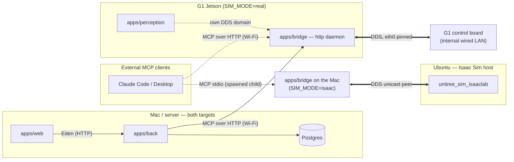
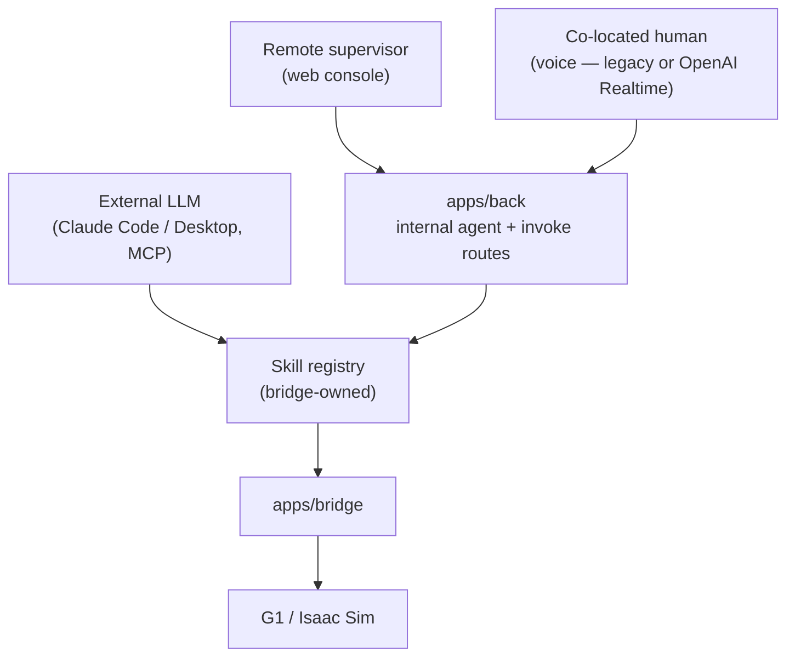

# C3PO — Architecture

How the system fits together: the layers, where each one runs and why, how a
command becomes motion, the seams that keep sim and real on one code path, and
the safety model. Companion documents:

- `docs/DECISIONS.md` — why the choices were made (decision records)
- `docs/OPERATIONS.md` — deploying and operating (topology, ports, domains, secrets)
- `docs/ROBOT-API.md` — the reverse-engineered G1 control API
- `docs/ROBOT-HARDWARE.md` — what the physical machine presents
- per-app READMEs (`apps/*/README.md`) — developing each component

## 0. The model in one paragraph

C3PO is an embodiment layer that gives an LLM a Unitree G1 humanoid body. A
**skill registry** defines what the robot can do, in terms an LLM can reason
about. Three kinds of driver — a human in a web console, an external LLM over
MCP, or a co-located person speaking — all issue the _same_ skills. A **control
plane** (`apps/back`) owns orchestration, persistence and auth. A **bridge**
(`apps/bridge`) turns a skill invocation into robot motion over DDS. The
robot's own firmware does the actual walking; we send high-level setpoints,
never joint torques. The same DDS code path drives a simulated G1 (Isaac Sim)
and the real one.

The single most important structural fact: **the skill registry is independent
of who drives it.** That is what let the conversation host change — Claude Code
first, the in-house agent now — without touching the skills, the bridge, or
the protocol.

## 1. Four layers

| Layer         | Workspace     | Owns                                                                  | Does **not** own      |
| ------------- | ------------- | --------------------------------------------------------------------- | --------------------- |
| Console       | `apps/web`    | Operator UI, live view, chat with the agent                           | Any robot logic       |
| Control plane | `apps/back`   | Skill catalogue (derived), agent runtime, sessions, persistence, auth | Talking to the robot  |
| Bridge        | `apps/bridge` | DDS, skill execution, task lifecycle, robot state, safety stops       | Deciding _what_ to do |
| Robot         | firmware      | Balance, gait, joint control, its own safety limits                   | Anything semantic     |

A fifth component sits beside the bridge rather than above or below it:
**perception** (`apps/perception`), containers on the robot's Jetson that read
the LiDAR/camera and hand the bridge a world summary (§8). It observes and
proposes; the bridge alone actuates.

**Video is the one thing the console fetches directly**, rather than through
`apps/back`. Proxying ~1.5 Mbit/s of frames through the control plane to
re-authenticate a picture the operator is already authorised to see would buy
nothing; the browser reaches the bridge's camera relay directly over the robot
LAN. Everything that _commands_ the robot still goes console → control plane →
bridge, and that is the invariant the layer table is about.

On the real robot there are **two** servers for the one camera, and which is
alive depends on who currently owns `/dev/video4` — the vendor's `videohub_pc4`
(read over its RPC, no device claim) or perception's vision container (owns the
device, and the object detector comes with it). They are mutually exclusive
because a V4L2 node has one owner, and the owner changes whenever somebody runs
`c3po camera take`. **The bridge picks**: `:8001/camera` serves the vendor feed when
it is live and relays the container's when it is not, so the console's URL does
not change when the camera changes hands. Measurements and the trade:
`docs/ROBOT-HARDWARE.md` §6.6; the selection itself:
`apps/bridge/src/bridge/sdk/camera_relay.py`. The sim is unaffected — its
cameras are teleimager WebRTC servers and a different page speaks to them.

The boundary that matters most is **bridge ↔ robot**: we send _high-level
setpoints_ ("walk at 0.4 m/s", "enter damp") and the G1's own controller
decides how to move its legs. Everything in `apps/bridge/src/bridge/skills/`
is a policy over the vendor's API, not a controller.

## 2. Where each layer runs

This differs between targets, and it is not a config detail — it is forced by
the hardware. The G1 is two computers: the **Jetson** (the SSH-able host we
control) and the **control board**, which publishes the robot's DDS topics as
multicast on the robot's internal _wired_ LAN only. The control board has no
wireless interface, so a Mac on Wi-Fi can never join the robot's DDS domain,
and no configuration change can fix that — you cannot add an interface to a
machine that doesn't have one. (Hosts, addresses and traffic numbers:
`docs/ROBOT-HARDWARE.md`.)

Consequence, worth stating plainly: **`SIM_MODE=real` is not a `ROBOT_HOST`
swap. It is a relocation of the bridge onto the Jetson.** (Cabling a Mac onto
the robot's wired LAN does work for bench bring-up — but it tethers the robot,
which defeats the purpose.)

- **`SIM_MODE=isaac`** — the bridge runs on the Mac and reaches the simulator
  over LAN DDS (unicast peer config; see `apps/bridge/README.md`).
- **`SIM_MODE=real`** — the bridge runs onboard the Jetson as a streamable-HTTP
  MCP daemon, bound to the robot LAN. It can command the legs and has no
  authentication of its own, so this is a trusted-network deployment. Ports,
  addressing and the daemon lifecycle: `docs/OPERATIONS.md`.

`apps/back`, Postgres and `apps/web` stay off-robot in **both** cases. The
test for "does this belong onboard?" is: _must it keep working when the
operator link drops?_ That set is deliberately small — the bridge, and
stop-related safety (§7). The agent does not qualify: it calls a remote LLM
gateway, so a dropped link kills it wherever it runs. Running `apps/back`
onboard is explicitly rejected — it buys no autonomy while dragging Postgres
either onto a device that gets hard-powered-off, or across Wi-Fi, where DB
chatter is far less latency-tolerant than the handful of MCP calls per second
the agent actually makes. It would move the wrong link onto the unreliable
medium. Perception, conversely, **cannot** move off the robot: its sensors are
wired/USB-attached to the Jetson (`docs/OPERATIONS.md`).

## 3. Three drivers, one registry

Two paths are live today; they are permanent, not stages — adding the internal
agent required removing nothing, and both can run forever:

1. **External MCP client → bridge, directly.** Claude Code (or any MCP client)
   speaks MCP to the bridge — stdio when it spawns the bridge as a child (the
   sim entry in `.mcp.json`), streamable HTTP against the onboard daemon (the
   real entry). This was the bootstrap path — it validated the skill ABI
   against a frontier LLM before any agent runtime existed — and it remains
   the developer path.
2. **Internal agent in `apps/back`.** The agent runtime
   (`apps/back/src/agent/runtime.ts`, behind `POST /agent`) hosts the
   conversation server-side: an OpenAI-compatible LLM gateway is called with
   the skill registry exposed as tools, each tool call dispatches to the
   bridge as MCP over HTTP (`apps/back/src/bridge/client.ts`), results feed
   the next turn, and the console consumes the run as a token/tool-call
   stream. Provider and gateway facts: `apps/back/.env.example`; the
   provider-choice rationale: `docs/DECISIONS.md` D5.
3. **Voice** (co-located human) is live behind an explicit dashboard switch.
   `VOICE_ENGINE=legacy` uses local transcription + the text agent + Piper;
   `VOICE_ENGINE=realtime` keeps the OpenAI key and session in `back`, streams
   PCM to/from the bridge, persists final transcripts, and dispatches function
   calls through the same bridge registry.

An earlier design had `apps/back` also _serving_ MCP to external clients
(Claude Desktop through the control plane, with tokens and auditing). That
adapter was never built: today `apps/back` is only an MCP **client** of the
bridge.

**The bridge owns the skill definitions.** `apps/back` once restated the
catalogue in TypeScript and the copies drifted — silently, and into the LLM's
prompt. Now the bridge's tool names, descriptions, parameter schemas
(pydantic → JSON Schema) and safety metadata (via MCP `_meta`) are the single
source of truth; `apps/back/src/skills/catalogue.ts` derives its catalogue
from the bridge's `listTools` and caches the last good answer with its age
attached rather than ever inventing a default.

**Console ↔ control plane typing** needs no shared package: `apps/back`
exports its Elysia router type (`App`) from `src/index.ts`, and `apps/web`
imports it through the `@back/*` path alias for full end-to-end inference via
Eden Treaty. The rejected `packages/shared` design is a closed decision —
`docs/DECISIONS.md`.

**Operational schema — mostly planned, not built.** Of the designed
memory/audit tables, only `tool_call_log` (the skill audit trail) exists in
`apps/back/src/db/schema.ts`. The rest (`sessions`, `landmarks`, `episodes`,
`mcp_tokens`, with `vector(1024)` embeddings sized for Voyage `voyage-3-large`
and HNSW cosine indexes) do **not** exist yet, and nothing
depends on the embedding-model choice; TIC AI advertises `tic-embed` as a
possible substitute, but `GET /models` did not list it (2026-08-18). When this
gets built, mind the pgvector `CREATE EXTENSION` gotcha in
`apps/back/README.md`.

## 4. How a command becomes motion

**Isaac Sim** (`walk_to(3, 2)`):

1. The MCP tool call arrives at `mcp_server.walk_to`.
2. `task_runtime` creates a `Task` (id, status, progress, phase, cancel event).
3. `walk_to` reads pose from the state sampler (`sdk/state.py`) and computes
   the world→body error.
4. Every 20 ms (50 Hz) it calls `_locomotion.send_velocity(vx, vy, vyaw,
height)` — proportional gains, velocity caps clamped.
5. `send_velocity` publishes the string `"[vx, vy, vyaw, h]"` to the sim's
   `run_command` topic.
6. Isaac Sim's scene consumes it; the walk policy moves the robot.
7. The loop exits on arrival, timeout, or cancel; `stop_motion` zeroes
   velocity.

**Real G1** — the same code path, diverging in exactly two places:

- Step 3's pose comes from the vendor's odometry topic instead of the sim's
  JSON pose — a different topic with a different DDS type, parsed by a
  different branch of `state.py`. It is drifting odometry, not a map frame —
  fine for the relative motion `walk_to` does. (Full state-source story,
  including the silent-type-mismatch failure mode: `docs/ROBOT-API.md`.)
- Step 5 becomes a `SET_VELOCITY` RPC (api_id 7105 on the sport service)
  carrying `{"velocity": [vx, vy, omega], "duration": 1.0}`. The sim channel
  does not exist on real firmware — publishing there would be a silent no-op.

The divergence is deliberately confined to `_locomotion.send_velocity` (plus
the pose parsers), so `walk_to` and `turn` contain no target-specific code at
all. The velocity caps and gains are fitted to the sim walk policy and will
not transfer to hardware unmeasured — see `apps/bridge/README.md` and
`docs/ROBOT-API.md`.

### 4.1 The same path, entered by speech

A tool call is not the only way in. Two selectable voice engines share the
same control boundary. The **legacy loop** (`apps/back/src/voice/loop.ts`) reads
the bridge transcript and hands each utterance to the text agent. The **Realtime
session** (`apps/back/src/voice/realtime.ts`) streams the listener's 16 kHz PCM
through `back` to OpenAI, returns generated PCM to the robot speaker, and executes
Realtime function calls through the same bridge MCP client. Speech is an input
to the agent, never a second motion controller.

Three properties are deliberate and easy to lose:

- **It is explicitly started and never ambient.** A robot that reasons about
  every overheard sentence is a privacy problem and a bill, so the loop runs
  only while an operator has switched it on — `POST /voice/start`, or the
  control on the console's dashboard. The name of whoever started it goes in
  the log.
- **It reasons where the credentials are.** `apps/back` owns the cloud key,
  Realtime WebSocket, authenticated operator and durable chat id. The bridge
  exposes raw PCM only on its loopback-bound trusted transport; neither robot nor
  browser receives the key. During a Realtime PCM subscription, its existing
  stop detector is armed with a bridge-local callback to `stop_everything`, so
  the spoken stop does not wait for OpenAI or `back`.
- **One session per backend.** A second operator receives a conflict instead of
  attaching to or duplicating the active microphone stream. The resulting chat
  is operator-owned, marked `channel=voice`, and read-only in typed chat so the
  two input channels are never merged implicitly.

The robot's own microphone hears its own speaker, so anything that listens
directly after speaking needs to know when the speaking stopped: `say` takes
`wait_for_completion`, backed by the `rt/audio_msg` `play_state` signal rather
than an estimate (`docs/ROBOT-API.md` §7.1).

## 5. Transport and the sim/real seams

The bridge reaches every non-stub target over DDS (CycloneDDS). WebRTC — the
original plan for the real G1, back when the phone-app route looked like the
only way in — was dropped once SSH access to the Jetson made native DDS
reachable; it survives only as a documented fallback protocol in
`docs/ROBOT-API.md`. Collapsing `real` onto the sim's transport deleted a
translation layer and its quirks.

| `SIM_MODE`     | Transport        | Target                                         |
| -------------- | ---------------- | ---------------------------------------------- |
| `stub`         | none (in-memory) | tools log and return fake data                 |
| `isaac`        | DDS              | Isaac Sim + `unitree_sim_isaaclab` on the LAN  |
| `mujoco_local` | DDS              | local `unitree_mujoco` (unused today)          |
| `real`         | DDS              | real G1, bridge running **onboard the Jetson** |

`SIM_MODE` selects three things at once: the topic profile, the dispatch path,
and where the bridge is deployed. The seams that make one skill codebase serve
both targets, all in `apps/bridge/src/bridge/`:

- **Topics profile** — `sdk/g1_protocol.topics_for(SIM_MODE)` maps each
  logical channel (`lowstate`, `sport_request`, `run_command`, `odom`, …) to a
  concrete topic name per target; `None` means the target has no such channel.
  Sim has `run_command` and no `sport_request`/`arm_request`; real is the
  reverse.
- **`SKILL_REQUESTS`** — a table in `g1_protocol` mapping a skill name to
  `(topic_kind, api_id, data)` for posture and gesture skills. Adding most new
  gestures is a one-line entry.
- **`g1_rpc`** — request/response RPC over DDS for the real robot. Each
  _service_ (sport, arm, motion_switcher, voice) exposes many api_ids; a
  client registers the ones it uses. Timeouts are sized per service — some
  services ack on completion of the motion, not on receipt
  (`docs/ROBOT-API.md`).
- **`_locomotion.send_velocity`** — the one function that knows how each
  target takes velocity (§4).

An earlier design specified a formal `Transport` Protocol class
(`sdk/transport/`) with pluggable DDS/WebRTC implementations. It was never
implemented — the directory is empty — and with WebRTC gone there is nothing
left for it to abstract; the seams above are the real mechanism.

A second bridge↔back transport — a WebSocket event stream with push state,
progress fan-out and a shared token — is **designed, not built**. If it is
built, note that off-loopback the token stops being belt-and-braces: it
becomes the only thing between the LAN and a humanoid's motion API, and must
be enforced, not assumed. Tracked in `docs/OPERATIONS.md` open items.

## 6. Wire formats (as implemented)

Only what runs today. Deep robot-API detail (api_id tables, FSM, types,
verified-live evidence) is owned by `docs/ROBOT-API.md`.

**MCP tool calls** (both external clients and `apps/back`): plain MCP over
stdio or streamable HTTP. Long-running tools (`walk_to`, `turn`) create a
`Task` and report progress through MCP progress notifications
(`ctx.report_progress`); the call itself blocks until the skill finishes.
`list_active_tasks` and `cancel_task` operate on the shared registry — over
HTTP, where requests are concurrent, cancel genuinely interrupts an in-flight
task from another connection. A `Task` serializes as `{task_id, skill_name,
status, progress, phase, result, error}` with `status ∈ running | completed |
cancelled | failed`. True fire-and-forget (return the `task_id` immediately,
poll for progress) is the planned next step — see
`skills/task_runtime.py`.

**Bridge → robot**:

- sim velocity: the string `"[vx, vy, vyaw, height]"` published to the
  profile's `run_command` topic.
- real posture/gesture: `{"data": <index>}` on the sport/arm request topic
  with the api_id from `SKILL_REQUESTS`.
- real velocity: `SET_VELOCITY` (7105) with
  `{"velocity": [vx, vy, omega], "duration": 1.0}`.

**Control plane ↔ console**: Eden-typed REST for skills/tasks/state/chats, and
the AI SDK UI-message stream for `POST /agent` (tokens, tool calls and tool
results arrive incrementally; `@ai-sdk/svelte`'s Chat consumes the same wire
format). Route surfaces are documented in `apps/back/README.md`.

**Cancel path**: `cancel_task` flips the task's cancel event; the skill
observes it between progress emits and runs its own stop sequence
(§7 layer 4). `stop_everything` is the hammer that does not wait for
cooperation (§7 layer 3).

## 7. The safety model

Five layers, outermost first. Each is independent — that is the point.

1. **The physical remote / e-stop.** Always authoritative. Nothing we write
   overrides it.
2. **Firmware velocity deadman.** Every `SET_VELOCITY` carries
   `duration: 1.0` s and is re-issued at loop rate, so if the bridge crashes
   the robot stops within a second. This is a deadman _below our software_ and
   the strongest guarantee we have. The vendor's continuous mode
   (`duration=864000`) would instead leave a crashed bridge's robot walking
   with its last setpoint — never use it. (Constant and rationale live in
   `apps/bridge/src/bridge/skills/_locomotion.py`.)
3. **`stop_everything`.** Cancels every running task, sends a zero-velocity
   burst (dispatched per target, so it is real on hardware too), then damps.
   Damp is not redundant with zero velocity: zero velocity stops the gait,
   damp zeroes joint stiffness. Synchronous by design — it never yields the
   event loop while halting the robot.
4. **Cooperative cancellation.** Long-running skills check
   `task.cancel_event` between iterations and run their own stop sequence.
   Cooperative, not preemptive — a skill stuck in a blocking call won't
   observe it.
5. **Link watchdog** (`apps/bridge/src/bridge/watchdog.py`). Built, and
   **disarmed by default** — deliberately. Its scope is narrower than
   originally specified because layer 2 already covers the velocity case: the
   watchdog exists for what a silent operator leaves running _besides_
   velocity — a posture transition mid-flight, a gesture already dispatched.
   It stops but never damps (a dropped Wi-Fi packet has decided nothing, and
   damping a standing robot drops it on the floor), and it only acts when
   something is actually moving. It cannot be armed usefully while tool calls
   are blocking — "operator silent for a while" is the normal state during any
   long skill — and becomes correct once long skills are fire-and-forget. The
   full reasoning is in the module docstring; the arming flag is in
   `apps/bridge/.env.example`.

What keeps working with **no network at all** is a short list: the firmware
velocity deadman (layer 2), the local wake word and a spoken "stop" once voice
ships (`docs/DECISIONS.md` D6), and Nav2 continuing toward an already-set goal.
Everything else — the agent, the console, any _new_ decision — is
cloud-dependent.

### Not a layer, but load-bearing

There is **no runtime interlock with the `gemm` Nav2 stack** cohabiting the
robot (`docs/ROBOT-HARDWARE.md`). Its `cmd_vel_to_loco` bridge is off by
default but one launch argument from live, and two independent controllers
commanding the same legs is the obvious way to break this robot. The start-up
path is guarded — `c3po up` refuses to start while another motion commander
is alive (see `scripts/robot/_common.sh` for the pattern list and rationale) —
but nothing technical prevents the other stack from starting _after_ ours is
up. That gap is an open operational item (`docs/OPERATIONS.md`).

## 8. The perception boundary

Perception (`apps/perception`, containers on the Jetson) runs on its own DDS
domain, isolated from the vendor's domain 0 by construction rather than by
convention (domain map: `docs/OPERATIONS.md`; the why:
`apps/bridge/src/bridge/sdk/perception_link.py`). Two topics cross the
boundary: a JSON **world summary** the bridge folds into what the agent sees,
and a Nav2 velocity proposal on a namespaced topic that the bridge — and only
the bridge — may translate into motion. The world-model contract (egocentric
range/bearing, "absent is not empty", token budget) is decision record D7 in
`docs/DECISIONS.md`; the concrete schema lives in
`apps/bridge/src/bridge/world_model.py`'s docstring. Building and running the
stack: `apps/perception/README.md`.

## 9. Glossary

- **Skill** — a discrete robot capability with typed parameters and safety
  metadata, defined and executed by the bridge; `walk_to`, `damp`, `wave`.
  The bridge's schemas are the single source of truth (§3).
- **Task** — one _invocation_ of a long-running skill, identified by a
  `task_id`; carries status, progress, phase, and a cancel event (§6).
- **Session** — a window during which an agent (internal or external)
  interacts with the robot; produces an episode.
- **`session` vs `sessions`** — in the database, `session` (singular) is
  Better Auth's login session; `sessions` (plural) is a supervisor/operator
  run. Never conflate them.
- **Episode** — durable record of a session (transcript, tool calls, outcome,
  embedding) for memory recall.
- **Bridge** — the Python sidecar at `apps/bridge` that owns the SDK and the
  DDS connection.
- **Internal agent** — the LLM loop inside `apps/back` driving the robot via
  the skill registry (§3).
- **External MCP client** — Claude Code, Claude Desktop, or any MCP-capable
  client driving the bridge via MCP.
- **Topics profile** — `g1_protocol.topics_for(SIM_MODE)`; maps logical
  channels to per-target topic names, `None` = channel absent (§5).
- **`SKILL_REQUESTS`** — skill name → `(topic_kind, api_id, data)` table for
  one-shot posture/gesture skills (§5).
- **`g1_rpc`** — request/response RPC over DDS for the real robot (§5).
- **api_id** — an operation selector **scoped to a service**, not globally
  unique: the same number means different things on `sport` and `arm`. Full
  tables and the trap's sharpest cases: `docs/ROBOT-API.md`.
- **`SIM_MODE`** — `stub` | `isaac` | `mujoco_local` | `real`. Selects topic
  profile, dispatch path, _and_ where the bridge is deployed.
- **Transport** — how the bridge reaches the robot: DDS on every non-stub
  target. WebRTC is a deprecated fallback only (`docs/ROBOT-API.md`).
- **World model / world summary** — the perception→agent contract (§8).
- **Reflex cancel** — designed bridge-local fast-path cancel on a spoken
  safety phrase, no LLM round-trip; part of the unbuilt voice loop
  (`docs/DECISIONS.md` D6).
- **The pose-source naming wart** — in the topics profile, the slot named
  `sportmodestate` holds the sim's JSON pose topic, while on real that slot's
  topic carries a binary type the SDK cannot decode and pose comes from the
  separate `odom` slot. The historical name has already hidden one bug: DDS
  matches subscriptions by type, so a wrong-type subscription fails
  _silently_ — no error, no message, ever — which is indistinguishable from a
  quiet robot. `get_state()["raw"]` reports `pose_source`,
  `pose_messages_received` and `pose_age_s` so a null pose can be diagnosed
  without reading the source. Details: `docs/ROBOT-API.md`.
