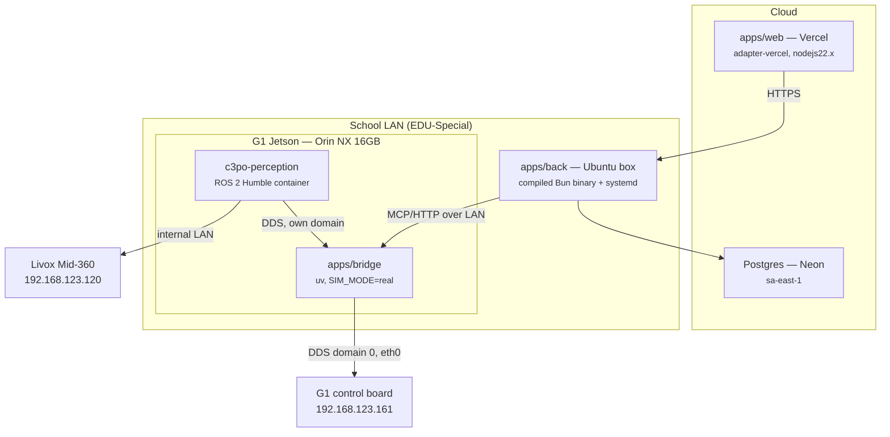

# C3PO — Deployment

Where each piece runs, how it gets there, and the constraints that decided it.

Companion docs: `STACK-DECISIONS.md` (what we build), `MENTAL-MODEL.md` (how it fits
together), `ROBOT-INVENTORY.md` (what the hardware presents).

Settled **2026-08-12**. Status markers: ✅ done · 🔧 partial · ⬜ not built.

---

## 1. Topology



| Component         | Where                 | How                                              | Status                          |
| ----------------- | --------------------- | ------------------------------------------------ | ------------------------------- |
| `apps/web`        | Vercel                | git push; adapter pinned `nodejs22.x`            | ✅ configured                   |
| `apps/back`       | Ubuntu box on the LAN | `bun build --compile` → one binary + systemd     | ⬜                              |
| Postgres          | Neon                  | managed; `drizzle-kit migrate` on deploy         | ✅ live                         |
| `apps/bridge`     | **G1 Jetson**         | `~/c3po` checkout, uv, `run_c3po`                | 🔧 manual scripts, no boot unit |
| `c3po-perception` | **G1 Jetson**         | ROS 2 Humble container (Nav2, FAST-LIO2, YOLO11) | ⬜                              |

### Why perception cannot move off the robot

Tempting, since there's now a Linux box on the LAN. It doesn't work: the Livox sits on the
robot's **internal** `192.168.123.0/24` network and the RealSense is USB-attached to the
Jetson — neither is reachable from the school LAN (`ROBOT-INVENTORY.md` §1). Even if they
were, you would be running a navigation control loop across Wi-Fi.

Perception and Nav2 stay on the Jetson. `back` is the only thing that moved.

---

## 2. The exclusivity model

This shapes more of the deployment than anything else. Two independent stacks share one
robot — ours and the colleague's `gemm` workspace — and some resources cannot be shared.

| Resource                | Shareable?                                                       | Consequence                                  |
| ----------------------- | ---------------------------------------------------------------- | -------------------------------------------- |
| RealSense D435i         | **No** — V4L2 device, one owner                                  | Their driver must stop for ours to open it   |
| Livox Mid-360           | **No** — driver binds UDP 56100–56500, unit unicasts to one host | Same                                         |
| ROS/DDS topics          | Yes, with separate `ROS_DOMAIN_ID`                               | Isolate rather than block                    |
| Compute (16 GB Orin NX) | Degrades                                                         | Two Nav2 + two SLAM pipelines is over budget |
| **Robot control API**   | **No, and cannot be isolated**                                   | See below                                    |

The control API is the one that matters. `gemm`'s `cmd_vel_to_loco` and our bridge both
command motion through `/api/sport/request` api_id 7105, and **no DDS domain split helps** —
both stacks must sit on domain 0 to reach the control board at all. Domain isolation
protects topics, not the robot.

So the invariant is **one owner of the robot at a time**, enforced by the stack controls.

### Stack controls ✅

`scripts/robot/`, installed onto PATH with `./scripts/robot/install_robot_scripts.sh`:

| Command     | Does                                                                                                 |
| ----------- | ---------------------------------------------------------------------------------------------------- |
| `run_c3po`  | Stops `gemm`, refuses if `cmd_vel_to_loco` is alive, starts the bridge (+ perception when it exists) |
| `stop_c3po` | SIGTERM→SIGKILL the bridge, stops perception                                                         |
| `run_gemm`  | Stops our stack, starts their containers                                                             |
| `stop_gemm` | Stops their containers, warns about a surviving `cmd_vel_to_loco`                                    |

Starting either stack stops the other. That's forced by the sensor ownership above, not a
policy — and doing it inside the scripts turns a confusing `EBUSY` mid-startup into an
explicit "gemm was stopped for you".

`stop_gemm` uses `docker stop`, not `down`: their `unless-stopped` policy means an explicit
stop survives a daemon restart, so they cannot quietly reclaim the sensors.

**Stopping the bridge removes `stop_everything`.** The physical e-stop and the firmware's
1 s `SET_VELOCITY` deadman still apply — they always do — but don't `stop_c3po` while the
robot is mid-task expecting to be cancellable.

---

## 3. Per-component

### `apps/web` → Vercel ✅

Push to deploy. `@sveltejs/adapter-vercel` pinned to `nodejs22.x` because it needs Node
crypto — **do not** run it on Bun (see `f2e105d`: Bun's `URLSearchParams` breaks SvelteKit's
`make_trackable`, 500ing every server `load`).

Env: `PUBLIC_API_URL` (the Ubuntu box), `BETTER_AUTH_SECRET` (must match `back`).

Since `back` lives on a private LAN, the browser can only reach it if that box is
reachable from wherever the operator is. For a console used on-site that is fine; exposing
it publicly is a separate decision, not something to do by accident.

### `apps/back` → Ubuntu box ⬜

Builds to a **single self-contained binary**, which makes this unusually simple:

```bash
bun run build          # → ./server, no node_modules at runtime
scp apps/back/server  ubuntu-box:/opt/c3po/server.new
```

Deploy order matters: **migrate, then restart.**

```bash
bunx drizzle-kit migrate     # additive migrations only; see §6
mv server.new server && systemctl restart c3po-back
```

Env: `DATABASE_URL`, `BETTER_AUTH_SECRET`, `BETTER_AUTH_URL`, `WEB_URL`,
`ANTHROPIC_API_KEY`, and `BRIDGE_URL`.

⚠️ `BRIDGE_URL` currently defaults to `http://127.0.0.1:8000/mcp`, which only works while
`back` and the bridge share a host. Point it at the robot.

### `apps/bridge` → Jetson 🔧

A git checkout at `~/c3po`, Python 3.12 via uv, CycloneDDS 0.10.2 already present on the
box. Deploy is `git pull && stop_c3po && run_c3po`.

Config lives in `apps/bridge/.env` and is **not** in git:

```
SIM_MODE=real
DDS_DOMAIN_ID=0
ROBOT_HOST=192.168.123.161      # the control board, NOT the Jetson
DDS_INTERFACE=eth0              # required onboard — see ROBOT-INVENTORY §2
CYCLONEDDS_HOME=/home/unitree/cyclonedds_ws/install/cyclonedds
```

**Missing: a boot unit.** Today the bridge only runs while someone has run `run_c3po`. A
systemd unit calling `run_c3po` with `Restart=on-failure` is the next step. It must start
even when perception is down, and must never initiate motion on boot.

### `c3po-perception` → Jetson ⬜

ROS 2 Humble in our own container: `livox_ros_driver2`, FAST-LIO2 (G1 humanoid fork),
`realsense2_camera`, Nav2, YOLO11 + TensorRT.

Containerised because the Jetson is Ubuntu 20.04 and Humble needs 22.04 — and because it
pins the runtime against Unitree OTA churn. `--network host` for DDS.

---

## 4. Networking and addressing

`back` on the LAN removes the hard problem: no NAT traversal, no reverse-dial, no
Tailscale. `back` reaches the bridge directly.

What remains is **addressing**. The G1 is on DHCP and has already moved twice
(`10.4.64.27` → `10.10.32.19`), and once that lease went to a different device entirely.
Two fixes, either is fine:

- a **static DHCP reservation** for MAC `14:0a:02:f0:63:f6` (already whitelisted on
  `EDU-Special`), or
- **mDNS** — `avahi-daemon` is running on the Jetson, so `g1-orin.local` should resolve on
  the same LAN. Untested; worth five minutes.

Do not hardcode an IP in `BRIDGE_URL` without one of those.

### DDS domain map

| Participant                      | Domain            | Why                                           |
| -------------------------------- | ----------------- | --------------------------------------------- |
| G1 control board, `ai_odom_node` | 0                 | Vendor's, not ours to change                  |
| `apps/bridge`                    | 0 (+ ours)        | Must be on 0 to reach the control board       |
| `c3po-perception`                | **ours, e.g. 42** | Keeps our Nav2/TF/costmaps away from `gemm`'s |
| `gemm` stack                     | 0                 | Theirs                                        |

The bridge spans the boundary — which is its job, since it is already the actuation
chokepoint (`STACK-DECISIONS.md` D2.1). **It must never subscribe to a bare `/cmd_vel`**: on
a shared domain that would mean their planner driving the robot through our actuation path.

---

## 5. Secrets

| Secret               | Web | Back |   Robot   |
| -------------------- | :-: | :--: | :-------: |
| `ANTHROPIC_API_KEY`  |  —  |  ✅  | **never** |
| `DATABASE_URL`       |  —  |  ✅  | **never** |
| `BETTER_AUTH_SECRET` | ✅  |  ✅  |     —     |

**The robot holds no cloud credentials**, because the agent runs in `back`. That's a real
security property — the robot is physically accessible, shared with another team, and runs
third-party containers. It is also easy to lose by accident: moving the agent onboard for
"lower latency" would hand an API key to the least trusted machine in the system. Don't.

---

## 6. Migrations

`drizzle-kit migrate` against Neon, before restarting `back`.

`apps/back/migrations/meta/` **must stay committed**. It was gitignored until 2026-08-11,
which meant drizzle had no journal, and every `generate` on a fresh clone emitted a
full-schema `0000` that collided with what was already applied. If someone re-adds
`meta/` to `.gitignore`, incremental migrations stop working repo-wide.

Migrations are additive-only for now. There is no rollback story; adding one before the
first destructive migration is cheaper than after.

---

## 7. CI / CD

CI ✅ runs type-check (all workspaces) and bridge pytest. There is no CD ⬜.

Rough plan, in the order it's worth building:

1. **`back`** — build the binary in CI, `scp` + `systemctl restart` on the LAN box. Needs a
   runner that can reach it, so likely a self-hosted runner or a manual `make deploy`.
2. **`bridge`** — `git pull && stop_c3po && run_c3po` over SSH. Trivial once the boot unit
   exists.
3. **web** — already automatic on Vercel.

Rollback: `back` keeps the previous binary alongside; the bridge is a git checkout, so
`git checkout <sha> && run_c3po`.

---

## 8. Open items

1. **systemd unit for the bridge** so it survives a robot reboot (§3).
2. **Perception container** — the largest unbuilt piece (§3).
3. **Static lease or mDNS** for the robot before `BRIDGE_URL` is set (§4).
4. **`BRIDGE_URL` still points at localhost** (§3).
5. **Written agreement that `cmd_vel_to_loco` stays off.** The scripts detect and refuse,
   but that's a backstop, not a substitute for the two teams agreeing who drives.
6. **Compute budget unmeasured** — nobody has watched an Orin NX run our full perception
   stack. It may not fit alongside anything else.
7. **No rollback for migrations** (§6).
