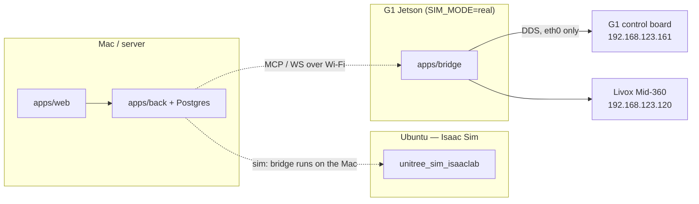
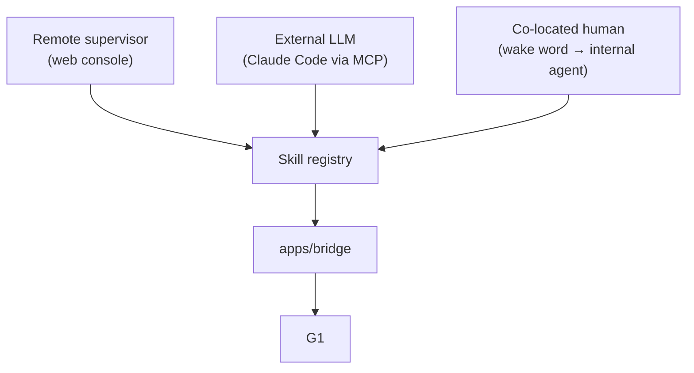

# C3PO — System Model

`SPEC.md` says what we intend to build. `ROBOT-INVENTORY.md` says what the hardware
actually presents. **This document says how the pieces fit together, what each one is
responsible for, and — honestly — which parts work today.**

Read this first if you're new to the project or coming back to it after a while.

Status as of **2026-08-11**.

---

## 0. The model in one paragraph

C3PO gives an LLM a body. A **skill registry** defines what the robot can do, in terms
an LLM can reason about. Three different kinds of driver — a human in a web console, an
external LLM over MCP, or a co-located person speaking — all issue the _same_ skills.
A **control plane** (`apps/back`) owns orchestration, persistence and auth. A **bridge**
(`apps/bridge`) turns a skill invocation into robot motion over DDS. The robot's own
firmware does the actual walking; we send high-level setpoints, never joint torques.

The single most important structural fact: **the skill registry is independent of who
drives it.** That's what lets us swap the conversation host — Claude Code today, an
in-house agent later — without touching the skills, the bridge, or the protocol.

---

## 1. Four layers

| Layer         | Workspace     | Owns                                                                     | Does **not** own      |
| ------------- | ------------- | ------------------------------------------------------------------------ | --------------------- |
| Console       | `apps/web`    | Operator UI, live view, e-stop button                                    | Any robot logic       |
| Control plane | `apps/back`   | Skill catalogue, agent runtime, sessions, persistence, auth, MCP adapter | Talking to the robot  |
| Bridge        | `apps/bridge` | DDS, skill execution, task lifecycle, robot state                        | Deciding _what_ to do |
| Robot         | firmware      | Balance, gait, joint control, safety limits                              | Anything semantic     |

The boundary that matters most is **bridge ↔ robot**: we send _high-level setpoints_
("walk at 0.4 m/s", "enter damp") and the G1's own controller decides how to move its
legs. We are not doing low-level control. Everything in `apps/bridge/skills` is a
policy over the vendor's API, not a controller.

---

## 2. Where each layer runs

This differs between targets, and it is not a config detail — it's forced by the
hardware (`ROBOT-INVENTORY.md` §1).

- **`SIM_MODE=isaac`** — the bridge runs on the Mac and reaches the simulator over LAN DDS.
- **`SIM_MODE=real`** — the bridge runs **onboard the Jetson**, because the control board
  publishes only to the robot's internal wired LAN. Nothing on Wi-Fi can join that DDS
  domain. `SIM_MODE=real` relocates the bridge; it is not a `ROBOT_HOST` swap.

`apps/back`, Postgres and `apps/web` stay off-robot in **both** cases. The test for
"does this belong onboard?" is: _must it keep working when the operator link drops?_
That set is small — the bridge, and stop-related safety. The agent doesn't qualify: it
calls a remote API, so a dropped link kills it wherever it runs.

---

## 3. Three drivers, one registry

Today only the middle path is fully wired: Claude Code speaks MCP directly to the
bridge. The console and the voice loop are later phases. Because they converge on the
same registry, adding them doesn't change the robot-facing code.

---

## 4. End to end: how a command becomes motion

**Isaac Sim** (`walk_to(3, 2)`):

1. MCP tool call arrives at `mcp_server.walk_to`.
2. `task_runtime` creates a `Task` (id, status, progress, cancel event).
3. `walk_to` reads pose from `state.get_sampler()`, computes world→body error.
4. Every 20 ms it calls `_locomotion.send_velocity(vx, vy, vyaw, height)`.
5. `send_velocity` publishes `"[vx, vy, vyaw, h]"` to `rt/run_command/cmd`.
6. Isaac Sim's scene consumes it; the walk policy moves the robot.
7. Loop exits on arrival, timeout, or cancel; `stop_motion` zeroes velocity.

**Real G1** — the same code path, diverging only at steps 3 and 5:

- Step 5 becomes a `SET_VELOCITY` RPC: api_id **7105** on `rt/api/sport/request`,
  parameter `{"velocity": [vx, vy, omega], "duration": 1.0}`.
- **Step 3 has no source of pose.** See §6. This is the current break.

The divergence is deliberately confined to `_locomotion.send_velocity`, so `walk_to`
and `turn` contain no target-specific code at all.

---

## 5. Vocabulary

Precise meanings for terms that get used loosely.

- **Skill** — a discrete robot capability with typed parameters, defined once and
  executed by the bridge. `walk_to`, `damp`, `wave`.
- **Task** (`skills/task_runtime.py`) — one _invocation_ of a long-running skill. Carries
  id, status, progress, phase, and a cancel event that the skill checks between loop
  iterations. This is how cancellation works: cooperative, not preemptive.
- **Topics profile** (`g1_protocol.topics_for(SIM_MODE)`) — maps a logical channel
  (`lowstate`, `sport_request`, `run_command`) to a concrete topic name per target.
  `None` means "this target has no such channel". Sim has `run_command` and no
  `sport_request`; real is the reverse.
- **`SKILL_REQUESTS`** — table mapping a skill name to `(topic_kind, api_id, data)` for
  posture/gesture skills. Adding most new gestures is a one-line entry here.
- **`g1_rpc`** — request/response RPC over DDS for the real robot. Each _service_
  (`sport`, `arm`) exposes many api_ids; a client registers the ones it uses.
- **api_id** — an operation selector **scoped to a service**, not globally unique. `7107`
  means one thing on `sport` and another on `arm`.
- **`SIM_MODE`** — `stub` | `isaac` | `mujoco_local` | `real`. Selects topic profile,
  dispatch path, _and_ where the bridge is deployed.

### Two words that mean different things

- **`session`** (Better Auth login) vs **`sessions`** (an operator run). Never conflate.
- **"sim_state"** in `state.py` is the _variable_ name for the pose source. On real it
  resolves to `sportmodestate`, which is a different message entirely — a naming wart
  that currently hides a bug (§6).

---

## 6. State: what we can know about the robot

| Quantity               | Sim                 | Real               | Status                              |
| ---------------------- | ------------------- | ------------------ | ----------------------------------- |
| Joint state, IMU, tick | `rt/lowstate`       | `rt/lf/lowstate`   | ✅ works both, verified live        |
| Pose (x, y, yaw)       | `rt/sim_state` JSON | `rt/odommodestate` | ✅ **works both, verified live**    |
| Posture / FSM mode     | `mode_machine`      | —                  | ⚠️ returns `not_available_over_dds` |
| Battery                | —                   | `rt/lf/bmsstate`   | ⬜ not wired                        |
| Faults                 | —                   | unknown source     | ⬜ decoder written, unwired         |

### Pose is not symmetric, and that asymmetry bit us once

The two targets publish pose on **different topics with different types**:

|      | Topic              | Type                          | Yaw from           |
| ---- | ------------------ | ----------------------------- | ------------------ |
| sim  | `rt/sim_state`     | `String_` (JSON)              | quaternion         |
| real | `rt/odommodestate` | `unitree_go::SportModeState_` | `imu_state.rpy[2]` |

Originally real pose was subscribed as `String_` on `rt/lf/sportmodestate`, inheriting
the sim shape. That topic carries a binary `unitree_hg` type, and **DDS matches by
type** — so the subscription never received a message, `pose` stayed `None` forever, and
`walk_to`/`turn` aborted on `pose is None` before sending anything. Nothing errored;
it just looked like a quiet robot.

The lesson generalises: a wrong DDS type is a _silent_ failure. `get_state()["raw"]`
now reports `pose_source`, `pose_messages_received` and `pose_age_s` so a null pose can
be diagnosed without reading the source.

Why `rt/odommodestate` and not the `rt/state_estimator/*` topics: those carry
`nav_msgs::msg::dds_::Odometry_`, which would mean hand-writing the ROS IDL.
`rt/odommodestate` carries `unitree_go`'s `SportModeState_`, a type `unitree_sdk2py`
already ships. Same information, no new IDL. (It's published by the vendor's
`ai_odom_node`.)

**It is odometry, not global localisation** — it drifts, and its origin is wherever the
estimator started. Fine for the relative motion `walk_to` does; not a map frame.

### Posture on real

Blocked not by transport but by SDK type coverage: `unitree_sdk2py` ships
`SportModeState_` only under `unitree_go` (quadruped) and the G1 publishes `unitree_hg`.
The clean route is api_id **7001**/**7002** over the RPC path we already have, which
needs no IDL type.

---

## 7. Actuation: what we can command

| Capability                     | Sim                  | Real                       | Status                              |
| ------------------------------ | -------------------- | -------------------------- | ----------------------------------- |
| Velocity                       | `rt/run_command/cmd` | api_id 7105                | ✅ wired, ⚠️ unverified on hardware |
| Postures (damp, sit, squat…)   | —                    | api_id 7101                | ✅ wired, damp verified live        |
| Arm gestures                   | —                    | api_id 7106                | ✅ wired                            |
| Stand/swing height, speed mode | —                    | 7102–7104, 7107            | ⬜ not wired                        |
| Hands (Dex3)                   | —                    | `/api/dex3_msg_controller` | ⬜ not wired                        |

---

## 8. The safety model

Five layers, outermost first. Each is independent — that's the point.

1. **The physical remote / e-stop.** Always authoritative. Nothing we write overrides it.
2. **Firmware velocity timeout.** `SET_VELOCITY` carries `duration`; we send **1.0 s** and
   re-issue at loop rate. If the bridge crashes, the robot stops within a second. This is
   a deadman _below our software_ and the strongest guarantee we have. The vendor's
   continuous mode (`duration=864000`) would instead leave the robot walking with its
   last setpoint — never use it.
3. **`stop_everything`.** Cancels every running task, sends zero velocity, then damps.
   Damp is not redundant with zero velocity: zero velocity stops the gait, damp zeroes
   joint stiffness.
4. **Cooperative cancellation.** Long-running skills check `task.cancel_event` between
   iterations and run their own stop sequence. Note this is _cooperative_ — a skill stuck
   in a blocking call won't observe it.
5. **Link watchdog** (SPEC §10.3, not built). Scope reduced by layer 2: the firmware
   already handles the velocity case, so the watchdog is for non-velocity state (a
   posture command mid-transition), not the primary stop.

### Not a layer, but load-bearing

There is **no interlock with the `gemm` Nav2 stack** running on the same robot. Its
`cmd_vel_to_loco` bridge is off by default, but it is one launch argument from live, and
two independent controllers commanding the same legs is the obvious way to break this
robot. This is currently solved socially, not technically.

---

## 9. What is actually true today

|                                    | Status                                                         |
| ---------------------------------- | -------------------------------------------------------------- |
| Bridge deployed onboard the Jetson | ✅ `~/c3po`, Python 3.12, deps synced, `.env` written          |
| DDS pinned to `eth0`               | ✅ `DDS_INTERFACE`                                             |
| Robot networking                   | ✅ Wi-Fi + internet + internal LAN, survives reboot            |
| `get_state` against real hardware  | ✅ **verified live** — lowstate ~20 Hz, pose ~50 Hz, 35 motors |
| Pose on real                       | ✅ verified live via `rt/odommodestate`                        |
| Posture/gesture skills on real     | ✅ **arm gesture verified live — the robot moved**             |
| Velocity RPC accepted (7105)       | ✅ `code=0` with zero-velocity setpoint                        |
| Non-zero velocity / stepping       | ⬜ **never executed** — axis signs and scaling unknown         |
| `walk_to` / `turn` on real         | ⚠️ unblocked, untested, gains are sim-fitted                   |
| Posture readback on real           | ✅ verified live via api_id 7001 (FSM 802)                     |
| Console, voice, agent runtime      | ⬜ later phases                                                |

---

## 10. Critical path

1. ~~Run `get_state` on the robot.~~ ✅ done, verified live.
2. ~~Wire real pose.~~ ✅ done via `rt/odommodestate`, verified live.
3. **Wire posture via 7001/7002.** Small, no motion, and the last thing making
   `get_state` incomplete on real.
4. **Supervised motion window** — verify `stop_everything` _first_, then the 7105 JSON,
   axis signs, required FSM mode, and real velocity scaling.
5. Then: battery, faults source, link watchdog, hands, and the console/agent phases.

Step 3 involves no motion. Step 4 is the first time this robot moves under our control.

### Standing unknowns

- Whether api_id 7105 and its JSON match this robot's firmware
- Axis sign conventions for `[vx, vy, omega]`
- Which FSM mode must be active before velocity is accepted
- Real velocity scaling — the sim gains are fitted to a policy running at ~10–15 % of
  commanded velocity and will **not** transfer
