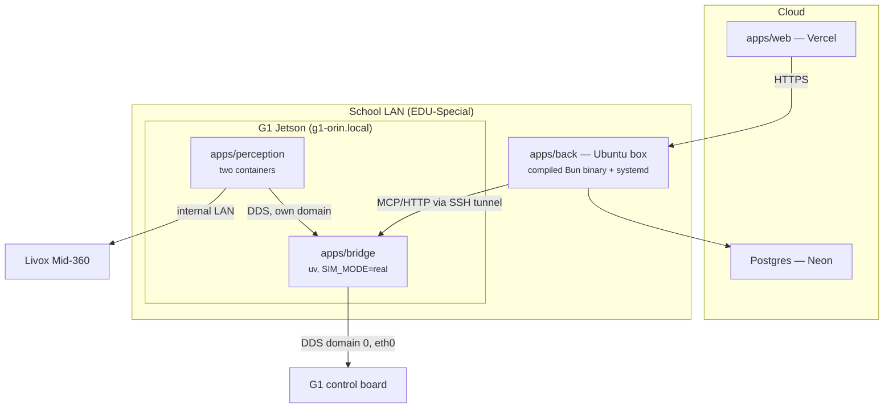

# C3PO — Operations

Where each piece runs, how it deploys, who owns the robot at any moment, and the traps
that have already cost real debugging time. How the system fits together is
`docs/ARCHITECTURE.md`; what the hardware presents is `docs/ROBOT-HARDWARE.md`; the
reverse-engineered control API is `docs/ROBOT-API.md`; why choices were made is
`docs/DECISIONS.md`. Per-app dev docs live in each app's README.

---

## 1. Topology



| Component         | Where                     | How it deploys                                                     |
| ----------------- | ------------------------- | ------------------------------------------------------------------ |
| `apps/web`        | Vercel                    | git push (see `apps/web/README.md`)                                |
| `apps/back`       | Ubuntu box on the LAN     | `bun build --compile` → one self-contained binary + systemd (§5)   |
| Postgres          | Neon (managed, sa-east-1) | `drizzle-kit migrate` on deploy (§7)                               |
| `apps/bridge`     | G1 Jetson                 | `~/c3po` checkout; `git pull && stop_c3po && run_c3po`; boot unit  |
| `apps/perception` | G1 Jetson                 | `build_perception`, then `perception_up <stage>` — never automatic |

Neon is the live DB only; local dev runs against a Homebrew Postgres — setup in
`apps/back/README.md`.

**Why perception cannot move off the robot.** The Livox sits on the robot's _internal_
`192.168.123.0/24` network and the RealSense is USB-attached to the Jetson
(`docs/ROBOT-HARDWARE.md`) — neither is reachable from the school LAN. Even if they were,
that would put a navigation control loop across Wi-Fi. Perception and Nav2 stay onboard;
`back` is the only component that moved off the robot. Why the bridge must be onboard and
why `back` must not be is argued in `docs/ARCHITECTURE.md`.

**Sim topology.** Isaac Sim runs on a separate Ubuntu host, on DDS domain 1. The router
blocks sim-host→Mac UDP across VLANs, so a Mac-hosted bridge cannot receive state from
the sim — drive it from a bridge running locally on that box. Connection values for the
locally spawned sim server live in `.mcp.json` (`c3po-sim`).

---

## 2. Ports and addressing

The port map, in one place:

| Service                    | Host                    | Port  | Notes                                                                            |
| -------------------------- | ----------------------- | ----- | -------------------------------------------------------------------------------- |
| `apps/back` HTTP           | LAN box (dev: anywhere) | 3000  | Better Auth cookie                                                               |
| `apps/web` dev             | dev machine             | 3001  | Vite                                                                             |
| `apps/bridge` MCP (daemon) | Jetson, **loopback**    | 8001  | streamable HTTP `/mcp`; 8000 is held by `gemm-ai.service`                        |
| `apps/bridge` MCP (child)  | —                       | stdio | when an MCP client spawns it as a child process                                  |
| `apps/bridge` WS           | Jetson                  | 7077  | **planned, not built** — token must be enforced once off-loopback                |
| Vision MJPEG               | Jetson, **loopback**    | 8081  | `/live-camera`'s real-robot feed; only up with `perception_up perception`/`nav2` |
| Isaac Sim DDS              | Ubuntu sim host         | 7400+ | UDP (CycloneDDS)                                                                 |
| G1 internal DDS            | control board           | 7400+ | multicast, wired internal LAN only                                               |

`DDS_DOMAIN_ID`: Isaac Sim is `1`, the real G1 is `0` (set per host in `apps/bridge/.env`;
see `apps/bridge/.env.example`).

**Address the robot by name, never by IP.** The Jetson is `g1-orin.local` (mDNS,
`avahi-daemon` onboard; SSH user `unitree`, `c3po` Host alias in `~/.ssh/config`). Its
DHCP lease has already moved twice, and one of the old addresses later answered as a
_different device_ — a stale IP does not fail closed, it reaches the wrong machine. Use
the name in `~/.ssh/config`, in `BRIDGE_URL`, everywhere. Lease history, MAC, Wi-Fi
whitelist, and the vendor route trap that black-holes the robot's egress are in
`docs/ROBOT-HARDWARE.md` — the route trap must be re-checked after any Unitree OTA.

---

## 3. DDS domain map

| Participant                      | Domain     | Why                                                                                                                                   |
| -------------------------------- | ---------- | ------------------------------------------------------------------------------------------------------------------------------------- |
| G1 control board, `ai_odom_node` | 0          | Vendor's, not ours to change                                                                                                          |
| `apps/bridge`                    | 0 (+ ours) | Must be on 0 to reach the control board                                                                                               |
| `apps/perception`                | ours — 42  | Keeps our Nav2/TF/costmaps away from `gemm`'s                                                                                         |
| `gemm` stack                     | 0          | Theirs — incl. `gemm-ai.service`, a live domain-0 participant pinned to `eth0`, not just a port-holder (`docs/ROBOT-HARDWARE.md` §10) |

The bridge spans the boundary — it is the actuation chokepoint (`docs/DECISIONS.md`
D2.1). **It must never subscribe to a bare `/cmd_vel`**: on a shared domain that would
mean another stack's planner driving the robot through our actuation path. Perception
publishes `/c3po/cmd_vel` and the bridge decides what becomes motion.

---

## 4. One owner of the robot

Two independent stacks share the G1 — ours and the colleague's `gemm` workspace. The
sensors have exactly one OS-level owner each, and the control API cannot be
domain-isolated: both stacks must sit on DDS domain 0 to reach the control board at all,
and the firmware arbitrates nothing (every vendor client runs `enableLease=false`). The
invariant is **one commander of the robot at a time**, and it is entirely ours to
enforce. The full rationale, the sensor-ownership facts, and the list of known
other-commander processes live in the `scripts/robot/_common.sh` header; the `gemm`
stack itself is described in `docs/ROBOT-HARDWARE.md`.

### Stack controls

`scripts/robot/`. `./scripts/robot/install_robot_scripts.sh` symlinks the four stack
controls (`run_c3po`, `stop_c3po`, `run_gemm`, `stop_gemm`) onto PATH, so `git pull`
updates them with no reinstall; `perception_up`, `build_perception` and `measure.sh` are
**not** linked — invoke them by path from the checkout (`~/c3po/scripts/robot/…`). What
each command _guarantees_ — the mechanics are in the scripts' own headers:

| Command                 | Guarantees                                                                                                                                                                                                                  |
| ----------------------- | --------------------------------------------------------------------------------------------------------------------------------------------------------------------------------------------------------------------------- |
| `run_c3po`              | Stops `gemm` first (unless `C3PO_NO_TAKEOVER=1`); refuses if another commander or an untracked bridge is alive; syncs deps + re-applies the `postsync.sh` patch; starts the bridge and waits for its port, not just its pid |
| `stop_c3po`             | SIGTERM→SIGKILL the bridge _and its whole process tree_, then verifies no bridge survived; stops both perception containers                                                                                                 |
| `run_gemm`              | Stops our stack first, then starts their containers                                                                                                                                                                         |
| `stop_gemm`             | `docker stop` (not `down`) so a docker-daemon restart does not resurrect them — though the container has been observed returning anyway (§9); warns about a `cmd_vel_to_loco` surviving outside docker                      |
| `perception_up <stage>` | States which shared sensors the stage claims _before_ claiming them; `fake` claims none                                                                                                                                     |

Starting either stack stops the other — forced by sensor ownership, not policy; doing it
in the scripts turns a confusing mid-startup `EBUSY` into an explicit "gemm was stopped
for you".

`C3PO_NO_TAKEOVER=1` means exactly one thing: start the bridge **without** stopping
`gemm`. It exists for the boot unit — a machine powering on is not a person asking to
own the robot.

**⚠️ `stop_gemm` does not stop `gemm-ai.service`.** It filters running _containers_, and
`gemm-ai` is a systemd unit. That service is a voice/vision assistant — verified to
issue no motion commands, so the one-commander invariant holds — but it binds
`0.0.0.0:8000`, which is why our bridge listens on 8001. If it must go:
`sudo systemctl stop gemm-ai` — coordinate first, it is theirs. Details in
`docs/ROBOT-HARDWARE.md`.

**⚠️ Stopping the bridge removes `stop_everything`.** The physical e-stop and the
firmware's 1 s `SET_VELOCITY` deadman still apply — they always do — but do not
`stop_c3po` while the robot is mid-task expecting to be cancellable.

Perception is **never** started by `run_c3po` or any boot path. Claiming the RealSense
and the Livox is a different conversation with the other team than "the bridge is mine",
so it is one explicit command: `perception_up <stage>`.

---

## 5. Per-component deploy

### `apps/web` → Vercel

Push to deploy. Env: see `apps/web/.env.example` (`BETTER_AUTH_SECRET` must match
`back`). Runtime and adapter constraints are in `apps/web/README.md`.

Since `back` sits on a private LAN, the console only works where that box is reachable —
fine for on-site use; exposing `back` publicly is a deliberate decision, never a side
effect.

### `apps/back` → Ubuntu LAN box

Builds to a single self-contained binary — no `node_modules` at runtime:

```bash
bun run build                      # → ./server
scp apps/back/server ubuntu-box:/opt/c3po/server.new
bunx drizzle-kit migrate           # migrate FIRST — deploy order matters (§7)
mv server.new server && systemctl restart c3po-back
```

Keep the previous binary alongside for rollback. Env: see `apps/back/.env.example` — it
is the authority for every variable, including the TIC AI gateway gotchas (plain HTTP,
ORT-network-only, hand-issued keys). Two things to verify per deploy target:

- **The box must have a route to the TIC AI gateway.** Without one, `back` boots and
  serves `/health`, `/skills`, `/state` — and fails every `/agent` call. This rules out
  Vercel for `back` and is a thing to _test_ on the LAN box, not assume. Gateway outages
  also happen; expect `/agent` to be down while the rest of `back` is fine — a 2026-08-18
  nginx 502 stretch surfaced to the operator as _"Failed after 3 attempts. Last error:
  Bad Gateway"_ after ~6 s (the AI SDK retries a 5xx twice; the HTML body never leaves
  `APICallError.responseBody`).
- **The three AI SDK packages move as a set**: `ai` + `@ai-sdk/openai-compatible` in
  `back`, `ai` + `@ai-sdk/svelte` in `web`. Their major numbers differ by design
  (currently majors 7 / 3 / 5 — exact pins in `apps/back/package.json` and
  `apps/web/package.json`), each carrying a provider-specification version. `ai@7`
  speaks spec v4 and refuses a v3 model with `UnsupportedModelVersionError` **on the
  first request only** — a mismatch typechecks and links, so CI (type-check only)
  passes it and `bun build --compile` freezes it into the shipped binary. Bump all
  three in one change and exercise one real `/agent` turn before shipping. npm
  publishes `ai-v6`/`ai-v5` dist-tags on all three if a line must be walked back.

### `apps/bridge` → G1 Jetson

A git checkout at `~/c3po`; Python and `uv` under `~/.local`; CycloneDDS prebuilt on the
box (paths in `apps/bridge/.env.example`). Deploy:

```bash
ssh c3po 'bash -lc "cd ~/c3po && git pull && stop_c3po && run_c3po"'
```

`run_c3po` runs `uv sync` and re-applies `scripts/postsync.sh` itself — a dependency
change needs no manual step. Config lives in `apps/bridge/.env` (not in git; template and
per-host values in `apps/bridge/.env.example`).

- **⚠️ A pull is a `stop_everything` outage.** The deploy line implies
  `stop_c3po` → `run_c3po` — a window with no `stop_everything` (§4). Do it with the
  robot in damp/zero_torque, never mid-task.
- **Transport trap.** The bridge's own default transport is **stdio** — correct when an
  MCP client spawns it as a child over pipes, fatal as a daemon: stdin is `/dev/null`,
  it reads EOF and exits before ever reaching the robot, presenting as a failed start
  with an empty log. `run_c3po` supplies `BRIDGE_TRANSPORT=http` /
  `BRIDGE_HOST=127.0.0.1` / `BRIDGE_PORT=8001` as defaults; `.env` only overrides.
- **Loopback is deliberate.** The bridge can command the legs and has no authentication
  of its own, so it must never bind to the school LAN. Reach it through an SSH tunnel
  with `ControlMaster=no` (a forward on a shared master evaporates when the master idles
  out) — the exact command and the never-spawn-a-second-bridge rule are in
  `apps/bridge/README.md`.
- **Non-interactive SSH PATH trap.** `~/.local/bin` is added by `~/.profile`, which a
  plain `ssh c3po 'run_c3po'` never sources — `uv` and the stack controls are not found.
  Use `bash -lc`, or absolute paths. The boot unit sets an explicit `PATH` for the same
  reason.
- **Boot unit.** `scripts/robot/c3po-bridge.service`, installed by
  `scripts/robot/install_boot_unit.sh`, enabled on the robot. It starts the bridge with
  `C3PO_NO_TAKEOVER=1` — a reboot brings the bridge (and `stop_everything`) up without
  stealing the robot from the colleague's stack, and it never initiates motion.
- **⚠️ Symlink trap.** `/etc/systemd/system/c3po-bridge.service` is a **symlink into the
  checkout** — that is what lets `git pull` update the unit — so deleting the file from
  the repo dangles the unit, and the next boot has no bridge and therefore no
  `stop_everything`. If the unit is ever genuinely retired:
  `sudo systemctl disable --now c3po-bridge` on the robot **first**, then remove the
  file — never the other way round.

Rollback: the bridge is a git checkout — `git checkout <sha> && run_c3po`.

### `apps/perception` → G1 Jetson

Built with `scripts/robot/build_perception`, run with `perception_up <stage>` — and
never by `run_c3po` or a boot path (§4). Architecture, stages, and thresholds:
`apps/perception/README.md`.

---

## 6. Secrets

| Secret               | Web | Back |   Robot   |
| -------------------- | :-: | :--: | :-------: |
| `AGENT_API_KEY`      |  —  |  ✅  | **never** |
| `DATABASE_URL`       |  —  |  ✅  | **never** |
| `BETTER_AUTH_SECRET` | ✅  |  ✅  |     —     |

**The robot holds no model or database credentials**, because the agent runs in `back`.
That is a real security property: the robot is physically accessible, shared with
another team, and runs third-party containers. It is also easy to lose by accident —
moving the agent onboard for "lower latency" would hand an API key to the least trusted
machine in the system. Don't.

---

## 7. Migrations

`drizzle-kit migrate` against Neon, **before** restarting `back` — migrate-then-restart
is the deploy order.

`apps/back/migrations/meta/` **must stay committed**. It was gitignored once, which left
drizzle with no journal: every `generate` on a fresh clone emitted a full-schema `0000`
migration that collided with what was already applied. Re-adding `meta/` to `.gitignore`
breaks incremental migrations repo-wide.

Migrations are **additive-only**. There is no rollback story; adding one before the
first destructive migration is cheaper than after. Local-dev workarounds live in
`apps/back/README.md`.

---

## 8. CI / CD

CI (`.github/workflows/ci.yml`) runs type-check across all workspaces plus the bridge's
pytest. `apps/perception`'s pytest suites are **not** in CI yet, even though its Stage 0
cites them as the verification step. There is **no CD**: web is automatic on Vercel;
`back` would need a runner that can reach the LAN box (self-hosted, or a manual
`make deploy`); the bridge deploy is the one-liner in §5.

---

## 9. Known operational issues

Plain facts, not a roadmap. Each stays here until fixed.

- **`back` cannot reach the bridge under Bun.** The MCP SDK's
  `StreamableHTTPClientTransport` fails under Bun 1.4.0 with _"The socket connection was
  closed unexpectedly"_, while the identical code under Node v26 connects and lists all
  28 tools with `_meta` intact — same URL, same moment, same machine. Not the network,
  not the bridge: `curl` gets a clean 200 and a raw `fetch()` _in Bun_ returns the SSE
  body fine; the break is in the SDK transport's long-lived stream handling on Bun.
  (Observed on Bun 1.4.0; CI and `packageManager` pin 1.3.12, where it is unverified.) This
  is the second Bun trap here (with web's `--bun`/`make_trackable` failure —
  `apps/web/README.md`): Bun has repeatedly been wrong for library code that holds a
  stream open. Options, none chosen: run `back` under Node (Elysia has a Node adapter);
  plain request/response POSTs instead of the SDK transport; upgrade/patch the MCP SDK.
  Until one is picked, `back` deploys but cannot call a single robot tool.
- **`BRIDGE_URL` default is wrong on both host and port** (`apps/back/.env.example`):
  the real target is an SSH tunnel to `g1-orin.local:8001`, not `127.0.0.1:8000`. The
  8000 default is also baked into code — `apps/back/src/bridge/client.ts` (`BRIDGE_URL`
  fallback) and the bridge's own `mcp_server.py` (`BRIDGE_PORT`) — while the robot
  deployment runs on 8001 (§2; `run_c3po` supplies it). The mismatch stands until fixed
  in code.
- **The planned `back` target host is unreachable.** `perrobot` (10.40.5.4) does not
  answer ping from the dev machine — a different VLAN, the same constraint that blocks
  sim→Mac DDS (§1). Deploying `back` needs that resolved or a different host.
- **No written agreement that `cmd_vel_to_loco` stays off.** The scripts detect and
  refuse (§4), but that is a backstop, not a substitute for the two teams agreeing who
  drives.
- **`gemm-bringup` comes back after an explicit stop.** Observed 2026-08-15: the
  container (`restart=unless-stopped`) was up again on its own after `run_c3po`'s
  explicit `docker stop` (§4) — "stopped" is not a permanent state. Verify with
  `docker ps` before counting on the sensors or the one-commander invariant.
- **The one-commander check has blind spots.** `OTHER_COMMANDER_PATTERNS` in
  `scripts/robot/_common.sh` covers `cmd_vel_to_loco|xr_teleoperate|brainco_hand_server`
  but not `unitree_slam` — its 1102 pose navigation closes its own PID velocity loop
  (`docs/ROBOT-API.md`) — or the returning gemm container's `gemm_robot_server`
  (audited: no `SetFsmId`/`SetVelocity`/`LocoClient`/`cmd_vel`/7101/7105 references, so
  no leg risk today; re-check if their backend grows). `warn_if_other_commander` should
  extend to both.
- **`bridge.log` is never rotated** — append-only structlog (path defined in
  `scripts/robot/_common.sh`). Add a logrotate entry before it matters, and make it
  cover the two perception container log streams and the CycloneDDS trace file
  perception adds, not just `bridge.log`.
- **Bridge WS `:7077` token is unenforced** — the WS transport is design, not built;
  once it leaves loopback the token is the only thing between the LAN and a humanoid's
  motion API (`docs/ARCHITECTURE.md`).
- **No migration rollback story** (§7).
- **No CD** (§8).
