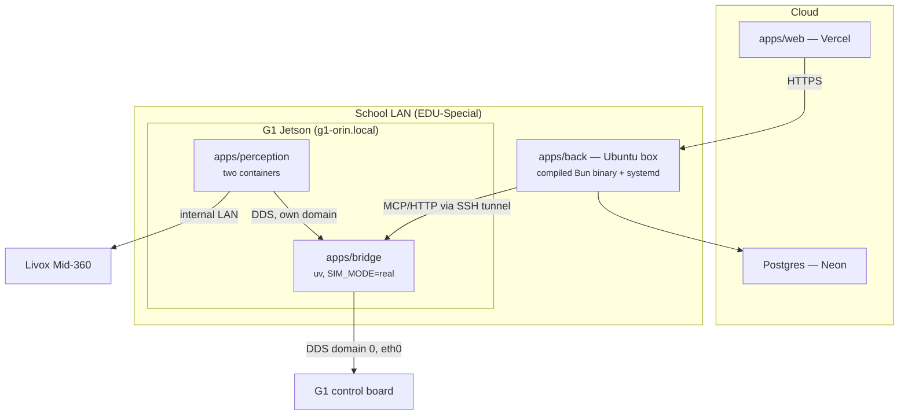

# C3PO — Operations

Where each piece runs, how it deploys, who owns the robot at any moment, and the traps
that have already cost real debugging time. How the system fits together is
`docs/ARCHITECTURE.md`; what the hardware presents is `docs/ROBOT-HARDWARE.md`; the
reverse-engineered control API is `docs/ROBOT-API.md`; why choices were made is
`docs/DECISIONS.md`. Per-app dev docs live in each app's README.

---

## 1. Topology



| Component         | Where                     | How it deploys                                                     |
| ----------------- | ------------------------- | ------------------------------------------------------------------ |
| `apps/web`        | Vercel                    | git push (see `apps/web/README.md`)                                |
| `apps/back`       | Ubuntu box on the LAN     | `bun build --compile` → one self-contained binary + systemd (§5)   |
| Postgres          | Neon (managed, sa-east-1) | `drizzle-kit migrate` on deploy (§7)                               |
| `apps/bridge`     | G1 Jetson                 | `~/c3po` checkout; `git pull && c3po restart`; systemd             |
| `apps/perception` | G1 Jetson                 | `c3po perception build`, then `c3po perception up <stage>`         |

Neon is the live DB only; local dev runs against a Homebrew Postgres — setup in
`apps/back/README.md`.

**Why perception cannot move off the robot.** The Livox sits on the robot's _internal_
`192.168.123.0/24` network and the RealSense is USB-attached to the Jetson
(`docs/ROBOT-HARDWARE.md`) — neither is reachable from the school LAN. Even if they were,
that would put a navigation control loop across Wi-Fi. Perception and Nav2 stay onboard;
`back` is the only component that moved off the robot. Why the bridge must be onboard and
why `back` must not be is argued in `docs/ARCHITECTURE.md`.

**Sim topology.** Isaac Sim runs on a separate Ubuntu host, on DDS domain 1. The router
blocks sim-host→Mac UDP across VLANs, so a Mac-hosted bridge cannot receive state from
the sim — drive it from a bridge running locally on that box. Connection values for the
locally spawned sim server live in `.mcp.json` (`c3po-sim`).

---

## 2. Ports and addressing

The port map, in one place:

| Service                    | Host                    | Port  | Notes                                                                            |
| -------------------------- | ----------------------- | ----- | -------------------------------------------------------------------------------- |
| `apps/back` HTTP           | LAN box (dev: anywhere) | 3000  | Better Auth cookie                                                               |
| `apps/web` dev             | dev machine             | 3001  | Vite                                                                             |
| `apps/bridge` MCP (daemon) | Jetson, **loopback**    | 8001  | streamable HTTP `/mcp`; 8000 is held by `gemm-ai.service`                        |
| `apps/bridge` MCP (child)  | —                       | stdio | when an MCP client spawns it as a child process                                  |
| `apps/bridge` WS           | Jetson                  | 7077  | **planned, not built** — token must be enforced once off-loopback                |
| Vision MJPEG               | Jetson, **loopback**    | 8081  | `/live-camera` feed; up with `c3po perception up perception`/`nav2`               |
| Head camera via videohub   | Jetson, **loopback**    | 8001  | `/camera/*` on the bridge — the same feed **without** owning `/dev/video4`       |
| Isaac Sim DDS              | Ubuntu sim host         | 7400+ | UDP (CycloneDDS)                                                                 |
| G1 internal DDS            | control board           | 7400+ | multicast, wired internal LAN only                                               |

`DDS_DOMAIN_ID`: Isaac Sim is `1`, the real G1 is `0` (set per host in `apps/bridge/.env`;
see `apps/bridge/.env.example`).

**Address the robot by name, never by IP.** The Jetson is `g1-orin.local` (mDNS,
`avahi-daemon` onboard; SSH user `unitree`, `c3po` Host alias in `~/.ssh/config`). Its
DHCP lease has already moved twice, and one of the old addresses later answered as a
_different device_ — a stale IP does not fail closed, it reaches the wrong machine. Use
the name in `~/.ssh/config`, in `BRIDGE_URL`, everywhere. Lease history, MAC, Wi-Fi
whitelist, and the vendor route trap that black-holes the robot's egress are in
`docs/ROBOT-HARDWARE.md` — the route trap must be re-checked after any Unitree OTA.

---

## 3. DDS domain map

| Participant                      | Domain     | Why                                                                                                                                   |
| -------------------------------- | ---------- | ------------------------------------------------------------------------------------------------------------------------------------- |
| G1 control board, `ai_odom_node` | 0          | Vendor's, not ours to change                                                                                                          |
| `apps/bridge`                    | 0 (+ ours) | Must be on 0 to reach the control board                                                                                               |
| `apps/perception`                | ours — 42  | Keeps our Nav2/TF/costmaps away from `gemm`'s                                                                                         |
| `gemm` stack                     | 0          | Theirs — incl. `gemm-ai.service`, a live domain-0 participant pinned to `eth0`, not just a port-holder (`docs/ROBOT-HARDWARE.md` §10) |

The bridge spans the boundary — it is the actuation chokepoint (`docs/DECISIONS.md`
D2.1). **It must never subscribe to a bare `/cmd_vel`**: on a shared domain that would
mean another stack's planner driving the robot through our actuation path. Perception
publishes `/c3po/cmd_vel` and the bridge decides what becomes motion.

---

## 4. One owner of the robot

Two independent stacks share the G1 — ours and the colleague's `gemm` workspace. The
sensors have exactly one OS-level owner each, and the control API cannot be
domain-isolated: both stacks must sit on DDS domain 0 to reach the control board at all,
and the firmware arbitrates nothing (every vendor client runs `enableLease=false`). The
invariant is **one commander of the robot at a time**, and it is entirely ours to
enforce. The full rationale, the sensor-ownership facts, and the list of known
other-commander processes live in the `scripts/robot/_common.sh` header; the `gemm`
stack itself is described in `docs/ROBOT-HARDWARE.md`.

### The durable install

There is one installer and one operator command:

```bash
./scripts/robot/c3po install
c3po status
```

The installer links only `c3po` onto `~/.local/bin`, validates and copies one root-owned
systemd unit (never a symlink into the writable checkout), and installs root-owned
logrotate/sudoers policies. It starts nothing. Re-run `c3po install` after pulling a unit
change.

| Unit                  | What it owns                                                    |
| --------------------- | --------------------------------------------------------------- |
| `c3po-bridge.service` | The bridge directly (`Type=exec`); no wrapper, nohup or pidfile |

There is deliberately no perception unit and no repair timer. Every perception stage,
including sensor-free ones, is a foreground `c3po perception up <stage>` decision. Boot may
make `stop_everything` available; it cannot claim a sensor, start Nav2, or arm motion.

**Boot does not require the network.** `bridge_sync`, the unit's `ExecStartPre`, syncs only
when `uv.lock`'s hash changes. A failed sync with a usable venv is a loud warning rather
than a boot refusal; a first install with no interpreter still fails.

### One operator CLI

The implementation remains split into narrow scripts because systemd and tests call those
operations independently, but operators use one surface:

| Command                              | Guarantee                                                                                       |
| ------------------------------------ | ----------------------------------------------------------------------------------------------- |
| `c3po start`                         | Stops `gemm`, rejects other commanders, then proves systemd's MainPID owns the ready HTTP socket |
| `c3po stop`                          | Stops perception, then lets systemd stop/reap the bridge cgroup                                 |
| `c3po status`                        | Read-only report of bridge HTTP/gate, perception containers and co-tenant state                  |
| `c3po preflight`                     | Read-only safety gate before Nav2 is armed                                                      |
| `c3po perception up <stage>`         | Explicitly starts one stage and states which shared sensors it claims                           |
| `c3po perception stop`               | Releases perception containers while leaving the bridge available                              |
| `c3po perception build|measure ...`  | Builds images or runs the bounded compute harness                                               |
| `c3po gemm start|stop`               | Hands ownership to/from the co-tenant                                                           |
| `c3po teleop start|stop`             | Manages the per-session VR sidecar                                                              |
| `c3po camera take`                   | Performs the explicit vendor-camera takeover                                                    |
| `c3po logs`                          | Follows `c3po-bridge.service` in journald                                                       |

Starting either stack stops the other. Perception is never started by `c3po start` or a
bridge boot path. The systemd unit starts no sensor and does not need a takeover flag.

Bridge logs live in journald. Build/perception trace files are bounded by the installed
logrotate policy; Docker output is bounded per C3PO container with
`max-size=32m,max-file=3` without changing the shared daemon.

**⚠️ `c3po gemm stop` does not stop `gemm-ai.service`.** It is a separate systemd
voice/vision service, verified not to issue motion commands, and owns port 8000. Coordinate
before stopping it. The bridge therefore stays on loopback port 8001.

**⚠️ `c3po stop` removes `stop_everything`.** Do not stop the stack mid-task expecting a
software cancellation path; the physical e-stop and firmware velocity deadman remain.

---

## 5. Per-component deploy

### `apps/web` → Vercel

Push to deploy. Env: see `apps/web/.env.example` (`BETTER_AUTH_SECRET` must match
`back`). Runtime and adapter constraints are in `apps/web/README.md`.

Since `back` sits on a private LAN, the console only works where that box is reachable —
fine for on-site use; exposing `back` publicly is a deliberate decision, never a side
effect.

### `apps/back` → Ubuntu LAN box

Builds to a single self-contained binary — no `node_modules` at runtime:

```bash
bun run build                      # → ./server
scp apps/back/server ubuntu-box:/opt/c3po/server.new
bunx drizzle-kit migrate           # migrate FIRST — deploy order matters (§7)
mv server.new server && systemctl restart c3po-back
```

Keep the previous binary alongside for rollback. Env: see `apps/back/.env.example` — it
is the authority for every variable, including the TIC AI gateway gotchas (plain HTTP,
ORT-network-only, hand-issued keys). Two things to verify per deploy target:

- **The box must have a route to the TIC AI gateway.** Without one, `back` boots and
  serves `/health`, `/skills`, `/state` — and fails every `/agent` call. This rules out
  Vercel for `back` and is a thing to _test_ on the LAN box, not assume. Gateway outages
  also happen; expect `/agent` to be down while the rest of `back` is fine — a 2026-08-18
  nginx 502 stretch surfaced to the operator as _"Failed after 3 attempts. Last error:
  Bad Gateway"_ after ~6 s (the AI SDK retries a 5xx twice; the HTML body never leaves
  `APICallError.responseBody`).
- **The three AI SDK packages move as a set**: `ai` + `@ai-sdk/openai-compatible` in
  `back`, `ai` + `@ai-sdk/svelte` in `web`. Their major numbers differ by design
  (currently majors 7 / 3 / 5 — exact pins in `apps/back/package.json` and
  `apps/web/package.json`), each carrying a provider-specification version. `ai@7`
  speaks spec v4 and refuses a v3 model with `UnsupportedModelVersionError` **on the
  first request only** — a mismatch typechecks and links, so CI (type-check only)
  passes it and `bun build --compile` freezes it into the shipped binary. Bump all
  three in one change and exercise one real `/agent` turn before shipping. npm
  publishes `ai-v6`/`ai-v5` dist-tags on all three if a line must be walked back.

### `apps/bridge` → G1 Jetson

A git checkout at `~/c3po`; Python and `uv` under `~/.local`; CycloneDDS prebuilt on the
box (paths in `apps/bridge/.env.example`). Deploy:

```bash
ssh c3po 'bash -lc "cd ~/c3po && git pull && ./scripts/robot/c3po install && c3po restart"'
```

Re-running the installer is intentional: unit and root-owned config changes are applied
and validated in the same operation. `c3po restart` restarts only the bridge; perception
containers are untouched. `bridge_sync` handles dependency changes and re-applies the SDK
patch before the service starts. Config remains in `apps/bridge/.env`.

- **⚠️ Restart is a brief `stop_everything` outage.** Deploy only with the robot stopped
  and the physical e-stop available.
- **Transport trap.** The bridge defaults to stdio for child-process MCP use. The systemd
  unit pins daemon mode to HTTP on `127.0.0.1:8001`, so an `.env` edit cannot accidentally
  expose its unauthenticated motion surface to the LAN.
- **Loopback is deliberate.** The bridge can command the legs and has no authentication
  of its own, so it must never bind to the school LAN. Reach it through an SSH tunnel
  with `ControlMaster=no` (a forward on a shared master evaporates when the master idles
  out) — the exact command and the never-spawn-a-second-bridge rule are in
  `apps/bridge/README.md`.
- **Non-interactive SSH PATH trap.** `~/.local/bin` comes from `~/.profile`; use
  `ssh c3po 'bash -lc "c3po status"'` or the script's absolute path. The unit has an
  explicit `PATH` and does not depend on a login shell.
- **Boot unit.** `c3po install` installs and enables `c3po-bridge.service`. The unit
  directly supervises the interpreter, claims no sensor, and issues no motion command.
- **Root boundary.** Unit files are copied root-owned into `/etc/systemd/system`; PID 1
  never follows a symlink into the user-writable checkout. A pull does not update a loaded
  unit until `c3po install` validates, copies and reloads it.

Rollback uses the root-owned `/var/lib/c3po/previous-c3po-bridge.service` backup created
before each install. Restore the checkout and that unit, then restore only the old user PATH
commands—never run the old full-stack installer, because it would revive the retired
perception unit and repair timer. Exact commands are in `MONDAY-RUNBOOK.md`.

### When the robot ignores everything

Symptom: every posture and locomotion command returns **rpc_code 0** and the
robot does not move. `get_state` reports `posture="unknown"` and `fsm_id=None`,
and the bridge log fills with `rpc_code=3102` from the FSM poller.

This is almost never a network fault, and it looks exactly like one — we
checked cables, `DDS_INTERFACE`, `ROBOT_HOST` and the peer config before
finding it on 2026-08-20. The robot has **no motion controller loaded**. The
colleague's `xr_teleoperate` calls `Enter_Debug_Mode()`, which loops
`ReleaseMode()` until nothing is loaded, and that state lives in the robot — so
killing their processes does not undo it, and neither does restarting ours.

Diagnose and fix, in that order:

```bash
cd ~/c3po/apps/bridge && set -a && . ./.env && set +a
uv run python scripts/select_motion_mode.py --check-only   # empty name = this
uv run python scripts/select_motion_mode.py                # robot supported!
```

`check_motion_mode` is the diagnostic that distinguishes this from a wrong FSM
id, because both answer `code 0` from the sport service and look identical
otherwise. Expect to need this **once per session** whenever the robot is
shared.

### Putting a Quest on the console

WebXR refuses `immersive-vr` outside a **secure context**, so browsing the headset
to `http://<mac-ip>:3001` gives a page where `navigator.xr` is simply undefined —
/vr-control reports "WebXR no está disponible" with nothing visibly wrong. HTTPS
with a self-signed cert works but means clicking through a certificate warning
inside a headset, per port.

`http://localhost` **is** a secure context (a potentially trustworthy origin, and
Quest Browser is Chromium), so the answer is USB: `scripts/quest_setup.sh` uses
`adb reverse` to forward the headset's own localhost to this machine. The page
becomes secure-context, `ws://localhost:8767` is same-scheme so there is no
mixed-content problem, and nothing is exposed to the school LAN — a bonus, given
the teleop socket has no authentication of its own.

The script verifies every port is listening **before** forwarding, because a
forward to a dead port succeeds now and fails later, in the headset, as a page
that will not load. Needs `adb` (`brew install --cask android-platform-tools`),
developer mode on the headset, and the in-headset "Allow USB debugging?" prompt
accepted — that last one is easy to miss. ⚠️ Not yet tested with a real headset.

### The VR teleop stream on the Jetson 🔧

One more process now runs beside the bridge, for `/vr-control`. It is not under
the bridge unit — `c3po teleop start` starts it per session because it exists to
serve a person who is currently wearing a headset. The camera comes from
`apps/perception`'s vision container (`c3po perception up perception`, port 8081), which is the
process that owns the D435i.

| Process                | Start        | Port | What it is                                                      |
| ---------------------- | ------------ | ---- | --------------------------------------------------------------- |
| `bridge.teleop.server` | `c3po teleop start` | 8767 | Head yaw + both wrists + finger closure from the headset, 30 Hz |

The port numbering is not arbitrary and the constraint is tight — everything else on this
Jetson is already spoken for: **8000** `gemm-ai.service`, **8001** our bridge, **8081** perception's
vision MJPEG, **8765** the colleague's `foxglove_bridge`, **55555/60000** teleimager
itself (`docs/ROBOT-HARDWARE.md`).

It binds loopback and **has no authentication at all** — less even than the MCP transport,
which at least sits behind `apps/back`'s session guard, and it carries live setpoints for
the arms. Tunnel it:

```bash
ssh -N -o ControlMaster=no \
    -L 8001:127.0.0.1:8001 \
    -L 8081:127.0.0.1:8081 \
    -L 8767:127.0.0.1:8767 c3po
```

`ControlMaster=no` matters: a forward on the shared master evaporates when the master idles
out, and the failure then presents as an unreachable bridge with no obvious cause.

**One commander at a time, and the teleop server is one.** While a session is open it is
the only writer of `SetVelocity` — `/vr-control` suspends its own `walk_velocity` loop and
routes the walk buttons through the stream instead. Do not drive the robot from Claude Code
or the console while someone is wearing the headset; nothing at the DDS layer will stop you
(every vendor client is `enableLease=false`, so whoever publishes is obeyed) and the two
sets of setpoints will simply interleave.

**Both hardware paths in the teleop server ship disabled** and stay that way until a person
has run the corresponding check on the robot:

| Env                                                                             | Unblocked by                | Why it is gated                                                                                                                                                            |
| ------------------------------------------------------------------------------- | --------------------------- | -------------------------------------------------------------------------------------------------------------------------------------------------------------------------- |
| `TELEOP_ARM_ENABLED=1`                                                          | `scripts/arm_sign_check.py` | No source gives the positive direction of any G1 arm joint                                                                                                                 |
| `TELEOP_HAND_ENABLED=1` + `TELEOP_HAND_TYPE=brainco` + `TELEOP_BRAINCO_OPEN_AT` | inspection                  | The hands are **two BrainCo** (settled 2026-08-19). Units are [0,1], not Dex3 radians — and BrainCo has **no firmware deadman**, so any hold must be bounded by the bridge |

Put them in `apps/bridge/.env` once settled, not on the command line, so the answer
survives the next session. Head-yaw turning and the walk axis are not gated — they ride on
`_locomotion.send_velocity_async`, which already carries the hardware clamp and sits above
the firmware's own `duration` deadman.

⚠️ **The teleop stream has never run against the robot.**

### `apps/perception` → G1 Jetson

Built with `c3po perception build`, run with `c3po perception up <stage>` — and
never by `c3po start` or a boot path (§4). Architecture, stages, and thresholds:
`apps/perception/README.md`.

---

## 6. Secrets

| Secret               | Web | Back |   Robot   |
| -------------------- | :-: | :--: | :-------: |
| `AGENT_API_KEY`      |  —  |  ✅  | **never** |
| `DATABASE_URL`       |  —  |  ✅  | **never** |
| `BETTER_AUTH_SECRET` | ✅  |  ✅  |     —     |

**The robot holds no model or database credentials**, because the agent runs in `back`.
That is a real security property: the robot is physically accessible, shared with
another team, and runs third-party containers. It is also easy to lose by accident —
moving the agent onboard for "lower latency" would hand an API key to the least trusted
machine in the system. Don't.

---

## 7. Migrations

`drizzle-kit migrate` against Neon, **before** restarting `back` — migrate-then-restart
is the deploy order.

`apps/back/migrations/meta/` **must stay committed**. It was gitignored once, which left
drizzle with no journal: every `generate` on a fresh clone emitted a full-schema `0000`
migration that collided with what was already applied. Re-adding `meta/` to `.gitignore`
breaks incremental migrations repo-wide.

Migrations are **additive-only**. There is no rollback story; adding one before the
first destructive migration is cheaper than after. Local-dev workarounds live in
`apps/back/README.md`.

---

## 8. CI / CD

CI (`.github/workflows/ci.yml`) runs TypeScript/Svelte type-checks, back and web unit
tests, the perception harness's Ruff + pytest gates, and the bridge's Ruff + mypy + pytest
gates. There is **no CD**: web is automatic on Vercel;
`back` would need a runner that can reach the LAN box (self-hosted, or a manual
`make deploy`); the bridge deploy is the one-liner in §5.

---

## 9. Known operational issues

Plain facts, not a roadmap. Each stays here until fixed.

- **Written and never run on hardware.** These are not suspected broken — they
  are untested, which is a different claim and a weaker one. Run them in the
  fail-closed order in [`MONDAY-RUNBOOK.md`](MONDAY-RUNBOOK.md); the inventory is:

  | What                                                    | How to check it                                                                                                         |
  | ------------------------------------------------------- | ----------------------------------------------------------------------------------------------------------------------- |
  | The camera relay (`:8001/camera` picking the live feed) | `c3po camera take`, then `curl :8001/camera/status` — `source` flips without a config change                            |
  | Perception build shim over `bringup/build.py`           | `c3po perception build vision --dry-run`, then a real `vision` build                                                     |
  | Compute sampling loop (its parsing is tested)           | `c3po perception measure idle 90` — the verdict table should fill in, not read UNKNOWN                                  |
  | The `np.bool` fix in the detector                       | a build with a COLD engine cache; it is confirmed on a warm one                                                         |
  | Simplified installer + `Type=exec` bridge unit          | install, restart, gate check, and prove perception remains untouched                                                    |
  | The voice loop end to end                               | start it from the dashboard and say something to the robot                                                              |

  The last one is the only one that can move the robot, and it should be done
  with somebody's hand near the e-stop: the loop's whole job is turning
  overheard speech into tool calls.

- **The simplified installer and `Type=exec` bridge unit are written but not yet
  applied on the robot.** The repository now has one canonical bridge unit, no
  pidfile lifecycle, one installer, and one operator CLI. Monday's first gate is
  to run `./scripts/robot/c3po install`, verify the bridge and closed gate, prove a bridge
  restart leaves perception untouched, and roll the checkout back if any check
  fails. Until that supervised install happens, the robot may still have the old
  symlinked unit loaded in systemd.

- **`back` → bridge under Bun: FIXED, on localhost at least.** This was recorded as a hard
  blocker — the MCP SDK's `StreamableHTTPClientTransport` failing under Bun 1.4.0 with
  _"The socket connection was closed unexpectedly"_ while the same code under Node listed
  all tools. Re-tested 2026-08-21 on **Bun 1.4.0 with SDK 1.29.0**: `apps/back`'s own
  `bridge/client.ts` connects, lists **31 tools**, and successfully calls `get_state`,
  `say` and `listen` against a stub bridge. The likeliest cause is the SDK upgrade; the
  original entry did not record which SDK version failed, which is why this took a
  re-test rather than a changelog read. **Record the dependency version next time a
  library bug is filed here.**

  **Now verified through the SSH tunnel too, 2026-08-22** — the condition the original
  failure was observed under. `apps/back`'s `bridge/client.ts` over `ssh -L
8001:127.0.0.1:8001` to the real robot: **33 tools listed**, `get_state` returned. So
  the tunnel's stream handling is not a factor and the fallback (plain request/response
  POSTs instead of the SDK transport) is not needed. The blocker is fully closed.

- **The planned `back` target host is unreachable.** `perrobot` (10.40.5.4) does not
  answer ping from the dev machine — a different VLAN, the same constraint that blocks
  sim→Mac DDS (§1). Deploying `back` needs that resolved or a different host.
- **No written agreement that `cmd_vel_to_loco` stays off.** The scripts detect and
  refuse (§4), but that is a backstop, not a substitute for the two teams agreeing who
  drives.
- **`gemm-bringup` comes back after an explicit stop.** Observed 2026-08-15: the
  container (`restart=unless-stopped`) was up again on its own after `c3po start`'s
  explicit `docker stop` (§4) — "stopped" is not a permanent state. Verify with
  `docker ps` before counting on the sensors or the one-commander invariant.
- **The one-commander check is signature-based.** `OTHER_COMMANDER_PATTERNS` in
  `scripts/robot/_common.sh` covers the known leg/arm/hand commanders, including
  `unitree_slam` (its 1102 pose navigation closes its own velocity loop). The returning
  gemm container's `gemm_robot_server` is deliberately excluded after an audit found no
  `SetFsmId`/`SetVelocity`/`LocoClient`/`cmd_vel`/7101/7105 references. Re-audit and add it
  before accepting any new motion feature in that backend; process-name detection cannot
  discover a new commander by itself.
- **Bridge WS `:7077` token is unenforced** — the WS transport is design, not built;
  once it leaves loopback the token is the only thing between the LAN and a humanoid's
  motion API (`docs/ARCHITECTURE.md`).
- **No migration rollback story** (§7).
- **No CD** (§8).
