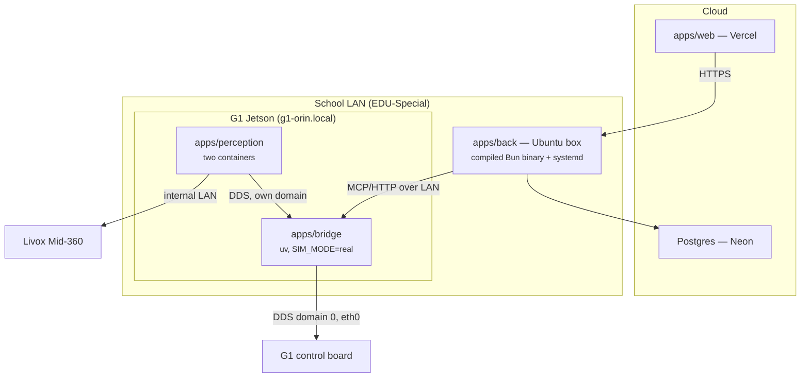

# C3PO — Operations

Where each piece runs, how it deploys, who owns the robot at any moment, and the traps
that have already cost real debugging time. How the system fits together is
`docs/ARCHITECTURE.md`; what the hardware presents is `docs/ROBOT-HARDWARE.md`; the
reverse-engineered control API is `docs/ROBOT-API.md`; why choices were made is
`docs/DECISIONS.md`. Per-app dev docs live in each app's README.

**Standing next to the robot with a session to run?** `docs/SESSION-CHECKLIST.md`
is the ordered runbook — deploy, verify, headset, then motion — and it starts
with the deploy step that silently does nothing if the robot's checkout is on
the wrong branch. This file is the reference; that one is the sequence.

---

## 1. Topology



| Component         | Where                     | How it deploys                                                   |
| ----------------- | ------------------------- | ---------------------------------------------------------------- |
| `apps/web`        | Vercel                    | git push (see `apps/web/README.md`)                              |
| `apps/back`       | Ubuntu box on the LAN     | `bun build --compile` → one self-contained binary + systemd (§5) |
| Postgres          | Neon (managed, sa-east-1) | `drizzle-kit migrate` on deploy (§7)                             |
| `apps/bridge`     | G1 Jetson                 | `~/c3po` checkout; `git pull && c3po restart`; systemd           |
| `apps/perception` | G1 Jetson                 | `c3po perception build`, then `c3po up <stage>`                  |

Neon is the live DB only; local dev runs against a Homebrew Postgres — setup in
`apps/back/README.md`.

**Why perception cannot move off the robot.** The Livox sits on the robot's _internal_
`192.168.123.0/24` network and the RealSense is USB-attached to the Jetson
(`docs/ROBOT-HARDWARE.md`) — neither is reachable from the school LAN. Even if they were,
that would put a navigation control loop across Wi-Fi. Perception and Nav2 stay onboard;
`back` is the only component that moved off the robot. Why the bridge must be onboard and
why `back` must not be is argued in `docs/ARCHITECTURE.md`.

**Sim topology.** Isaac Sim runs on a separate Ubuntu host, on DDS domain 1. The router
blocks sim-host→Mac UDP across VLANs, so a Mac-hosted bridge cannot receive state from
the sim — drive it from a bridge running locally on that box. Connection values for the
locally spawned sim server live in `.mcp.json` (`c3po-sim`).

---

## 2. Ports and addressing

The port map, in one place:

| Service                    | Host                    | Port  | Notes                                                                      |
| -------------------------- | ----------------------- | ----- | -------------------------------------------------------------------------- |
| `apps/back` HTTP           | LAN box (dev: anywhere) | 3000  | Better Auth cookie                                                         |
| `apps/web` dev             | dev machine             | 3001  | Vite                                                                       |
| `apps/bridge` MCP (daemon) | Jetson, **LAN**         | 8001  | streamable HTTP `/mcp` plus `/camera/*`; unauthenticated                   |
| `apps/bridge` MCP (child)  | —                       | stdio | when an MCP client spawns it as a child process                            |
| `apps/bridge` WS           | Jetson                  | 7077  | **planned, not built** — token must be enforced once off-loopback          |
| Vision MJPEG               | Jetson, **loopback**    | 8081  | `/live-camera` feed; up with `c3po perception up perception`/`nav2`        |
| Head camera via videohub   | Jetson, **LAN**         | 8001  | `/camera/*` on the bridge — the same feed **without** owning `/dev/video4` |
| VR teleop                  | Jetson, **LAN**         | 8767  | WebSocket setpoints while `c3po up teleop` is active; unauthenticated      |
| Isaac Sim DDS              | Ubuntu sim host         | 7400+ | UDP (CycloneDDS)                                                           |
| G1 internal DDS            | control board           | 7400+ | multicast, wired internal LAN only                                         |

`DDS_DOMAIN_ID`: Isaac Sim is `1`, the real G1 is `0` (set per host in `apps/bridge/.env`;
see `apps/bridge/.env.example`).

**Address the robot by name, never by IP.** The Jetson is `g1-orin.local` (mDNS,
`avahi-daemon` onboard; SSH user `unitree`, `c3po` Host alias in `~/.ssh/config`). Its
DHCP lease has already moved twice, and one of the old addresses later answered as a
_different device_ — a stale IP does not fail closed, it reaches the wrong machine. Use
the name in `~/.ssh/config`, in `BRIDGE_URL`, everywhere. Lease history, MAC, Wi-Fi
whitelist, and the vendor route trap that black-holes the robot's egress are in
`docs/ROBOT-HARDWARE.md` — the route trap must be re-checked after any Unitree OTA.

---

## 3. DDS domain map

| Participant                      | Domain     | Why                                                                                                                                   |
| -------------------------------- | ---------- | ------------------------------------------------------------------------------------------------------------------------------------- |
| G1 control board, `ai_odom_node` | 0          | Vendor's, not ours to change                                                                                                          |
| `apps/bridge`                    | 0 (+ ours) | Must be on 0 to reach the control board                                                                                               |
| `apps/perception`                | ours — 42  | Keeps our Nav2/TF/costmaps away from `gemm`'s                                                                                         |
| `gemm` stack                     | 0          | Theirs — incl. `gemm-ai.service`, a live domain-0 participant pinned to `eth0`, not just a port-holder (`docs/ROBOT-HARDWARE.md` §10) |

The bridge spans the boundary — it is the actuation chokepoint (`docs/DECISIONS.md`
D2.1). **It must never subscribe to a bare `/cmd_vel`**: on a shared domain that would
mean another stack's planner driving the robot through our actuation path. Perception
publishes `/c3po/cmd_vel` and the bridge decides what becomes motion.

---

## 4. One owner of the robot

Two independent stacks share the G1 — ours and the colleague's `gemm` workspace. The
sensors have exactly one OS-level owner each, and the control API cannot be
domain-isolated: both stacks must sit on DDS domain 0 to reach the control board at all,
and the firmware arbitrates nothing (every vendor client runs `enableLease=false`). The
invariant is **one commander of the robot at a time**, and it is entirely ours to
enforce. The full rationale, the sensor-ownership facts, and the list of known
other-commander processes live in the `scripts/robot/_common.sh` header; the `gemm`
stack itself is described in `docs/ROBOT-HARDWARE.md`.

### The durable install

There is one installer and one operator command:

```bash
./scripts/robot/c3po install
c3po status
```

The installer links only `c3po` onto `~/.local/bin`, validates and copies one root-owned
systemd unit (never a symlink into the writable checkout), and installs root-owned
logrotate/sudoers policies. It starts nothing. Re-run `c3po install` after pulling a unit
change.

| Unit                  | What it owns                                                    |
| --------------------- | --------------------------------------------------------------- |
| `c3po-bridge.service` | The bridge directly (`Type=exec`); no wrapper, nohup or pidfile |

There is deliberately no perception unit and no repair timer. Every perception stage,
including sensor-free ones, is a foreground `c3po up <stage>` decision. Boot may
make `stop_everything` available; it cannot claim a sensor, start Nav2, or arm motion.

**Boot does not require the network.** `bridge_sync`, the unit's `ExecStartPre`, syncs only
when `uv.lock`'s hash changes. A failed sync with a usable venv is a loud warning rather
than a boot refusal; a first install with no interpreter still fails.

### One operator CLI

The implementation remains split into narrow, independently testable operations, but normal
bring-up is profile-based. Operators do not need to remember the order in which the bridge,
perception and teleop layers start or stop:

| Profile                   | What comes up                                                   | Sensor/motion posture                                        |
| ------------------------- | --------------------------------------------------------------- | ------------------------------------------------------------ |
| `c3po up` / `up operator` | Bridge + camera perception + world model                        | Claims RealSense; motion remains gated                       |
| `c3po up core`            | Bridge only                                                     | Claims no sensors; motion remains gated                      |
| `c3po up nav2`            | Bridge + perception + Nav2                                      | Claims RealSense; Nav2 lifecycle and motion gate stay closed |
| `c3po up nav2-fake`       | Bridge + synthetic perception/Nav2                              | Claims no sensors; motion gate stays closed                  |
| `c3po up <stage>`         | Bridge + any named perception stage                             | Claims only the sensors declared by that stage               |
| `c3po up teleop`          | Bridge + camera perception + the explicitly attended VR sidecar | Claims RealSense; teleop's own dead-men still apply          |
| `c3po down`               | Stops teleop, perception, then the bridge                       | Complete C3PO shutdown                                       |

`start` and `stop` remain compatibility aliases for `up core` and `down`.
The granular commands below are retained for diagnostics and partial-stack work:

| Command                                 | Guarantee                                                           |
| --------------------------------------- | ------------------------------------------------------------------- |
| `c3po start`                            | Compatibility alias for `c3po up core`                              |
| `c3po stop`                             | Compatibility alias for `c3po down`                                 |
| `c3po status`                           | Reports bridge, motion gate, perception, teleop and co-tenant state |
| `c3po preflight`                        | Runs the read-only safety gate before Nav2 is armed                 |
| `c3po perception up <stage>`            | Starts one stage and states which shared sensors it claims          |
| `c3po perception stop`                  | Releases perception while leaving the bridge available              |
| `c3po perception build <target>`        | Builds robot-native perception images                               |
| `c3po perception measure <label> [sec]` | Runs the bounded compute harness                                    |
| `c3po gemm {start,stop}`                | Hands ownership to/from the co-tenant                               |
| `c3po teleop {start,stop}`              | Manages only the per-session VR sidecar                             |
| `c3po camera take`                      | Performs the explicit vendor-camera takeover                        |
| `c3po logs`                             | Follows `c3po-bridge.service` in journald                           |

Starting either stack stops the other. The systemd bridge boot path still starts no sensor;
only an explicit `c3po up` profile can compose perception or teleop around it. No profile
arms Nav2 or opens the bridge motion gate.

Bridge logs live in journald. Build/perception trace files are bounded by the installed
logrotate policy; Docker output is bounded per C3PO container with
`max-size=32m,max-file=3` without changing the shared daemon.

**⚠️ `c3po gemm stop` does not stop `gemm-ai.service`.** It is a separate systemd
voice/vision service, verified not to issue motion commands, and owns port 8000. Coordinate
before stopping it. The bridge therefore uses LAN port 8001.

**⚠️ `c3po down` (and its `stop` alias) removes `stop_everything`.** Do not stop
the stack mid-task expecting a software cancellation path; the physical e-stop
and firmware velocity deadman remain.

---

## 5. Per-component deploy

### `apps/web` → Vercel

Push to deploy. Env: see `apps/web/.env.example` (`BETTER_AUTH_SECRET` must match
`back`). Runtime and adapter constraints are in `apps/web/README.md`.

Since `back` sits on a private LAN, the console only works where that box is reachable —
fine for on-site use; exposing `back` publicly is a deliberate decision, never a side
effect.

### `apps/back` → Ubuntu LAN box

Builds to a single self-contained binary — no `node_modules` at runtime:

```bash
bun run build                      # → ./server
scp apps/back/server ubuntu-box:/opt/c3po/server.new
bunx drizzle-kit migrate           # migrate FIRST — deploy order matters (§7)
mv server.new server && systemctl restart c3po-back
```

Keep the previous binary alongside for rollback. Env: see `apps/back/.env.example` — it
is the authority for every variable, including the TIC AI gateway gotchas (plain HTTP,
ORT-network-only, hand-issued keys). Two things to verify per deploy target:

- **The box must have a route to the TIC AI gateway.** Without one, `back` boots and
  serves `/health`, `/skills`, `/state` — and fails every `/agent` call. This rules out
  Vercel for `back` and is a thing to _test_ on the LAN box, not assume. Gateway outages
  also happen; expect `/agent` to be down while the rest of `back` is fine — a 2026-08-18
  nginx 502 stretch surfaced to the operator as _"Failed after 3 attempts. Last error:
  Bad Gateway"_ after ~6 s (the AI SDK retries a 5xx twice; the HTML body never leaves
  `APICallError.responseBody`).
- **The three AI SDK packages move as a set**: `ai` + `@ai-sdk/openai-compatible` in
  `back`, `ai` + `@ai-sdk/svelte` in `web`. Their major numbers differ by design
  (currently majors 7 / 3 / 5 — exact pins in `apps/back/package.json` and
  `apps/web/package.json`), each carrying a provider-specification version. `ai@7`
  speaks spec v4 and refuses a v3 model with `UnsupportedModelVersionError` **on the
  first request only** — a mismatch typechecks and links, so CI (type-check only)
  passes it and `bun build --compile` freezes it into the shipped binary. Bump all
  three in one change and exercise one real `/agent` turn before shipping. npm
  publishes `ai-v6`/`ai-v5` dist-tags on all three if a line must be walked back.

### `apps/bridge` → G1 Jetson

A git checkout at `~/c3po`; Python and `uv` under `~/.local`; CycloneDDS prebuilt on the
box (paths in `apps/bridge/.env.example`). Deploy:

```bash
ssh c3po 'bash -lc "cd ~/c3po && git pull && ./scripts/robot/c3po install && c3po restart"'
```

Re-running the installer is intentional: unit and root-owned config changes are applied
and validated in the same operation. `c3po restart` restarts only the bridge; perception
containers are untouched. `bridge_sync` handles dependency changes and re-applies the SDK
patch before the service starts. Config remains in `apps/bridge/.env`.

- **⚠️ Restart is a brief `stop_everything` outage.** Deploy only with the robot stopped
  and the physical e-stop available.
- **Transport trap.** The bridge defaults to stdio for child-process MCP use. The systemd
  unit pins daemon mode to HTTP on `0.0.0.0:8001`; ad-hoc developer runs retain the
  loopback default.
- **Direct LAN exposure is deliberate.** Port 8001 has no transport authentication and
  can invoke robot tools; port 8767 accepts live teleop setpoints while enabled. The robot
  currently has no active host firewall. Use `g1-orin.local`, never a stale DHCP address,
  and treat the school LAN as part of the robot's control boundary.
- **Non-interactive SSH PATH trap.** `~/.local/bin` comes from `~/.profile`; use
  `ssh c3po 'bash -lc "c3po status"'` or the script's absolute path. The unit has an
  explicit `PATH` and does not depend on a login shell.
- **Boot unit.** `c3po install` installs and enables `c3po-bridge.service`. The unit
  directly supervises the interpreter, claims no sensor, and issues no motion command.
- **Root boundary.** Unit files are copied root-owned into `/etc/systemd/system`; PID 1
  never follows a symlink into the user-writable checkout. A pull does not update a loaded
  unit until `c3po install` validates, copies and reloads it.

Rollback uses the root-owned `/var/lib/c3po/previous-c3po-bridge.service` backup created
before each install. Restore the checkout and that unit, then restore only the old user PATH
commands—never run the old full-stack installer, because it would revive the retired
perception unit and repair timer. Exact commands are in `MONDAY-RUNBOOK.md`.

### When the robot ignores everything

Symptom: every posture and locomotion command returns **rpc_code 0** and the
robot does not move. `get_state` reports `posture="unknown"` and `fsm_id=None`,
and the bridge log fills with `rpc_code=3102` from the FSM poller.

This is almost never a network fault, and it looks exactly like one — we
checked cables, `DDS_INTERFACE`, `ROBOT_HOST` and the peer config before
finding it on 2026-08-20. The robot has **no motion controller loaded**. The
colleague's `xr_teleoperate` calls `Enter_Debug_Mode()`, which loops
`ReleaseMode()` until nothing is loaded, and that state lives in the robot — so
killing their processes does not undo it, and neither does restarting ours.

Diagnose and fix, in that order:

```bash
cd ~/c3po/apps/bridge && set -a && . ./.env && set +a
uv run python scripts/select_motion_mode.py --check-only   # empty name = this
uv run python scripts/select_motion_mode.py                # robot supported!
```

`check_motion_mode` is the diagnostic that distinguishes this from a wrong FSM
id, because both answer `code 0` from the sport service and look identical
otherwise. Expect to need this **once per session** whenever the robot is
shared.

### Putting a Quest on the console

WebXR refuses `immersive-vr` outside a **secure context**, so browsing the headset
to `http://<mac-ip>:3001` gives a page where `navigator.xr` is simply undefined —
/vr-control reports "WebXR no está disponible" with nothing visibly wrong. HTTPS
with a self-signed cert works but means clicking through a certificate warning
inside a headset, per port.

`http://localhost` **is** a secure context (a potentially trustworthy origin, and
Quest Browser is Chromium), so the answer is USB: `scripts/quest_setup.sh` uses
`adb reverse` to forward the headset's own localhost to this machine. The page
becomes secure-context, `ws://localhost:8767` is same-scheme so there is no
mixed-content problem, and nothing is exposed to the school LAN — a bonus, given
the teleop socket has no authentication of its own.

The script verifies every port is listening **before** forwarding, because a
forward to a dead port succeeds now and fails later, in the headset, as a page
that will not load. Needs `adb` (`brew install --cask android-platform-tools`),
developer mode on the headset, and the in-headset "Allow USB debugging?" prompt
accepted — that last one is easy to miss.

✅ **First run against a real Quest: 2026-08-21.** Detection, authorisation, the
port checks and all four forwards work, and the Quest browser loads the console
over `http://localhost:3001` — the secure-context reasoning holds. Two bugs
surfaced and were fixed on that run: Vite bound `::1` only while `adb reverse`
connects over IPv4 (fixed with `--host 127.0.0.1` in `apps/web/package.json`),
and the script's own empty-tunnel check was silently defeated by `pipefail`,
awarding a dead camera port a green tick — the exact failure its header promises
to prevent, reintroduced by the shape of the fix for it.

⚠️ **Still unproven: that an immersive session drives the robot.** On the first
run no teleop session ever registered — `list_active_tasks` stayed empty, because
8767 was not forwarded at the time. Head yaw reaching the robot from a headset
has not been observed end to end, and the yaw sign is still unsettled.

🔧 **The camera port is read from `PUBLIC_ROBOT_CAM_URL`, not hardcoded — since
2026-08-27.** The forward list said 8081, which is `apps/perception`'s vision
container. The feed had already moved to **8001**, the bridge's own port (see
"WHY NOT PORT 8081" in `mcp_server.py`: 8081 belongs to the process that is dead
in exactly the case the relay exists for). `PUBLIC_ROBOT_CAM_URL` was updated;
the forward list was not, so the headset asked _its own_ `127.0.0.1:8001`, where
nothing listens.

The symptom was "i cannot see the camara" with **everything else working** —
because everything else reaches the bridge through apps/back on 3000, which was
forwarded. `quest_setup.sh` now parses the port out of `apps/web/.env` (falling
back to `.env.example`), so the two cannot drift apart again. If you point
`PUBLIC_ROBOT_CAM_URL` somewhere new, the forward follows it with no edit here.

The headset also no longer goes silently black when the feed is missing: the
camera layer draws a **SIN IMAGEN** card naming the reason, the same way the
radar dial always says why it is empty. A black field is an assertion that
everything is fine, and it was wrong every time it appeared.

🚨 **THE BRIDGE IS NOT ON LOOPBACK. It is on `0.0.0.0`, on the school LAN.**
Verified on the running robot, 2026-08-28:

```
$ ss -ltnp | grep 8001
LISTEN 0 2048 0.0.0.0:8001 0.0.0.0:*  users:(("python",pid=1213,...))
$ hostname -I
192.168.123.164  172.17.0.1  10.10.32.19      # <- 10.10.32.19 is the school LAN
```

`scripts/robot/c3po-bridge.service` **used to set** `Environment=BRIDGE_HOST=0.0.0.0`,
while `apps/bridge/.env.example` said `127.0.0.1`, the code default was
`127.0.0.1`, and the table above and `apps/back/src/routes/telemetry.ts` both
said **loopback**. Four places described this port and the one that actually ran
disagreed with the other three.

The consequence: `http://10.10.32.19:8001/mcp` was reachable from anywhere on
the school Wi-Fi, and it is the tool surface that can **walk the robot**, with
no authentication of its own. The SSH-tunnel posture that everything else in
this document assumes was not what was deployed. It arrived with the unit taken
from `main` in `06e5ea9` (2026-08-26).

✅ **Decided 2026-09-06: the unit binds `127.0.0.1`.** The alternative was to
keep the LAN binding and write down that we meant it, and that loses on the
merits — an unauthenticated API that can walk a humanoid should not be
reachable from a shared school Wi-Fi, the tunnel already exists and is already
printed by `quest_setup.sh`, and every other place in the repo already said
loopback. Keeping it would have meant editing five correct files to match one
wrong one.

**This breaks any back-end dialling the robot's LAN address**, which is not
hypothetical: a local `apps/back/.env` carrying
`BRIDGE_URL=http://10.10.32.19:8001/mcp` will now get a refused connection —
`bridge_unavailable` against a bridge that is perfectly healthy, the same
symptom the 8000/8001 port confusion produces. Two things to do, in this order:

```bash
ssh -N -L 8001:127.0.0.1:8001 -o ControlMaster=no c3po   # keep this running
# then in apps/back/.env:
BRIDGE_URL=http://127.0.0.1:8001/mcp
```

`apps/back` prints that exact pair of lines to its log the first time a connect
fails while `BRIDGE_URL` names a non-loopback host, so the breakage explains
itself rather than presenting as a dead robot.

**The tunnel was already mandatory, which is what makes this cheap.** `/camera/*`
and `/mcp` are `@mcp.custom_route`s on the _same_ FastMCP server — one process,
one port. A working headset setup already forwards 8001, because
`apps/web/.env.example` reaches the camera at `http://127.0.0.1:8001/camera` and
`quest_setup.sh` prints the `-L 8001:127.0.0.1:8001` line for exactly that
reason. So the LAN binding was never buying access that the tunnel did not
already provide — the console's two halves had simply drifted into disagreeing
about how to reach one port on one process, with `apps/web` going through the
tunnel and `apps/back` going around it. Pointing `BRIDGE_URL` at
`127.0.0.1:8001` needs no new forward.

⚠️ **The robot is still binding `0.0.0.0` until it is redeployed.** The unit
file is what changed, and `/etc/systemd/system/c3po-bridge.service` is a symlink
into the checkout, so the update rides a `git pull` — **but only if the robot's
checkout is on a branch that contains the change.** A `git pull` on the robot
pulls whatever branch it already has; if this is still sitting on an unmerged
branch, the pull is a no-op and the restart faithfully re-applies `0.0.0.0`.
Check with `git -C ~/c3po log --oneline -1 -- scripts/robot/c3po-bridge.service`
before concluding anything. Then:

```bash
git -C ~/c3po pull
grep BRIDGE_HOST ~/c3po/scripts/robot/c3po-bridge.service   # must say 127.0.0.1
sudo systemctl daemon-reload && sudo systemctl restart c3po-bridge
ss -ltnp | grep 8001                                        # must NOT say 0.0.0.0
```

Until that lands, `c3po_health` keeps reporting the wildcard bind as a problem,
which is correct — it reads the socket, not this file.

🔧 **`BRIDGE_CORS_ORIGINS` was set in the unit and read by no code.** The same
file carries
`Environment=BRIDGE_CORS_ORIGINS=http://localhost:3001,http://127.0.0.1:3001`,
and `grep -rn BRIDGE_CORS_ORIGINS ~/c3po/apps/` on the robot returned nothing.
Somebody decided the CORS policy, wrote it into the deployment, and it was
never implemented — which is why `/camera/status` answered 200 with no
`access-control-allow-origin` and the headset's camera could not have loaded.
The bridge now reads it, applied to `/camera/*` only.

✅ **The header plumbing is verified ON THE ROBOT** (2026-08-28), without
disturbing the running stack: this branch was checked out into a throwaway
worktree and started in `SIM_MODE=stub` on loopback:8009, which creates no DDS
participant (`mcp_server.py`'s `if SIM_MODE != "stub"` guard), claims no
sensor and commands nothing. Results:

| request                         | response                                                              |
| ------------------------------- | --------------------------------------------------------------------- |
| `Origin: http://localhost:3001` | `access-control-allow-origin: http://localhost:3001` + `vary: Origin` |
| `Origin: https://evil.example`  | no CORS header                                                        |
| no `Origin` (apps/back, curl)   | no CORS header — correct, CORS is browser-only                        |

The 503 (stub mode has no camera) **carries the header**, which was the point:
the console can read the _reason_. `Vary` is not needed on the no-CORS replies
because every camera response is `Cache-Control: no-store`, so nothing caches
them. The process was killed by pid and the worktree removed; the robot's
checkout stayed on `152e3a6`.

What remains unverified is the picture in the headset, which needs the bridge
restarted onto this branch.

⚠️ **Forwarding 8001 also forwards `/mcp`, and that is a known trade.** 8001 is
the bridge, which serves the tool surface that can walk the robot with no
authentication of its own, on the same port as `/camera/*`. This is the thing
`apps/back/src/routes/telemetry.ts` warns against — "Never hand a browser a
route to that port" — and `quest_setup.sh` now does it for the Quest's browser
whenever the cable is connected.

It is not currently exploitable: the bridge sends `Access-Control-Allow-Origin`
on `/camera/*` and nowhere else, so a page in the headset browser cannot
preflight a POST to `/mcp`. That is enforced by a test — `test_camera_relay.py`
fails if the header appears outside `camera_relay.py` — rather than left to
whoever edits the routes next.

**The fix, for when somebody is wearing the headset to verify it:** serve the
camera through `apps/back` on 3000, which is already forwarded, already behind
Better Auth, and already how `/telemetry/*` and `/map/costmap.png` reach the
console. Then the 8001 forward and the CORS grant both go away. It needs a
streaming MJPEG proxy — a new shape for that service, since the existing
proxies are request/response — which is why it was not done blind.

### Deploying this branch to the robot, then closing it out 🔧

The robot's checkout was on `152e3a6` as of 2026-08-28 — it does not have the
HUD placement fix, the stereo fix, the camera CORS fix, or anything else from
the last two days. Nothing in the headset can be judged until it does.

```bash
# 1. Robot free? Nobody else driving? (OPERATIONS §4 — one commander.)
ssh c3po 'cd ~/c3po && git pull && sudo systemctl restart c3po-bridge'
ssh c3po 'systemctl is-active c3po-bridge'

# 2. Prove the fix landed, from the Mac, before the headset goes on:
ssh c3po 'curl -sD- -o /dev/null -H "Origin: http://localhost:3001" \
    http://127.0.0.1:8001/camera/status | grep -i access-control'
#    expect:  access-control-allow-origin: http://localhost:3001
#    nothing => the restart did not take the new code. Stop here.

# 3. Then the headset.
scripts/quest_setup.sh
cd apps/bridge && uv run python scripts/headset_check.py
```

`c3po-bridge.service` says "does not claim sensors at boot", so the restart in
step 1 does not take the camera or the LiDAR from anyone — but it is still a
restart of a shared machine's service, so ask first.

Step 2 is not optional and is the lesson of 2026-08-27/28: the port fix and the
CORS fix are two separate causes of one identical black view, and testing the
second while running a build that has neither is how you conclude a correct fix
did not work. `preflight` now runs this check itself and says so in plain
language when frames arrive but the console cannot read them.

### Closing out the headset session — `headset_check.py` 🔧

Everything the headset does is currently **unverified**: immersive mode, the
panel position, the readiness banner, joystick walking, the 8-second alert
band, the lidar radar, the camera picture, and the per-eye stereo fix. Eight
changes across four days, none of them worn.

```bash
scripts/quest_setup.sh                                     # forward the ports
ssh -N -L 8001:127.0.0.1:8001 -o ControlMaster=no c3po     # another terminal
cd apps/bridge && uv run python scripts/headset_check.py
```

It prompts for each one with what to look for, and prints a report that can be
pasted into the commit that flips a claim from unverified to verified.

**The part that is not a checklist:** every visual check that depends on data
asks the bridge FIRST, and a NO with no data behind it is recorded **BLOCKED**,
never FAIL.

That distinction is the entire point. "I cannot see the radar" and "I cannot
see the camera" were reported three times between 21 and 27 August and the
cause was different every time — a clip-space placement outside the lens cone,
a QoS mismatch that meant no ring was ever published, and a port the headset
never had forwarded. **Two of those three were not rendering bugs**, and from
inside the headset all three looked identical. A FAIL from this script means
"the data was there and the headset did not show it", which is worth acting on.
A BLOCKED means go and start something.

Nothing in it commands the robot — every probe is a GET against a read-only
telemetry route. The two checks that involve motion ask the operator to drive,
because a script that walks a humanoid while somebody's eyes are covered is not
a thing this repo is going to grow.

### The VR teleop stream on the Jetson 🔧

One more process now runs beside the bridge, for `/vr-control`. It is not under
the bridge unit — `c3po up teleop` starts it per session because it exists to
serve a person who is currently wearing a headset. The same profile starts
`apps/perception`'s vision container on port 8081, which owns the D435i.

The camera normally comes from the **bridge's own relay on 8001** —
`PUBLIC_ROBOT_CAM_URL=http://127.0.0.1:8001/camera`, which is what
`quest_setup.sh` reads and forwards. The vision container serves the same paths
on 8081 and is the process that actually owns the D435i, so pointing the
variable at `:8081` instead works with no code change — but only while that
container is alive, which is exactly the case the 8001 relay exists to cover.

| Process                | Start            | Port | What it is                                                      |
| ---------------------- | ---------------- | ---- | --------------------------------------------------------------- |
| `bridge.teleop.server` | `c3po up teleop` | 8767 | Head yaw + both wrists + finger closure from the headset, 30 Hz |

The port numbering is not arbitrary and the constraint is tight — everything else on this
Jetson is already spoken for: **8000** `gemm-ai.service`, **8001** our bridge, **8081** perception's
vision MJPEG, **8765** the colleague's `foxglove_bridge`, **55555/60000** teleimager
itself (`docs/ROBOT-HARDWARE.md`).

The onboard launcher binds it to the LAN and it **has no authentication at all** — less
even than the MCP transport when reached through `apps/back`'s session guard — and it
carries live setpoints for the arms. Desktop development reaches it directly:

```bash
BRIDGE_URL=http://g1-orin.local:8001/mcp
PUBLIC_ROBOT_CAM_URL=http://g1-orin.local:8001/camera
PUBLIC_TELEOP_HOST=g1-orin.local
```

The Quest remains different: WebXR requires a secure context, and an HTTPS page cannot
open plain `ws://g1-orin.local:8767`. Until the robot serves TLS/WSS, keep the existing
ADB-reverse/localhost path for the headset even though ordinary desktop use needs no tunnel.

**One commander at a time, and the teleop server is one.** While a session is open it is
the only writer of `SetVelocity` — `/vr-control` suspends its own `walk_velocity` loop and
routes the walk buttons through the stream instead. Do not drive the robot from Claude Code
or the console while someone is wearing the headset; nothing at the DDS layer will stop you
(every vendor client is `enableLease=false`, so whoever publishes is obeyed) and the two
sets of setpoints will simply interleave.

**Both hardware paths in the teleop server ship disabled** and stay that way until a person
has run the corresponding check on the robot:

| Env                                                                             | Unblocked by                | Why it is gated                                                                                                                                                            |
| ------------------------------------------------------------------------------- | --------------------------- | -------------------------------------------------------------------------------------------------------------------------------------------------------------------------- |
| `TELEOP_ARM_ENABLED=1`                                                          | `scripts/arm_sign_check.py` | No source gives the positive direction of any G1 arm joint                                                                                                                 |
| `TELEOP_HAND_ENABLED=1` + `TELEOP_HAND_TYPE=brainco` + `TELEOP_BRAINCO_OPEN_AT` | inspection                  | The hands are **two BrainCo** (settled 2026-08-19). Units are [0,1], not Dex3 radians — and BrainCo has **no firmware deadman**, so any hold must be bounded by the bridge |

Put them in `apps/bridge/.env` once settled, not on the command line, so the answer
survives the next session. Head-yaw turning and the walk axis are not gated — they ride on
`_locomotion.send_velocity_async`, which already carries the hardware clamp and sits above
the firmware's own `duration` deadman.

⚠️ **The teleop stream has never run against the robot.**

#### What still needs confirming with the headset on

Written and tested off-robot, never worn. Each line is a thing an operator can
only verify from inside a session, and each has a specific way of being wrong
that looks fine from outside.

| Confirm                 | Wrong looks like                                                         |
| ----------------------- | ------------------------------------------------------------------------ |
| Black surround in VR    | the picture floating in the compositor's own background, not a lit frame |
| Panel top-right         | anywhere else — bottom-centre competes with where the robot is walking   |
| Readiness banner        | blank while the robot refuses gestures, walk and head-turn all at once   |
| Lidar radar bottom-left | an empty dial with no reason on it, or dots on the wrong side            |
| Thumbstick walk         | one impulse then nothing — that was the 8 s latch, now liveness-gated    |
| 8 s alert band          | walking stops dead with nothing on screen naming the latch               |

The radar has one reading worth checking deliberately: **stand something to the
robot's left and confirm the dot appears on the LEFT of the dial.** REP-103 puts
+yaw counterclockwise, the radar is heading-up, and a sign flip there is the one
bug that looks entirely plausible — dots, rings, a robot in the middle — while
telling someone the wall on their left is on their right.

### `apps/perception` → G1 Jetson

Built with `c3po perception build`, normally run with `c3po up <stage>`, and
never started by the bridge's boot path (§4). Architecture, stages, and thresholds:
`apps/perception/README.md`.

### Stage 3 + Stage 4, start to finish 🔧

Both are **sensor-free**: they leave the Livox and the RealSense with gemm, so
neither needs a window negotiated with the other team. This is the sequence, in
the order that keeps each check interpretable.

```bash
~/c3po/scripts/robot/perception_up fake
C3PO_NO_TAKEOVER=1 ~/c3po/scripts/robot/run_c3po   # NO_TAKEOVER: gemm stays up
~/c3po/scripts/robot/c3po_health
```

`c3po_health` is the whole Stage 3 crossing in one line:

```
lidar ring    8/120 bearings in base_footprint
```

Eight, because the fake scan is eight bearings 45° apart — verified off-robot by
`apps/perception/tests/test_fake_scan_ring_contract.py`, so a different number
here is a real finding rather than a surprise. `base_footprint` matters too: the
headset refuses any other frame rather than silently rotating the room.

Then the two kills, **one at a time**, so it is clear which flipped what:

```bash
docker exec c3po-perception-nav pkill -f '/c3po/objects'   # detector offline
docker exec c3po-perception-nav pkill -f '/scan'           # lidar offline
```

Match on the **topic alone**. `pkill -f 'topic pub /c3po/objects'` looks right
and never matches — `-r 4` sits between the two words — so it exits 1 in
silence, nothing dies, and "absent is not empty" appears to be broken while
being fine. Already cost one session.

And `pkill -f` matches **the command line running it**, including your own. A
helper script killed over SSH with `pkill -f my_helper.sh` takes the SSH
session with it, because the pattern appears in that session's own `bash -c`.
Confirmed the hard way on 2026-08-26. Match something narrower than the whole
invocation, or use the recorded pid.

| after killing   | what must happen                                                      |
| --------------- | --------------------------------------------------------------------- |
| `/c3po/objects` | summary flips to `detector: offline` with a note, `objects: []`       |
| `/scan`         | `/telemetry/scan` keeps the last ring, `age_s` climbing, then `stale` |

The second is the first real exercise of `SCAN_STALE_AFTER_S`. A **blanked**
ring is a bug: an old ring dimmed and labelled is correct, an empty dial is the
one thing this display must never say by accident.

Stage 4 adds Nav2 over the same synthetic sources, brought up **unconfigured**:

```bash
~/c3po/scripts/robot/perception_up nav2-fake
docker exec c3po-perception-nav ros2 service call \
  /lifecycle_manager_navigation/manage_nodes \
  nav2_msgs/srv/ManageLifecycleNodes "{command: 0}"
curl -s 127.0.0.1:8001/telemetry/gate
```

Send one goal **with the gate closed**. The reading that matters is the
conjunction, and either half alone is misleading:

```
cmd_vel_received        climbing   Nav2 is planning and publishing
dropped_while_disabled  climbing   every one of them was refused
last_sent               null       nothing ever reached the robot
```

A SIGILL here means MPPI got installed by accident.

---

## 6. Secrets

| Secret               | Web | Back |   Robot   |
| -------------------- | :-: | :--: | :-------: |
| `AGENT_API_KEY`      |  —  |  ✅  | **never** |
| `DATABASE_URL`       |  —  |  ✅  | **never** |
| `BETTER_AUTH_SECRET` | ✅  |  ✅  |     —     |

**The robot holds no model or database credentials**, because the agent runs in `back`.
That is a real security property: the robot is physically accessible, shared with
another team, and runs third-party containers. It is also easy to lose by accident —
moving the agent onboard for "lower latency" would hand an API key to the least trusted
machine in the system. Don't.

---

## 7. Migrations

`drizzle-kit migrate` against Neon, **before** restarting `back` — migrate-then-restart
is the deploy order.

`apps/back/migrations/meta/` **must stay committed**. It was gitignored once, which left
drizzle with no journal: every `generate` on a fresh clone emitted a full-schema `0000`
migration that collided with what was already applied. Re-adding `meta/` to `.gitignore`
breaks incremental migrations repo-wide.

Migrations are **additive-only**. There is no rollback story; adding one before the
first destructive migration is cheaper than after. Local-dev workarounds live in
`apps/back/README.md`.

---

## 8. CI / CD

CI (`.github/workflows/ci.yml`) runs TypeScript/Svelte type-checks, back and web unit
tests, the perception harness's Ruff + pytest gates, and the bridge's Ruff + mypy + pytest
gates. There is **no CD**: web is automatic on Vercel;
`back` would need a runner that can reach the LAN box (self-hosted, or a manual
`make deploy`); the bridge deploy is the one-liner in §5.

---

## 9. Known operational issues

Plain facts, not a roadmap. Each stays here until fixed.

- **Written and never run on hardware.** These are not suspected broken — they
  are untested, which is a different claim and a weaker one. Run them in the
  fail-closed order in [`MONDAY-RUNBOOK.md`](MONDAY-RUNBOOK.md); the inventory is:

  | What                                                    | How to check it                                                                              |
  | ------------------------------------------------------- | -------------------------------------------------------------------------------------------- |
  | The camera relay (`:8001/camera` picking the live feed) | `c3po camera take`, then `curl :8001/camera/status` — `source` flips without a config change |
  | Perception build shim over `bringup/build.py`           | `c3po perception build vision --dry-run`, then a real `vision` build                         |
  | Compute sampling loop (its parsing is tested)           | `c3po perception measure idle 90` — the verdict table should fill in, not read UNKNOWN       |
  | The `np.bool` fix in the detector                       | a build with a COLD engine cache; it is confirmed on a warm one                              |
  | Simplified installer + `Type=exec` bridge unit          | install, restart, gate check, and prove perception remains untouched                         |
  | The voice loop end to end                               | start it from the dashboard and say something to the robot                                   |

  The last one is the only one that can move the robot, and it should be done
  with somebody's hand near the e-stop: the loop's whole job is turning
  overheard speech into tool calls.

- **The simplified installer and `Type=exec` bridge unit are written but not yet
  applied on the robot.** The repository now has one canonical bridge unit, no
  pidfile lifecycle, one installer, and one operator CLI. Monday's first gate is
  to run `./scripts/robot/c3po install`, verify the bridge and closed gate, prove a bridge
  restart leaves perception untouched, and roll the checkout back if any check
  fails. Until that supervised install happens, the robot may still have the old
  symlinked unit loaded in systemd.

- **`back` → bridge under Bun: FIXED, on localhost at least.** This was recorded as a hard
  blocker — the MCP SDK's `StreamableHTTPClientTransport` failing under Bun 1.4.0 with
  _"The socket connection was closed unexpectedly"_ while the same code under Node listed
  all tools. Re-tested 2026-08-21 on **Bun 1.4.0 with SDK 1.29.0**: `apps/back`'s own
  `bridge/client.ts` connects, lists **31 tools**, and successfully calls `get_state`,
  `say` and `listen` against a stub bridge. The likeliest cause is the SDK upgrade; the
  original entry did not record which SDK version failed, which is why this took a
  re-test rather than a changelog read. **Record the dependency version next time a
  library bug is filed here.**

  **Now verified through the SSH tunnel too, 2026-08-22** — the condition the original
  failure was observed under. `apps/back`'s `bridge/client.ts` over `ssh -L
8001:127.0.0.1:8001` to the real robot: **33 tools listed**, `get_state` returned. So
  the tunnel's stream handling is not a factor and the fallback (plain request/response
  POSTs instead of the SDK transport) is not needed. The blocker is fully closed.

- **The planned `back` target host is unreachable.** `perrobot` (10.40.5.4) does not
  answer ping from the dev machine — a different VLAN, the same constraint that blocks
  sim→Mac DDS (§1). Deploying `back` needs that resolved or a different host.
- **No written agreement that `cmd_vel_to_loco` stays off.** The scripts detect and
  refuse (§4), but that is a backstop, not a substitute for the two teams agreeing who
  drives.
- **`gemm-bringup` comes back after an explicit stop.** Observed 2026-08-15: the
  container (`restart=unless-stopped`) was up again on its own after `c3po start`'s
  explicit `docker stop` (§4) — "stopped" is not a permanent state. Verify with
  `docker ps` before counting on the sensors or the one-commander invariant.
- **The one-commander check is signature-based.** `OTHER_COMMANDER_PATTERNS` in
  `scripts/robot/_common.sh` covers the known leg/arm/hand commanders, including
  `unitree_slam` (its 1102 pose navigation closes its own velocity loop). The returning
  gemm container's `gemm_robot_server` is deliberately excluded after an audit found no
  `SetFsmId`/`SetVelocity`/`LocoClient`/`cmd_vel`/7101/7105 references. Re-audit and add it
  before accepting any new motion feature in that backend; process-name detection cannot
  discover a new commander by itself.
- **Bridge WS `:7077` token is unenforced** — the WS transport is design, not built;
  once it leaves loopback the token is the only thing between the LAN and a humanoid's
  motion API (`docs/ARCHITECTURE.md`).
- **No migration rollback story** (§7).
- **No CD** (§8).
