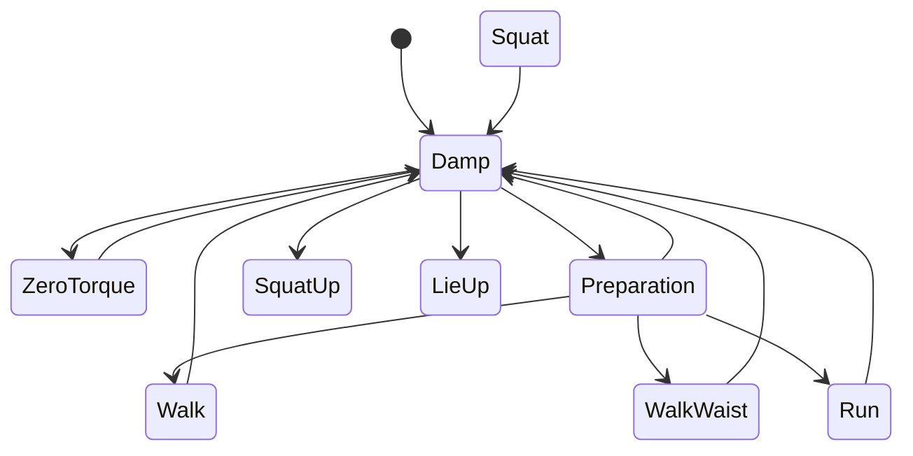

# G1 Robot API — what we send and what comes back

Companion to `ROBOT-HARDWARE.md` (what the physical machine presents) and `OPERATIONS.md`
(where each piece runs and how it is deployed). This file is the **software interface**:
services, api_ids, parameter shapes, error codes, FSM ids, DDS topics and exact message
layouts — assembled from a full read of the vendor source trees on the robot, live
sessions culminating in the robot walking under our control (2026-08-15), and Unitree's
official G1 developer documentation (45 pages).

Every claim is tagged:

- **[live]** — observed on the robot
- **[src]** — read from source on the robot (vendor headers, examples, IDL, recordings)
- **[web]** — published documentation. Two distinct bodies, both unverified against this
  robot: third-party/community material, and Unitree's own official G1 pages. A `[web]`
  claim is a hypothesis, never a fact — official or not.
- **[?]** — believed, not verified. Do not build safety-critical logic on these.

> **Yaw sign, settled 2026-08-20.** A commanded **positive** yaw rotates the G1
> **counterclockwise** (left, seen from above) — the same direction WebXR calls
> positive head yaw. Measured three times off `rt/odommodestate` during the
> first VR teleop session: +5.26°, +5.77°, and again in a full smoke-test run,
> each from a +25° head yaw held for 2 s through `send_velocity`.
>
> This closes the question `turn` was blocked on (_"may rotate the wrong way"_,
> 2026-08-15). Note what it does **not** close: `turn` itself still has
> `works_real=False`, because nobody has watched its closed loop converge. The
> shared sign is verified; the skill is not.
>
> Also measured, and worth re-fitting before anyone trusts a distance: yaw
> **under-travels command by ~2.2x** (25° commanded → ~5.5° achieved), matching
> the ~2.35x `walk_to` measures in translation. The gains are fitted to the sim
> policy and have never been re-fitted to this body.
>
> **And the response is NOT linear.** Re-tuning the teleop yaw policy the same
> day (deadzone 8→6°, full scale 45→30°, cap 0.25→0.30 rad/s) raised the
> commanded rate at a 25° head yaw by 2.07x — and produced **3.4x** more actual
> rotation: +19.5° where the same input had given +5.3° and +5.8°. A larger
> command clears stiction in the walk policy disproportionately well.
>
> The practical consequence: **a single scale factor will not correct this
> path.** Anyone re-fitting the gains should measure at several command
> magnitudes rather than one, or the correction will be right at exactly one
> speed and wrong either side of it. **[live]** 2026-08-20

## Contents

| §   | Section                                                                                                         |
| --- | --------------------------------------------------------------------------------------------------------------- |
| 1   | [Service model, and the per-service api_id trap](#1-the-service-model--and-the-trap-that-has-bitten-us-twice)   |
| 2   | [The `sport` service (loco)](#2-the-sport-service-loco)                                                         |
| 3   | [`motion_switcher` — the ownership service](#3-motion_switcher--the-ownership-service)                          |
| 4   | [The FSM](#4-the-fsm)                                                                                           |
| 5   | [`SET_VELOCITY` (7105) semantics](#5-set_velocity-7105-semantics)                                               |
| 6   | [Arms and gestures](#6-arms-and-gestures)                                                                       |
| 7   | [The `voice` service](#7-the-voice-service)                                                                     |
| 8   | [`robot_state` — the probe service](#8-robot_state--the-probe-service)                                          |
| 9   | [Types and message layouts](#9-types-and-message-layouts)                                                       |
| 10  | [DDS topic census](#10-dds-topic-census)                                                                        |
| 11  | [State and actuation per target (sim vs real)](#11-state-and-actuation-per-target-sim-vs-real)                  |
| 12  | [Solved: `fsm_id = 500` — it was the wrong walk program](#12-solved-fsm_id--500--it-was-the-wrong-walk-program) |
| 13  | [Appendix: WebRTC fallback transport](#13-appendix-webrtc-fallback-transport)                                   |
| 14  | [Open questions](#14-open-questions)                                                                            |

### Citing the official Unitree documentation

Official is not the same as correct, and on this doc set it is not even the same as
G1-specific. Rules that came straight out of reading it: **[web]**

1. **Always carry the page slug and the vendor's update date.** They range from 2024-09 to
   2026-07 and they contradict each other. Where two pages disagree, prefer the newer —
   with one exception below.
2. **Several G1 pages are demonstrably copy-pasted from other robots.**
   `motion_witcher_service_interface` documents "the current **Go2** form … Wheel-Foot
   Form"; `sport_services_interface` calls the G1 a "**robot dog**" in one remark;
   `inspire_dfx_dexterous_hand` describes the **H1**'s USB layout;
   `about_G1`'s "development computing unit" table is an **Intel** spec sheet pasted onto an
   Arm SoC; `remote_control_data`'s decode snippet types the message as the **Go2**
   `LowState_`. Treat wrong-robot residue as the default hypothesis, not the exception.
3. **The exception to "newer wins": struct layouts.** `basic_services_interface`
   (2025-10-21) publishes a `LowState_` missing the leading `version` field and a
   `MotorState_` carrying Go2-only `q_raw/dq_raw/ddq_raw` with `vol`/`sensor` swapped —
   while the older `dexterous_hand` (2025-02-10) matches our shipped IDL exactly. **Never
   hand-write IDL from a doc page.** Our venv's generated IDL is the arbiter; see §9.3.
4. **The docs publish no api_ids at all.** Not one, for any service, across 45 pages — only
   error codes. Every api_id in this file remains `[src]` from the robot's own headers.
5. **The robot wins.** Where an official page contradicts a `[live]` or `[src]` finding of
   ours, ours stands and the conflict is recorded. Those usually mark a firmware or variant
   difference, not our error. The robot's own `GetActionList` (§6.3) has already overruled
   the official gesture table once.

Access note: `support.unitree.com` is a JS SPA that returns a nav shell to plain fetches;
content only came through a text-render proxy (retrying sometimes flips an empty result
into full content), a headless browser got HTTP 567 "Access Restricted", and the Wayback
snapshot is an empty shell. Relevant because Unitree's own `g1_arm_action_error.hpp` cites
that site as the normative FSM-restriction reference.

**A note on dates.** The robot's clock is `Asia/Shanghai` (CST, +0800) and the UTC time is
correct, so on-robot timestamps read roughly a day ahead of local expectation. **[live]**
"2026-08-14 01:40 CST" and "the evening of 2026-08-13 locally" are the same moment.

### The two vendor source trees, and which one counts

Both are on the robot and **they disagree**. Knowing which is which is the difference
between a real api_id and one that does not exist on our firmware. **[live]**

| Tree           | Path                                           | Cloned     | Commit     | Has 7110/7111?         | Has arm 7108/7113? |
| -------------- | ---------------------------------------------- | ---------- | ---------- | ---------------------- | ------------------ |
| `unitree_ros2` | `~/gemm/ros2_ws/src/external/unitree_ros2`     | 2026-07-20 | `668d1ec5` | **no** (stops at 7107) | **no**             |
| `unitree_sdk2` | `~/gemm_ai/xr_teleoperate/vendor/unitree_sdk2` | 2026-08-13 | `21d0a3b2` | yes                    | yes                |

**`unitree_ros2` is the tree that matches this firmware.** The C++ SDK clone is a week
newer than the robot's own OTA and carries constants the control board may not serve. Treat
anything that exists only in the newer clone — 7110, 7111, arm 7108/7113, the whole `agv`
service, `terminations.hpp` — as _declared in an SDK_, **not** as _implemented by firmware
1.5.3.8_. The cheap discriminator is a `3203 Api not implement error` response.

**Firmware identity: package `1.5.3.8`, product `G1_Edu+`.** From
`/unitree/ota/update/1.5.3/package_1.5.3.8_G1_Edu+_upk`; `version.json` carries per-module
versions (`master_service_pc4` 1.0.0.2, `unitree_patch_pc4` 1.0.0.6, `video_hub_pc4`
1.0.2.3) and an **empty** `"Package"` field, so `version.json` alone does not stamp the
firmware. **[live]** This does **not** give the `ai_sport` or `vui_service` versions — those
live on the control board (no SSH), but `robot_state` 1006 `GetPkgVersion` can reach them
over RPC (§8).

SDK archaeology anchors, for dating third-party material: **[web]** `Start()` changed
`SetFsmId(200)` → `SetFsmId(500)` in the C++ SDK on **2025-06-09** (`40c02be`) but in the
Python SDK only on **2026-04-20** (`82d7dde`) — ten months when the two official SDKs
disagreed. The `loco` → `sport` service rename landed 2025-06-13 (`331352d`, which also
added 7107). The Python `g1/audio/loco/arm` subpackages only became installable on
2026-05-11 (`d801b12`, "add init py"), the root cause behind our old `a7dff75` pin's
missing-`g1`-package problem.

---

## 1. The service model — and the trap that has bitten us twice

### 1.1 Name → topic

Every RPC service is a _name_. The SDK mechanically derives the topic pair: **[src]**

```cpp
// include/unitree/robot/channel/channel_namer.hpp
ROBOT_SDK_CHANNEL_PREFIX        = "rt/api/";
ROBOT_SDK_CHANNEL_SUFFIX_CLIENT = "/request";
ROBOT_SDK_CHANNEL_SUFFIX_SERVER = "/response";
```

So service `S` is always `rt/api/S/request` (we publish) and `rt/api/S/response` (we
subscribe). The Python SDK builds the same names in `core/channel_name.py::
GetClientChannelName`. ROS 2 clients write `/api/S/request` — the `rt/` prefix is what
ROS 2 adds on the DDS side, so those are the _same topic_, not two topics. **[src]**

Both directions carry the generic envelope, types shipped by `unitree_sdk2py`: **[src]**

```
unitree_api::msg::dds_::Request_
  header.identity.id       int64   # correlation id
  header.identity.api_id   int64   # <-- the only thing that selects the call
  header.lease.id          int64
  header.policy.priority   int32
  header.policy.noreply    bool
  parameter                string  # JSON, or empty
  binary                   seq<uint8>

unitree_api::msg::dds_::Response_
  header.identity          (echoes id/api_id)
  header.status.code       int32   # 0 = OK; see §1.5
  data                     string  # JSON, or empty
  binary                   seq<uint8>
```

The client-side API-version string (`"1.0.0.0"`, `"1.0.0.14"`, …) is **never put on the
wire** — `Client._SetApiVerson` only stores it. Our bridge omitting it is harmless. **[src]**

### 1.2 The trap: api_ids are scoped per service, not globally

**This has already cost us twice, and it is the single most important thing in this
document.** The same integer means different things on different services, and the service
name is chosen by which `Client(...)` you instantiate — nothing on the wire warns you.

| api_id | On `sport`                              | On `arm`                            | On `motion_switcher`       | On `robot_state`             | On `voice`   |
| ------ | --------------------------------------- | ----------------------------------- | -------------------------- | ---------------------------- | ------------ |
| 1001   | —                                       | —                                   | `CHECK_MODE` (read)        | `SERVICE_SWITCH` (**write**) | `TTS`        |
| 1003   | —                                       | —                                   | `RELEASE_MODE` (**write**) | `SERVICE_LIST` (read)        | `START_PLAY` |
| 7106   | `SET_ARM_TASK` (task ids 0–3)           | `EXECUTE_ACTION` (catalogue, §6.3)  | —                          | —                            | —            |
| 7107   | `SET_SPEED_MODE` (**a motion command**) | `GET_ACTION_LIST` (**a pure read**) | —                          | —                            | —            |

**[src]**

Two concrete failure shapes:

- **7106.** The vendor's `WaveHand()` is `sport`/7106 with `{"data":0}`. Our bridge's `wave`
  is `arm`/7106 with `{"data":26}`. Both are real and both work; they are not two spellings
  of one call. Send the arm catalogue's `26` to the **sport** service and it is not a wave —
  it is an out-of-range task id, answered `7303 Invalid task id`. **[src]**
- **7107.** Reading the gesture catalogue is `arm`/7107, a pure query. The same number on
  `sport` is `SET_SPEED_MODE`, which changes how fast the robot walks. A copy-paste of the
  service name turns a read into a motion command with no error. **[src]**

And a number collision that is _not_ an api_id at all: `motion_switcher`'s **error** codes
are 7001–7009 (§3), while `sport`'s **api_ids** are 7001–7006. Same integers, unrelated
meanings. **[src]**

`apps/bridge/src/bridge/sdk/g1_rpc.py` gets the structure right — it builds one client per
service name and `Client.__CheckApi` refuses any api_id not registered on that client — so
the routing is safe as long as nobody registers an id on the wrong client. **[src]**

### 1.3 Services found on this robot

| Service           | API version           | Topics                                      | Where declared                                         | Evidence                                       |
| ----------------- | --------------------- | ------------------------------------------- | ------------------------------------------------------ | ---------------------------------------------- |
| `sport`           | `1.0.0.0`             | `rt/api/sport/{request,response}`           | firmware-matched ROS 2 tree + newer SDK                | **[src]**, exercised **[live]**                |
| `arm`             | `1.0.0.14`            | `rt/api/arm/{request,response}`             | both trees                                             | **[src]**, exercised **[live]**                |
| `motion_switcher` | `1.0.0.1`             | `rt/api/motion_switcher/{request,response}` | G1 header in the ROS 2 tree                            | **[src]**, answered **[live]**                 |
| `robot_state`     | `1.0.0.2` (b2 client) | `rt/api/robot_state/{request,response}`     | B2-lineage header; colleague verified QoS on this unit | **[src]**                                      |
| `voice`           | `1.0.0.0`             | `rt/api/voice/{request,response}`           | both trees                                             | **[src]**, TTS exercised **[live]** 2026-08-15 |
| `agv`             | `1.0.0.1`             | `rt/api/agv/{request,response}`             | newer SDK only — wheeled G1-D                          | **[src]**, almost certainly absent here        |

Declared in the SDK but **Go2-scoped**, with no G1 counterpart anywhere on this machine:
`vui`, `obstacles_avoid`, `config`, `videohub` / `front_videohub` / `back_videohub`,
`uwbswitch`. **[src]** In particular the G1's vendor obstacle avoidance, if it exists at
all, is **not** the `obstacles_avoid` API.

Names that appear in **no** vendor source, binary or config on this robot — a
filesystem-wide grep over `/unitree`, both vendor trees and both SDKs returns zero hits:
`action_store`, `/api/gesture`, `/api/gpt`, `/api/vla`, `/api/dex3_msg_controller`.
**[live]** The last one appeared only in our own docs — unsourced, struck. `/api/audiohub`
is likewise absent as a DDS RPC service; the name is real but belongs to an app/WebRTC-side
"Audio Hub" firmware component (§7.4). The one survivor of that word list is `slam_nav`,
and only as a key in `/unitree/etc/master_service/protect` (`{"slam_nav": 0}`) — a service
name in a supervisor config with no code behind it on this host. **[live]**

**`slam_operate` is a real, vendor-documented service** — `SERVICE_NAME = "slam_operate"`,
`VERSION = "1.0.0.1"`, api_ids 1801 start mapping / 1802 end mapping / 1804 initialize
pose / 1102 pose navigation / 1201 pause / 1202 resume / 1901 close slam, all JSON — gated
behind the `unitree_slam` **and** `lidar_driver` services being switched on. **[web]**
(`slam_navigation_services_interface`, 2026-07-20.) Our zero-hit grep ran on the Jetson,
and topics/services can be absent until switched on (§8), so the correct statement is
**"documented, not enabled or not installed on this unit"** — `robot_state` 1003
`ServiceList` settles it, and it **works on this unit**: `rpc_code 0`, 2026-08-21. **[live]**

```python
c = _G1Client("robot_state", (1003,), timeout_s=5.0)   # register 1003 and nothing else
c._SetApiVerson("1.0.0.0"); c.Init()
code, data = c.call_raw(1003, "{}")
```

⚠️ **The documented envelope is wrong here.** The web docs describe
`{"succeed":bool,"errorCode":int,"info":str,"data":{}}` **[web]**; this robot returns a
**bare JSON array** of `{"name","protect","status"}` with no envelope at all. Parse
defensively — code expecting `data.succeed` gets an AttributeError on a successful call.

**Status polarity confirmed, and it is the inverted one.** `status` is `0 = running,
1 = stopped` — the opposite of the `swit` input to `ServiceSwitch`. Verified without
trusting the docs: `robot_state` reports `status: 0` _while answering this very call_, so
0 cannot mean stopped. `protect: 1` marks the services `ServiceSwitch` refuses with 5202 —
`basic_service`, `robot_state`, `webrtc_bridge`, `webrtc_signal_server`. **[live]**

Snapshot 2026-08-21 — stopped were `unitree_slam`, `auto_test_arm`, `auto_test_low`,
`ota_box`; **everything else was running**, including `vui_service`,
`audio_player_service`, `chat_go`, `ai_sport` and `lidar_driver`. The two audio services
being up is what rules out "a stopped service" as the reason the mic multicast is silent
(`ROBOT-HARDWARE.md` §8.2).

**`bashrunner` — CONFIRMED PRESENT AND RUNNING on this unit.** `ServiceList` lists it with
`protect: 0, status: 0`, upgrading it from **[?]** to **[live]**, 2026-08-21. The reported
`/api/bashrunner/request` DDS shell-execution path therefore has a live service behind it.
Two consequences, and the second matters more than the first: `docs/DECISIONS.md` D8 can
be designed against something real, **and this robot accepts remote shell execution over
DDS from anything on its wired LAN, with no authentication in the DDS layer.** It is
`protect: 0`, so unlike `basic_service` it can be switched off. Nobody has sent it a
request and this note is not an invitation to.

**Two namespaces, one word.** `robot_state`'s `ServiceSwitch` takes _process/service_
names — Unitree publishes the list as `ai_sport` (Main Motion Control Service),
`basic_service`, `g1_arm_example` (Upper Limb Motion Service), `vui_service` (Audio and
Lighting Control Service), `unitree_slam` (Navigation Service), plus `lidar_driver` named
elsewhere. **[web]** Those are **not** the RPC service names above. `vui_service` in that
list does not contradict the RPC service `vui` being Go2-scoped: `rt/api/vui/*` and the
switchable process `vui_service` are different things. Keep the lists apart or someone
will "correct" one with the other.

**PC1 being closed is vendor policy, not a missing key.** `architecture_description`
(2025-04-30): _"PC1 is dedicated to the Unitree motion control program and is **not open to
the public**. Developers can only use PC2 for secondary development."_ PC1 is the control
board, PC2 the Jetson (addresses in `docs/OPERATIONS.md`). `quick_development` adds
_"Development on Mac and Windows systems is currently not supported."_ **[web]** Running
the bridge onboard the Jetson for `SIM_MODE=real` (see `docs/ARCHITECTURE.md`) is what the
vendor prescribes, not a workaround we invented.

**The FSM does not live on the Jetson.** `/unitree/module/` holds exactly two modules
(`master_service`, `video_hub_pc4`), the vendor's own install bundle confirms that is the
complete "pc4" payload by design, and `strings` on the `master_service` binary yields no
`fsm` / `ai_sport` / `motion_switch` / `loco` hits at all. **[live]** Every motion service
runs on the control board, which has no SSH. **No source reading of the FSM owner is
possible from any host we control** — experiments are the only instrument.

(`master_service` supervises only `ota_pipe` and the two video-hub nodes; stopping it
changes camera behaviour and nothing else, though it also runs `amixer set Speaker 75%` at
boot, so while it is down the Jetson-side speaker volume is unset. **[live]**)

### 1.4 There is no ownership arbitration

`grep -rn 'Client(.*true)'` across the whole SDK include tree returns **zero** hits: every
vendor client is constructed with `enableLease = false`, including
`LocoClient() : Client(LOCO_SERVICE_NAME, false)`. **[src]**

The lease mechanism exists — api*id **101 LEASE_APPLY** (`{"name": str}` →
`{"id": int64, "term": int64}`), **102 LEASE_RENEWAL**, default term 1 000 000 µs — but
nothing uses it. **[src]** So the robot does not arbitrate: \_whoever publishes to the
request topic is obeyed*. The one-commander invariant (`docs/OPERATIONS.md`) is enforced
entirely by our own scripts and by the teams sharing the robot agreeing, never by the
firmware.

The corollary is a useful tell: codes **3205 / 3206 / 3207** (lease denied / not in cache /
already in cache) should be impossible. If one ever appears, something outside this SDK has
taken a lease.

### 1.5 Generic RPC codes (every service)

| Code      | Meaning                                                   | Side       | Notes                                                                                                                                                                          |
| --------- | --------------------------------------------------------- | ---------- | ------------------------------------------------------------------------------------------------------------------------------------------------------------------------------ |
| 0         | OK                                                        | —          | `0` does **not** mean the request had an effect (§3.1), and on `sport`/7101 it does not even mean the id exists (§12)                                                          |
| 3001      | Unknown                                                   | server     |                                                                                                                                                                                |
| 3102      | Send request error                                        | client     |                                                                                                                                                                                |
| 3103      | Api is not registed                                       | **client** | You called an api_id you never registered on that client                                                                                                                       |
| 3104      | Call api timeout                                          | **client** | Says nothing about robot state. This is what produced our false gesture failures — see §6.5                                                                                    |
| 3105      | Response api not match                                    | client     |                                                                                                                                                                                |
| 3106      | Response data error                                       | client     |                                                                                                                                                                                |
| 3107      | Lease is invalid                                          | client     |                                                                                                                                                                                |
| 3201      | Send response error                                       | server     | **Never reaches the client** — docs state it "occurred on the server and will not be returned to the client". Seeing one client-side should be treated as impossible **[web]** |
| 3202      | Server internal error                                     | server     |                                                                                                                                                                                |
| 3203      | **Api not implement**                                     | **server** | The firmware does not serve that api_id. The discriminator for every "does this firmware have X?" question                                                                     |
| 3204      | Api parameter error                                       | server     |                                                                                                                                                                                |
| 3205      | Lease denied _(header)_ / **"Request rejected"** _(docs)_ | server     | Not necessarily proof someone took a lease — the official gloss is a plain refusal **[web]**                                                                                   |
| 3206–3207 | Lease errors                                              | server     | Should be unreachable — see §1.4                                                                                                                                               |

**[src]**, with the 3201 and 3205 remarks **[web]** from `dds_services_interface`.

**The default RPC timeout is 1 second.** `SetTimeout(float seconds)` — _"If no timeout is
set, the default timeout time is 1 second."_ **[web]** That is the documented number behind
§6.5: the arm service acks on motion completion (4.19 s for a wave), so every gesture
returned `3104` against a 1 s default while the robot was visibly obeying.

Two reads on the generic client we do not use and should: **[web]**

- **`GetServerApiVersion()`** — returns the _server's_ API version for a service. Zero
  risk; the `arm_action_interface` example compares client against server before
  proceeding. Between this and `robot_state` 1006 (§8) we can version the control board.
- **`ChannelSubscriber::GetLastDataAvailableTime()`** — monotonic microseconds since boot,
  `-1` if the channel was never initialised. A cleaner source for `lowstate_age_s` and the
  `stale_lowstate_*` fault than our own receipt-time bookkeeping, because it distinguishes
  "never started" from "started but silent".

One thing **not** to copy: `ChannelFactory::Init`'s third argument, `enableSharedMemory`.
The docs say to leave it false "when developing applications outside of G1", which tempts a
reader into enabling it now that our bridge runs onboard. Don't — the publishers we care
about live on the control board, a **different host**, so shared memory cannot help and can
only add failure modes. **[web]**

---

## 2. The `sport` service (loco)

Authoritative source: `~/gemm/ros2_ws/src/external/unitree_ros2/example/src/include/g1/
g1_loco_client.hpp`, the firmware-matched tree. **[src]** Note the G1's locomotion service
is literally named **`sport`** — renamed from `loco`, with a precise threshold:
_"ai_sport >= 8.2.0.0 version is `LOCO_SERVICE_NAME = "sport"`; lower than this version
`LOCO_SERVICE_NAME = "loco"`."_ **[web]** (`rpc_routine`, 2025-09-15.) This unit's
`ai_sport` is past 8.6.x — see the 801→802 renumber in §4.1 — so `sport` is right for us.
Material calling the G1 service `loco` is stale.

**Cross-model traps.** Three other Unitree humanoids produce recipes that look plausible
for a G1 and are wrong on the wire: **[web]**

- **H2** uses the same service name (`sport`), the same api_ids and the **same error codes
  with identical strings** — but `H2 Start() = SetFsmId(601)` where G1 is 500/501. An
  H2-sourced snippet is indistinguishable from a G1 one until the id goes out.
- **H1** still uses service `loco` (api version 2.0.0.0) with ids at a +1000 offset from
  the G1's (8101 = SET_FSM_ID …) — but the offset **breaks at x106**: G1 7106 is
  SET_ARM_TASK while H1 8106 is SET_PHASE (H1's arm task is 8107), and H1 has odometry
  api_ids 8201–8204 the G1 lacks. H1-derived material misleads at exactly the arm-task id.
- **200** was `Start()` before 2025-06 (C++) / 2026-04 (Python). Both eras of blog post
  are on the internet and neither says which era it is from. Never send 200 or 601.

### 2.1 api_id table

| api_id | Call                       | Request parameter                                | Response `data`          |
| ------ | -------------------------- | ------------------------------------------------ | ------------------------ |
| 7001   | `GET_FSM_ID`               | **empty** parameter string — _not_ `"{}"`        | `{"data": <int>}`        |
| 7002   | `GET_FSM_MODE`             | as above                                         | `{"data": <int>}`        |
| 7003   | `GET_BALANCE_MODE`         | as above                                         | `{"data": <int>}`        |
| 7004   | `GET_SWING_HEIGHT`         | as above                                         | float **[web]**          |
| 7005   | `GET_STAND_HEIGHT`         | as above                                         | float **[web]**          |
| 7006   | `GET_PHASE` _(deprecated)_ | as above                                         | float list **[web]**     |
| 7101   | `SET_FSM_ID`               | `{"data": <int>}`                                | not parsed by any client |
| 7102   | `SET_BALANCE_MODE`         | `{"data": <int>}`                                | "                        |
| 7103   | `SET_SWING_HEIGHT`         | `{"data": <float>}`                              | "                        |
| 7104   | `SET_STAND_HEIGHT`         | `{"data": <float>}`                              | "                        |
| 7105   | `SET_VELOCITY`             | `{"velocity":[vx,vy,omega],"duration":<float>}`  | "                        |
| 7106   | `SET_ARM_TASK`             | `{"data": <int>}` — **task ids 0–3 only** (§6.2) | "                        |
| 7107   | `SET_SPEED_MODE`           | `{"data": <int>}` — **0/1/2/3 only** (below)     | "                        |

**[src]** for the api*ids and every `SET*_`parameter shape — read verbatim from`g1_loco_client.hpp`. The getter rows carry two caveats: the header passes an **empty**
parameter string (the _"empty string (C++) / `{}` (Python) — both accepted"* line is
community `[web]`, untested here — send the empty string), and the getter *response\* types
beyond `{"data": <int>}` are **[web]** — no client on this robot parses them.

**The range stops at 7107** in the firmware-matched tree. 7110/7111 exist only in the
newer SDK clone — see §2.4. `7008 GET_AVAILABLE_FSM_IDS` is declared for **H2** only, and
this firmware answers it **`3203` — not implemented** (probed 2026-08-15 **[live]**), so
there is no authoritative FSM table obtainable from the robot.

**No vendor client parses a response body for any setter** — only the int32 status code is
read. **[src]** So "did it work?" cannot be answered from a setter response; read state
back instead (7001/7002, or `rt/sportmodestate` §9.2).

**`SET_SPEED_MODE` has a documented ladder, scoped to running.** `speed_mode` takes
**0 : 1.0 m/s, 1 : 2.0 m/s, 2 : 2.7 m/s, 3 : 3.0 m/s**, described as _"Adjust the maximum
speed **in running mode**"_. **[web]** Whether it affects 500/501 walk at all is unstated,
and 3.0 m/s must never be reachable from an LLM-drivable path — if this is ever wired,
clamp to 0..3 and default 0.

**`SET_VELOCITY` is documented as firmware-clamped** — _"The program will automatically
set the cropping to the allowed range"_ — but the bound is not published, and the sign and
axis convention is documented nowhere (§5.3). **[web]**

### 2.2 Error codes

| Code | Symbol                                      | Message / meaning          |
| ---- | ------------------------------------------- | -------------------------- |
| 7301 | `UT_ROBOT_LOCO_ERR_LOCOSTATE_NOT_AVAILABLE` | "LocoState not available." |
| 7302 | `UT_ROBOT_LOCO_ERR_INVALID_FSM_ID`          | "Invalid fsm id."          |
| 7303 | `UT_ROBOT_LOCO_ERR_INVALID_TASK_ID`         | "Invalid task id."         |

**[src]** These three are declared with identical numbers _and identical strings_ for G1,
H2 and R1 — the error code alone never tells you which robot family you are talking to.
**[web]** There is no 7403. `7304 FSM ID return denied` is declared for R1 only, so a 7304
here would be undocumented rather than impossible. **[web]**

Observed live: **7301** from `GET_BALANCE_MODE` at `fsm_id=802` (2026-08-11) and from
7003/7004/7005/7006 even at `fsm_id=501` with a controller loaded and walking done
(2026-08-15) — those getters are simply unavailable on this build. ⚠️ **The 7301 responses
carry a plausible-looking body** (`{"data":0}`, `{"data":0.0}`) _alongside_ the error
code. Read the code, not the payload, or you will record a stand height of 0.0 m as fact.
**[live]**

**7302 has never been observed** — and cannot be provoked by a bad id: `SetFsmId(99999)`
returns **code 0** (§12). The sport service does not validate FSM ids.

### 2.3 High-level method → wire mapping

Read verbatim from `g1_loco_client.hpp`. **[src]**

| Vendor method                 | Sends                                                                     |
| ----------------------------- | ------------------------------------------------------------------------- |
| `ZeroTorque()`                | `SetFsmId(0)`                                                             |
| `Damp()`                      | `SetFsmId(1)`                                                             |
| `Squat()`                     | `SetFsmId(2)`                                                             |
| `Sit()`                       | `SetFsmId(3)`                                                             |
| `StandUp()`                   | `SetFsmId(4)`                                                             |
| `Start()`                     | `SetFsmId(500)`                                                           |
| `StopMove()`                  | `SetVelocity(0,0,0)` — **not** a special stop opcode                      |
| `Move(vx,vy,vyaw,continuous)` | `SetVelocity(vx,vy,vyaw, continuous ? 864000 : 1.0)`                      |
| `HighStand()` / `LowStand()`  | `SetStandHeight(UINT32_MAX)` / `SetStandHeight(0)` — saturating sentinels |
| `BalanceStand()`              | `SetBalanceMode(0)`                                                       |
| `ContinuousGait(flag)`        | `SetBalanceMode(flag ? 1 : 0)`                                            |
| `SwitchMoveMode(flag)`        | **sends nothing** — a client-side latch only                              |
| `WaveHand(turn_flag)`         | `SetTaskId(turn_flag ? 1 : 0)` → sport/7106                               |
| `ShakeHand(stage)`            | `SetTaskId(2)` or `SetTaskId(3)` → sport/7106 (§6.2)                      |

The **newer** SDK clone drops `StandUp()` entirely and replaces it with
`Squat2StandUp() = SetFsmId(706)` and `Lie2StandUp() = SetFsmId(702)`. **[src]** The C++
and Python SDKs also diverge on helpers (Python has no `StandUp`/`Squat`/`ContinuousGait`;
its `BalanceStand()` requires a `balance_mode` argument), and **no Unitree SDK provides a
convenience method for 501** — only `SetFsmId(int)` reaches it. **[web]**

### 2.4 7110 / 7111 — declared, unproven, and not a route to walking

From the newer SDK clone only: **[src]**

```cpp
ROBOT_API_ID_LOCO_SWITCH_TO_USER_CTRL     = 7110;   // sends {"data": false}
ROBOT_API_ID_LOCO_SWITCH_TO_INTERNAL_CTRL = 7111;   // {"data": 0|1|2}
enum class InternalFsmMode { LAST = 0, PASSIVE = 1, WALKRUN = 2 };
```

Unitree documents the feature as **User Development Mode**: _"an interface that
temporarily switches the robot into debug mode, allowing a custom controller to take over
the robot and then exit flexibly … users can send low-level commands to the motors using
the topic `rt/user_lowcmd`."_ Entering it **from walking/running** and returning via
`InternalFsmMode::WALKRUN` is explicitly supported. **[web]** It is still not a route to
built-in walking — it hands the robot to _our_ low-level control, the opposite of loading
a walk policy. The vendor's safety rule if we ever use it: _"make sure that both the first
and last actions of your motion control are in a standard standing posture! Otherwise, the
robot may lose control."_ **[web]**

Wire-shape conflict, recorded: the documented prototype is `SwitchToUserCtrl()` with no
parameters, while the newer on-robot SDK sends `{"data": false}`. The robot-side header
wins for the wire shape. **[src]** vs **[web]** Both ids remain absent from the
firmware-matched tree — `3203` vs `3204` vs `0` discriminates, but each is a write, so
this stays low priority.

---

## 3. `motion_switcher` — the ownership service

**Run `CheckMode` first, before anything else, whenever the robot ignores a command.**
This is the highest-value diagnostic we have and it costs one read-only RPC. The bridge
exposes it as the `check_motion_mode` tool (`g1_rpc.check_motion_mode`, 1001 registered
and nothing else).

### 3.1 Why it matters more than its size suggests

The `sport` service answers **`code 0`** in two completely different situations:

1. the FSM id you asked for is not enterable from where you are, and
2. **no motion controller is loaded at all**, so there is nothing to execute any FSM
   transition.

From the `sport` service those are **indistinguishable** — same code, same silence, same
`fsm_id` afterwards. `motion_switcher` 1001 separates them in one call. On 2026-08-14 it
returned an empty `name`, which is what "nothing is loaded" looks like; in that state
7001/7002 return nothing at all, so `get_state` reports `fsm_id=None`, `fsm_mode=None`,
`posture=unknown`. **[live]** Anyone who sees those nulls and concludes "the robot is off"
or "DDS is broken" will be wrong: the DDS link is fine, the robot simply has no
controller.

### 3.2 API

Service `motion_switcher`, api version `"1.0.0.1"`, topics
`rt/api/motion_switcher/{request,response}`. **[src]**

| api_id | Call           | Parameter                                              | Response                               | Effect                     |
| ------ | -------------- | ------------------------------------------------------ | -------------------------------------- | -------------------------- |
| 1001   | `CHECK_MODE`   | `"{}"` — an empty string also works per the C++ header | `{"name": "<mode>", "form": "<form>"}` | **getter, safe**           |
| 1002   | `SELECT_MODE`  | `{"name": "<name_or_alias>"}`                          | none                                   | **loads a controller**     |
| 1003   | `RELEASE_MODE` | none / `"{}"`                                          | none                                   | **unloads the controller** |
| 1004   | `SET_SILENT`   | `{"silent": true\|false}`                              | none                                   | write                      |
| 1005   | `GET_SILENT`   | empty                                                  | `{"silent": bool}`                     | getter                     |

`form` is optional in the vendor's `fromJson` — it is only parsed
`if (json.find("form") != json.end())`. **[src]**

Error codes, all scoped to this service: 7001 parameter invalid, 7002 **switcher is
busy**, 7003 event invalid, 7004/7005 name or alias invalid, 7006 check cmd execute error,
7007 select cmd execute error, 7008 release cmd execute error, 7009 save customize data
error. **[src]** Do not confuse these with `sport`'s api_ids 7001–7006 (§1.2).

Conflict with the official table, recorded and not resolved: Unitree's own list omits
**7003 entirely** and glosses **7005 as "Internal command execute error"**, not a second
name/alias failure. **[web]** (`motion_witcher_service_interface`, 2025-11-12 — vendor's
typo.) The robot's header ships with our firmware and wins, but a 7005 in the wild may be
an execution failure rather than a bad name. The official 7004 gloss is _"Unsupport mode
name"_ — the code to expect if `SelectMode("ai")` is wrong for this build.

### 3.3 Mode names

The vendor's own G1 example decodes `{form, name}` like this, for `form == "0"`: **[src]**

| `name`     | Service that owns the robot                          |
| ---------- | ---------------------------------------------------- |
| `normal`   | `sport_mode`                                         |
| `ai`       | `ai_sport`                                           |
| `advanced` | `advanced_sport`                                     |
| _(empty)_  | "The motion control-related service is deactivated." |

**Live reading, 2026-08-14: `rpc_code 0`, `{'form': '0', 'name': ''}`** — no controller
loaded, the robot in what `xr_teleoperate` calls debug mode. **[live]** The docs confirm
from the other side: after releasing the mode, _"the built-in operation control is
**completely exited** and the high-level motion service becomes invalid."_ **[web]** So an
empty name plus 7001/7002 answering nothing is not a fault — it is the documented
consequence of debug mode. See §4.6.

**Our `normal`/`ai`/`advanced` decode is the only source for these names.** The official
page points at a _"Motion Control Mode Name"_ table for the valid `SelectMode` strings —
**and that table does not exist** on any of the 45 pages. The same page is Go2 copy-paste,
so it should not be treated as a G1 source at all. **[web]** The indirect corroboration is
`robot_state`'s service list naming `ai_sport` the "Main Motion Control Service" (§8),
which lines up with `ai` → `ai_sport`.

### 3.4 Recovering a released mode — three routes, in increasing violence

1. **`SelectMode("ai")`** — motion_switcher 1002. What `xr_teleoperate`'s own
   `Exit_Debug_Mode()` does. **[src]** Expect `7004 Unsupport mode name` if the string is
   wrong for this build.
2. **The remote.** No documented button exits debug mode directly. The documented path
   back is **L2 + UP** from damping, which re-enters Lock Standing (fsm 4). **[web]**
   (One community report — issue #43, 2025-02 — claims the only way out is a reboot, with
   `ai_sport` greyed out in the app while in debug mode; likely an older-firmware
   behaviour. Try L2+UP first, keep reboot as the fallback. **[web]**)
3. **`robot_state` `ServiceSwitch("ai_sport", 1, status)`** — if `ServiceList` (1003) ever
   shows `ai_sport` switched **off**, this turns it back on. **[web]** Errors `5201`
   (switch execution error), `5202` (service is protected). ⚠️ **Polarity foot-gun:** the
   _input_ `swit` is `1 = on, 0 = off`, but the _returned_ `status` is documented
   `0 = on, 1 = off` — **inverted**. §8 carries the same warning.

**Route 3 is a write and route 1 transfers ownership of the robot.** Neither belongs in an
LLM-callable tool. Register 1001 and nothing else — registering an api_id you do not
intend to send is how it gets sent by accident later. (The bridge's client does exactly
this.)

The no-controller state is reachable by accident from the other stack on this robot:
`xr_teleoperate`'s `Enter_Debug_Mode()` loops `ReleaseMode()` until `CheckMode` returns an
empty name, and it runs automatically whenever `teleop_hand_and_arm.py` is started
**without** `--motion`. `Exit_Debug_Mode()` calls `SelectMode(nameOrAlias='ai')`. **[src]**
So a teleop session deliberately leaves the robot with no controller loaded — the
exclusivity model in `docs/OPERATIONS.md` covers this.

---

## 4. The FSM

### 4.1 The state table, and the fact that nobody agrees on the names

Three sources name these ids and **all three differ**. **When reading anyone's notes,
translate to the number first.**

| id  | Vendor C++ header               | Official docs **[web]**                                          | Our `g1_protocol.Mode` | Evidence                                                                                                                                                 |
| --- | ------------------------------- | ---------------------------------------------------------------- | ---------------------- | -------------------------------------------------------------------------------------------------------------------------------------------------------- |
| 0   | `ZeroTorque()`                  | Zero torque                                                      | `ZERO_TORQUE`          | **[live]** read alongside `posture=zero_torque` — the first confirmed FSM-id → posture map entry                                                         |
| 1   | `Damp()`                        | Damping                                                          | `DAMP`                 | **[live]** sent 2026-08-13, `fsm_id → 1`                                                                                                                 |
| 2   | `Squat()`                       | —                                                                | `SQUAT`                | **[src]** — never sent by us                                                                                                                             |
| 3   | `Sit()`                         | —                                                                | `SEATING`              | **[src]**                                                                                                                                                |
| 4   | **`StandUp()`**                 | **"Lock Standing"** / **"Ready Mode"**, No Balance Control       | **`PREPARATION`**      | **[live]** sent 2026-08-13, robot physically stood (odom z 0.04 → ~1.00 m)                                                                               |
| 500 | **`Start()`**                   | **"Walk Motion"** — the **1-DoF-waist** program, remote **R1+X** | **`WALK`**             | **[live]** accepted `code 0`, **no transition on this chassis** — §12                                                                                    |
| 501 | _(absent from every header)_    | **"Walk Motion-3Dof-waist"** — remote **R1+Y**                   | `WALK_WAIST`           | **[live]** — **this machine's walk program; the robot walked in it 2026-08-15**                                                                          |
| 503 | —                               | —                                                                | `DANCE`                | **[?]** our enum only — unsourced                                                                                                                        |
| 550 | —                               | —                                                                | —                      | **[live]** read once, 2026-08-15; appears in no table anywhere. Unexplained                                                                              |
| 702 | `Lie2StandUp()` _(newer SDK)_   | "Lie Down, Stand Up"                                             | `LIE_UP`               | **[src]**, in the official FSM table too **[web]**                                                                                                       |
| 706 | `Squat2StandUp()` _(newer SDK)_ | "Balance Squat, Squat Stand"                                     | `SQUAT_UP`             | **[src]** for the id. The claim that the Python SDK sends 706 for **both** directions (a toggle) is **[web]** and unchecked — read 7001 before and after |
| 801 | —                               | "Run", remote **R2+A**                                           | `RUN`                  | **[web]** — do not send on this chassis, see below                                                                                                       |
| 802 | —                               | **= 801 renumbered on 29-DoF `ai_sport` ≥ 8.6.x**                | _(observed value)_     | **[live]** read 2026-08-11                                                                                                                               |
| 812 | —                               | —                                                                | `CLIMB`                | **[?]** our enum only — unsourced                                                                                                                        |

The official Expert-interface table (`sport_services_interface`, 2026-07-13) is the only
vendor-authored enumeration: 0 Zero Torque, 1 Damping, 2 Position Control Squat, 3
Position Control Sit Down, 4 Lock Standing (all five "No Balance Control"), 706, 702, 500,
501, 801. **No 503, no 812** anywhere in 45 pages. **[web]**

**802 is Run.** The docs' remark on Run: _"The 29dof device `ai_sport` was updated to
version 802 after version 8.6.x.x"_ — Run was renumbered to **802** on 29-DoF `ai_sport`
≥ 8.6.x. Ours is a 29-DoF machine (`mode_machine = 5`, §4.2) and read 802 live. So the arm
header's gesture-permitted set reads as {500, 501, **802**} on this firmware, and **801
should never be sent on this chassis**. **[web]** + **[live]**

The vendor's own glossary, verbatim and worth having: **[web]**
_Zero Torque_ — motors stop, **no** damping felt when swinging. _Damping_ — motors stop,
**clear** damping felt, "which can enter the ready mode". _Squat_ / _Seating_ — assumed
slowly over 5 s, no balance control. _Continuous Walking_ — always stepping. _Standing_ —
stops stepping at zero stick, steps when disturbed or commanded. The damping-enters-ready
line confirms the **1 → 4** edge in the reference transition table (§4.3). On id 4 the
docs call it **Ready Mode** — _"the robot will slowly swing out the **preparatory posture
before the motion mode** within 5 seconds."_

### 4.2 `fsm_mode`, `mode_pr`, `mode_machine` — three fields, none of them the FSM id

- **`fsm_mode`** (api 7002) is a **documented gate on mode switching**. Official text:
  _"0: Static, allows switching to other modes / 1: Dynamic, switching to most modes is
  not allowed … When the robot's current state/posture is unsuitable for mode switching,
  we prohibit the robot from changing modes. … Damping mode, as the ultimate fallback, can
  always be activated."_ **[web]** (The same page also glosses it "0: standing / 1:
  moving" — read it as _static/dynamic_, the safety-relevant framing.) **Only 0 and 1 are
  documented anywhere.** The arm header implies a **3** exists ("in the state 801, the
  actions are only supported in the fsm mode {0, 3}") **[src]**; the widely-repeated
  **2 = "feet unloaded"** claim rests on a single self-citing LLM-generated repo — struck.
  **[?]** Observed live: 0 almost always; **1 once, at fsm 4** (2026-08-15). **[live]**
  Read 7002 (or `rt/sportmodestate`, §9.2) immediately before every 7101, log both
  together, and refuse-and-report rather than send blind when `fsm_mode != 0`.
- **`mode_machine`** is the **chassis variant**, not a mode. `basic_services_interface`
  (2025-10-21) comments the field in `LowCmd_` verbatim:
  **`// G1 Type：4：23-Dof; 5: 29-Dof; 6: 27-Dof (29Dof Fitted at the waist)`**. **[web]**
  Ours reads **5** at `fsm_id` 0, 4 and 802 alike **[live]** — a 29-DoF machine with a
  3-DoF waist, on the firmware's own account. Read simultaneously with different `fsm_id`
  values on two occasions, which settles that they are **independent fields** — never
  label one with the other. **[live]**
  ⚠️ A second vendor page (`joint_motor_sequence`, 2025-03-17) gives an incompatible
  numbering — 23-DoF `== 1`, 29-DoF `== 2`, 14-DoF `== 9`. Side with the newer page:
  **our live value 5 is a member of only the newer set**. **[web]** Two rules: surface
  `mode_machine` decoded (23/29/27-DoF) rather than as a bare integer, and **never
  hardcode it in a `LowCmd_` — echo back what `LowState_` reported**, as the vendor
  examples do. If it ever reads **6**, the waist has been fastened and the 501 branch may
  no longer apply.
- **`mode_pr`** selects the parallel-mechanism control convention: `PR = 0` (series
  pitch/roll), `AB = 1` (parallel A/B). Must also be set correctly in any `LowCmd_`.
  **[src]** It governs the **ankles _and the waist_** — the vendor comment reads
  _"Parallel mechanism (**ankle and waist**) control mode"_, and the joint table gives
  `WAIST_A`/`WAIST_B` as the `AB` names for indices 13/14. **[web]**

### 4.3 Transition rules

**What the firmware enforces is unknown, and the vendor's answer is an unreadable image.**
Every `Start`/`Damp`/`Squat`/`Sit`/`StandUp`/`ZeroTorque` entry in
`sport_services_interface` carries the identical remark pointing at the "Mode Switching"
section of `remote_control`, whose entire content is one JPEG:
`https://oss-global-cdn.unitree.com/static/98431a05f8e747709722e901d32d8ce3_11798x7046.jpg`
**[web]** Transcribing it remains the only route to the authoritative transition graph
(§14). The remote sticker PDFs linked at the top of `remote_control` are versioned by
Motion Control Version with separate 29-DoF and 23-DoF sheets — the 29-DoF > 8.6.0.0
sheet matches this machine and may name the FSM ids behind the R1+X / R1+Y combos.

**Documented preconditions for entering locomotion:** **[web]**

| Precondition                                                   | Source                                                                                                                     |
| -------------------------------------------------------------- | -------------------------------------------------------------------------------------------------------------------------- |
| Reach **Lock Standing (4)** first                              | both bring-up variants, and the `remote_control` chain ① → ② → ③/⑦/⑧                                                       |
| **Feet on the ground, bearing weight**                         | _"After descending the suspension rope, the G1 feet touch the ground. Press R2 + A … and then the control program starts"_ |
| **`fsm_mode == 0`** (static)                                   | _"switching to most modes is not allowed"_ while dynamic                                                                   |
| **Built-in motion control running**, i.e. **not** debug mode   | _"the high-level motion service becomes invalid"_ in debug mode                                                            |
| **Waist DoF must match the id** — 500 for 1-DoF, 501 for 3-DoF | the R1+X / R1+Y split (§4.4), confirmed by §12                                                                             |
| Ready mode takes **~5 s** to assume its posture                | _"within 5 seconds"_                                                                                                       |

And what the docs **do not** require: no battery/SOC threshold for any FSM id, no
`BalanceStand` and no `SetStandHeight` before `Start()`, no intermediate state between 4
and 500/501 beyond 4 itself. **[web]** (Community bring-up scripts that ramp
`SetStandHeight` before `Start()` are one team's practice, not a documented precondition.)

**Client-side reference table — reference data only, nothing enforces it.**
`g1_protocol.py` records a rule set taken from `legion1581/unitree_ui` (an **E-grade**
reverse-engineered source). A `can_transition()` helper built on it was never called by
any skill and was removed rather than wired up: encoding E-grade rules as a client-side
gate would refuse transitions the firmware would have accepted, turning a robot problem
into a bridge problem. The firmware rejects what it rejects and that is the answer we
want. **[web]**



**Damp is the hub**: `ZeroTorque`, `Preparation`, `SquatUp`, `LieUp` are reachable only
from `Damp`; `Preparation` (4) is the sole gateway into locomotion; every
locomotion-active mode drops straight back to `Damp` — the same edge `stop_everything`'s
real-hardware fallback dispatches (`SET_VELOCITY(0,0,0)` then damp, selected per
`SIM_MODE`). Whether that fallback has ever been exercised live is still open —
smoke-test it before relying on it. Legality beyond these edges (Seating, Dance, Climb,
SquatUp onward) is the firmware's call, not confirmed. Note `Mode.SQUAT` (2) is never
actually sent: the `squat` skill dispatches `SQUAT_UP` (706), matching the reference
implementation.

Observed live with a controller loaded: **[live]**

| Sent                  | rpc | Result                                                                       |
| --------------------- | --- | ---------------------------------------------------------------------------- |
| `SetFsmId(1)` Damp    | 0   | `fsm_id → 1`, `posture=damp` (2026-08-13)                                    |
| `SetFsmId(4)` StandUp | 0   | `fsm_id → 4`, robot stood, odom z 0.04 → ~1.00 m (2026-08-13)                |
| `SetFsmId(500)` Start | 0   | **`fsm_id` stayed 4** — 500 is the wrong walk program for this chassis (§12) |
| `SetBalanceMode(0)`   | 0   | no `fsm_id` change                                                           |
| `SetFsmId(501)`       | 0   | **`fsm_id → 501`, robot balanced, then walked** (2026-08-15, §12)            |

### 4.4 The canonical bring-up sequence

Unitree's own procedure, condensed to a runbook with the vendor's wording kept where it
carries information. All **[web]**, from `quick_start` (2025-11-12) and `remote_control`
(2026-06-25).

**Use the L2 forms.** `quick_start`'s "sitting in a chair" variant writes **L1**+A / L1+UP
/ L1+LEFT where its own hanging variant and the whole newer `remote_control` key table
write **L2**. Older firmware used L1+ combos — L1+A damp, L1+UP lock stand, sighted at
fw V1.0.2 and on a G1 EDU ≥ 1.3.0 — so a web guide citing L1+ is describing an earlier
remote-mapping generation, not a different robot. Prefer L2.

**Variant A — hanging on the protective rack. This is our situation.**

1. _"Use the protective rack to hang the G1 to ensure safety."_ Fit the battery — _"when
   you hear the 'click ~' sound, the battery pack is installed."_
2. _"After hanging G1, put it in its natural position."_
3. Short-press the battery power switch once, then long-press it for **more than 2
   seconds**.
4. Wait **~1 minute**. _"When the ankle hit the limit sound, the initialization is
   successful."_ Then **wait another 30 seconds.**
5. **L2 + B** → damping. (LED **solid orange**.) This "unlocks the control".
6. **L2 + UP** → **Lock Standing / Ready Mode**, fsm 4. The robot rises over ~5 s.
7. **Lower the suspension rope until the feet touch the ground and bear weight.**
8. **Enter locomotion.** Three different entries, not interchangeable:
   - **R2 + A** → _Run Control_, i.e. **801/802**. The vendor's own "regular boot
     process" chain uses this (① → ② → ③) — very likely how this robot reached the
     `fsm_id = 802` recorded on 2026-08-11.
   - **R1 + X** → _Main Operation Control_ = **500**, the **1-DoF-waist** walk program.
   - **R1 + Y** → the **3-DoF-waist** equivalent = **501**. _"Only Used For 3-DOF Waist
     structure, recommended to use R1 + Y mode."_ **On this 29-DoF machine, R1 + Y is the
     one to press** — see §12.
9. _"After the G1 movement is stabilized, the hook can be completely released."_ Sticks
   now drive it; **START** toggles standing ↔ walking.

**Variant B — starting seated in a chair.** Power on → wait ~1 min for zero torque →
**L2+A** damping → hold the shoulder and **L2+UP** to the ready state → _"After G1 is
straightened and standing, you can press R1 + X (1 degree of freedom waist) or R1 + Y (3
degrees of freedom waist) to enter the operation control state."_

**The vendor's own three chains**, in its ①…⑧ symbols (① L2+B damping, ② L2+UP lock
stand, ③ R2+A run control, ④ L2+LEFT seated, ⑤ L2+X lying-and-standing, ⑥ L2+A squat
switch, ⑦ R1+X main operation control, ⑧ R1+Y 3-DoF main operation control):

```
regular:    boot → ① → ② → ③ → demo → ④ (chair seat) → power off
lying:      boot (crotch post flat on the ground) → ① → ⑤ → demo → ⑥ → power off
squatting:  boot (squatting) → ① → ⑥ → demo → ⑥ → power off
```

**Shutdown.** Hanging: **L2+B** to damping, then power off — _"or press L2+R2 to enter
debug mode, or press L2 + UP to re-enter ready mode."_ Seated: **L2+LEFT**, help it sit,
then **L2+A** back to damping.

**Emergency stop: L2 + B.** _"G1 goes into damped mode, which will losing balance and
falling down."_ It works **even inside debug mode**. It is the one combination everyone in
the room should know.

⚠️ **With dexterous hands fitted**, the vendor warns against starting the device in the
lying or squatting positions (risk of damaging the hands) and against "running or balance
tests" generally. The hand-identity question lives in `docs/ROBOT-HARDWARE.md`.

### 4.5 Remote-control reference, and the LED strip

**Key description**, verbatim. The vendor writes every entry as _hold the first key, click
the second_. **[web]**

| Combination | Effect                                     |     | Combination               | Effect                            |
| ----------- | ------------------------------------------ | --- | ------------------------- | --------------------------------- |
| L2 + R2     | **Debug mode**                             |     | SELECT + Y                | Wave hand                         |
| L2 + Y      | Zero torque                                |     | SELECT + A                | Handshake                         |
| L2 + B      | ① Damping / **e-stop**                     |     | SELECT + X                | Turn around and wave              |
| L2 + UP     | ② Lock stand                               |     | R2 + DOWN / R2 + UP       | Slow / fast running (in ③)        |
| L2 + LEFT   | ④ Seated                                   |     | START + UP / START + DOWN | Forward / backward lean (in ③)    |
| L2 + X      | ⑤ Lying and standing                       |     | Double-click START        | Standing ↔ keep-stepping (in ⑦/⑧) |
| L2 + A      | ⑥ Squat switch                             |     | Double-click L2 / L1      | Low / high speed mode (in ⑦/⑧)    |
| R1 + X      | ⑦ Main operation control (1-DoF waist)     |     | R1 + arrow                | Offset compensation (in ⑦/⑧)      |
| R1 + Y      | ⑧ Main operation control (**3-DoF waist**) |     |                           |                                   |

**Four notes that change how you operate it:** **[web]**

1. **"When in the standing position, certain button combinations need to be `held for two
seconds` to take effect."** A tap does nothing.
2. Debug mode is enterable **only from zero-torque or damping**.
3. **L2 + B remains effective even in debug mode.**
4. To return to Main Operation Control after L2+A (squat), go through damping first and
   re-enter via ⑦/⑧. (The page's own text contradicts its key table here.)

Also stated: _"The robot's current walking mode does not include the function for climbing
stairs."_ And **nothing anywhere hands control to or takes it from the SDK** — the
SDK/remote relationship is mediated _only_ by debug mode. Which combinations the firmware
itself intercepts is documented nowhere (the docs map combos to ①…⑧ symbols, never to FSM
ids) — decoding `LowState_.wireless_remote` (§9.5) is the measurement.

**LED strip colour is a free, instant, zero-RPC readout of the robot's mode:** **[web]**

| Colour           | Mode             |     | Colour              | Mode           |
| ---------------- | ---------------- | --- | ------------------- | -------------- |
| Solid **blue**   | Normal operation |     | Solid **yellow**    | **Debug mode** |
| Solid **orange** | Damping          |     | Solid **purple**    | Zero torque    |
| Solid **green**  | Seated           |     | Solid **dark blue** | Standby        |
| Solid **red**    | **Error state**  |     |                     |                |

**Ask the operator to record the LED colour at the top of every window**, and specifically
to look for **solid red** — no diagnostic we currently have surfaces a firmware-level
error state. Note the strip has other writers (§7): the voice assistant breathes
blue/green, and our own `SET_RGB_LED` would overwrite the operator's only state indicator.

### 4.6 Debug mode — what it is, and what it is not

**Definition, verbatim:** _"For low-level development: when using the SDK for development
or debugging, always verify that G1 is in debug mode (damping or zero-torque). Enter debug
mode by pressing L2 + R2 on the remote; this halts the motion-control program and prevents
potential command conflicts. To confirm debug mode is active, press L2 + A."_ **[web]**

- **Entry:** L2 + R2, **only** from zero-torque or damping. If L2+A does not produce the
  diagnostic pose, _"press L2 + R2 several times to ensure entering the debugging mode."_
- **Confirmation:** the L2+A diagnostic pose; **or** the LED solid yellow; **or**
  `CheckMode` returns an empty `name` (§3.3).
- **Exit:** no button exits it directly. Documented routes: **L2 + UP** back to Ready
  Mode, or `SelectMode("ai")` over RPC (§3.4).
- **Why it exists:** _"once the G1 is turned on, the built-in motion control program will
  automatically start … periodically sends commands with a speed of 0. However, if you use
  the SDK in this state, you may cause conflicting instructions and thus cause G1 to
  jitter."_ **[web]**

**Which of our paths need it — the decisive pair:** **[web]**

| Path                                                         | Debug mode?                                                                              |
| ------------------------------------------------------------ | ---------------------------------------------------------------------------------------- |
| `rt/lowcmd` low-level (`g1_ankle_swing_example`)             | **Required**                                                                             |
| `rt/user_lowcmd` (7110 User Development Mode)                | Required (it _is_ a temporary debug mode)                                                |
| **High-level RPC — `sport`, the loco client, i.e. our path** | _"there is **no need** to enter the debug mode"_                                         |
| **`rt/arm_sdk`**                                             | _"there is **no need** to enter debugging mode"_; it blends into the running controller  |
| **`arm` action service (gestures)**                          | **Must be OFF** — _"After entering debug mode … the Arm Action Service becomes invalid"_ |

So for everything C3PO does, **debug mode is a state to be out of, not into** — the
opposite of the instinct the phrase invites. A robot in debug mode cannot execute
`StandUp` at all (the built-in operation control has "completely exited"), which is how
debug mode is _ruled out_ as an explanation for any session in which posture commands
physically executed.

**Stop citing `debugging_specification` for this.** Despite the name, that page
(2024-12-05) contains no software debug-mode content — it is about strapping the G1 to a
bracket and running an Ethernet cable to the shoulder RJ45.

---

## 5. `SET_VELOCITY` (7105) semantics

### 5.1 Shape

```json
{"velocity": [vx, vy, omega], "duration": 1.0}
```

`SetVelocity(vx, vy, omega, duration = 1.0f)` — note the **default duration of one
second**. `Move(vx, vy, vyaw, continuous)` maps to `duration = continuous ? 864000.f :
1.f`, and **864000 s is exactly 10 days**: that is the entire "continuous move" idiom, a
duration so long it never expires. `Move()`'s own `continous_move_` flag defaults to
**false**, and `SwitchMoveMode()` — which would flip it — sends nothing to the robot at
all. `StopMove()` is just `SetVelocity(0,0,0)` with the same 1 s duration. **[src]**

### 5.2 The 1 s deadman is the primary stop, and it is not ours

`duration` is a **firmware-level deadman**: the control board stops driving when it
expires, regardless of what our process is doing. That is stronger than any watchdog we
write in Python, because it survives our process being SIGKILLed, the Jetson wedging, or
the network cable coming out.

Consequences we have already acted on:

- **Send `duration = 1.0` and re-send every loop iteration (20 ms — ~50× headroom). Never
  use 864000 for anything an LLM can trigger.** If the commanding process dies mid-stride,
  a 1 s duration brakes the robot within a second; 864000 walks it into a wall for ten
  days. `_locomotion.py` encodes this; the vendor's blocking C++ client (up to 5 s per
  call) is unusable at loop rate, so the sends are fire-and-forget with the deadman as the
  backstop.
- **The bridge's link watchdog is a second layer, not the primary**, and is off by
  default. Its real job is the _non-velocity_ cases — a held gesture, a posture change
  mid-transition — where no firmware deadman exists. (The full five-layer safety model is
  in `docs/ARCHITECTURE.md`.)
- **Contrast the `agv` service.** Its `1001 AGV_MOVE` takes `{"vx":f,"vy":f,"vyaw":f}` —
  named scalars, **no duration field**, therefore **no deadman**. **[src]** Ours is a
  legged G1 so that path is almost certainly absent, but if anyone ever ports code from a
  G1-D, the safety property silently disappears.

### 5.3 What is _not_ documented

- **No vendor source states the sign or axis convention for `vx`/`vy`/`omega`** — this
  survived all 45 official pages. `sport_services_interface` names them (_"vx: forward
  speed; vy: horizontal speed; omega: rotation speed"_) and never defines _positive_.
  **[web]** ROS REP-103 (x forward, y left, yaw CCW) is the near-universal default and two
  official statements point the same way without settling it: the **odometry** frame is
  _"x-axis towards the front of the base, y-axis and z-axis towards left and upstraight,
  obeying the right-hand rule"_, and the **SLAM** output frame is _"X positive directly in
  front of the robot, Z positive vertically upward"_. Both are output frames of other
  services, not the command frame of 7105. **Still inference. Measure it** — log
  commanded velocity against `rt/odommodestate`'s `velocity[3]` (world m/s) and
  `yaw_speed` (body rad/s), which we already receive and currently drop.
- **A firmware clamp exists but its bound is unpublished** (§2.1). The two numbers usually
  quoted as limits are not limits: the ~2 m/s marketing figure, and `unitree_rl_lab`'s
  training ranges (vx −0.5…1.0, vy −0.3…0.3, ωz −0.2…0.2), which apply to RL policies
  over `rt/lowcmd`, a different control path, and are uncorroborated by Unitree. Use them
  as a conservative **ceiling**, never a target. **[web]**
- **The response body is never parsed** by any vendor client, so a `code 0` from 7105
  means "the request was accepted", not "the robot moved". **[src]**
- **Real velocity scaling is unmeasured.** The sim gains in `_locomotion.py` are fitted to
  an Isaac walk policy that runs at ~10–15 % of commanded velocity and will **not**
  transfer to hardware.

### 5.4 Status on this robot

`SET_VELOCITY(0,0,0,1.0)` returned `code=0` on 2026-08-11, confirming the JSON shape
against real firmware. On **2026-08-15** the full path executed: at `fsm_id = 501`,
`walk_to` drove non-zero velocity and the robot travelled **0.17 m** on the gantry with
feet loaded. **[live]** Axis signs and scaling remain unmeasured (§5.3).

---

## 6. Arms and gestures

### 6.1 Two paths, and how to tell which one you hit

|                    | **Path A — `sport` service** | **Path B — `arm` service**                          |
| ------------------ | ---------------------------- | --------------------------------------------------- |
| Topic              | `rt/api/sport/request`       | `rt/api/arm/request`                                |
| api_id             | 7106 `SET_ARM_TASK`          | 7106 `EXECUTE_ACTION`                               |
| Values             | task ids **0–3 only**        | catalogue ids (§6.3)                                |
| Vendor entry point | `WaveHand()`, `ShakeHand()`  | `ExecuteAction(id)`                                 |
| Out-of-range error | `7303 Invalid task id`       | `7402 Invalid action id`                            |
| Our bridge uses    | —                            | **this one** (`arm` client, `ARM_TIMEOUT_S = 15 s`) |

**[src]** A useful diagnostic falls out of the error tables: **7404 exists only on the
`arm` service.** The loco error header declares 7301/7302/7303 and nothing else. So a 7404
is positive proof the request reached the arm service's `EXECUTE_ACTION` — not
`SET_ARM_TASK`, not a lost message. **[src]**

### 6.2 Path A: the sport task ids

```cpp
WaveHand(bool turn_flag = false) { return SetTaskId(turn_flag ? 1 : 0); }
```

Task 0 = wave, task 1 = wave with "turn" (no header says what turns; most likely the torso
toward the addressee). **[src]**

`ShakeHand` is staged, with the stage held **client-side**: **[src]**

```cpp
int32_t ShakeHand(int stage = -1) {
  switch (stage) {
    case 0:  first_shake_hand_stage_ = false; return SetTaskId(2);
    case 1:  first_shake_hand_stage_ = true;  return SetTaskId(3);
    default: first_shake_hand_stage_ = !first_shake_hand_stage_;
             return SetTaskId(first_shake_hand_stage_ ? 3 : 2);
  }
}
```

The flag initialises **true**, so a bare `ShakeHand()` sends **2** first, then 3, then 2 —
an alternating two-press handshake. Neither header says what 2 and 3 physically do; "2
opens, 3 closes" is inferred from the toggle's initial value, not documented. **[?]** Our
`shake_hand` tool is not this: it is a one-shot `arm` catalogue id 27 with no staging.

### 6.3 Path B: the gesture catalogue — the robot's own table

**This firmware's real catalogue was read live on 2026-08-15** via `arm`/7107
`GetActionList`: 23 preset actions with ids, names and gating, plus taught actions with
durations. **The robot's table outranks every other source** — it corrected both the
decompiled-APK map _and_ Unitree's published table, which is incomplete for this build
(no id 1, 13, 28–30, 33, 34 or 36, and several different names). The firmware's own
strings turned out to match the APK-derived names (`refuse`, `ultraman_ray`,
`right_hand_up`…), not the published ones. **[live]** The full table with gating lives in
`g1_protocol.Gesture` / `ACTION_REQUIRES_*`; the ids:

| id  | Firmware name        | Gating                | id  | Firmware name                                           | Gating                |
| --- | -------------------- | --------------------- | --- | ------------------------------------------------------- | --------------------- |
| 1   | turn_back_wave       | **fsm ∈ {500, 501}**  | 24  | ultraman_ray                                            | —                     |
| 11  | blow_kiss_both_hands | —                     | 25  | wave_under_head                                         | —                     |
| 12  | blow_kiss_left_hand  | —                     | 26  | wave_above_head — **verified live 2026-08-11**          | —                     |
| 13  | blow_kiss_right_hand | —                     | 27  | shake_hand                                              | —                     |
| 15  | both_hands_up        | —                     | 28  | box_left_hand_win                                       | mode_machine ∈ {5, 6} |
| 17  | clamp (clap)         | —                     | 29  | box_right_hand_win                                      | mode_machine ∈ {5, 6} |
| 18  | high_five            | —                     | 30  | box_both_hand_win                                       | mode_machine ∈ {5, 6} |
| 19  | hug                  | —                     | 33  | right_hand_on_heart                                     | —                     |
| 20  | heart_both_hands     | mode_machine ∈ {5, 6} | 34  | both_hands_up_deviate_right                             | —                     |
| 21  | heart_right_hand     | mode_machine ∈ {5, 6} | 36  | forward_push                                            | mode_machine ∈ {5, 6} |
| 22  | refuse               | —                     | 99  | release_arm — recover initial arm pose, the 7401 escape | —                     |
| 23  | right_hand_up        | —                     |     |                                                         |                       |

Where Unitree's published table names these ids at all, its names diverge from the
firmware's: 22 = "Double Hand Cross" (firmware `refuse`), 23 = "Right Hand Horizontal"
(`right_hand_up`), 24 = "Dynamic Light Wave" (`ultraman_ray`), 25 = "Wave Hand in Front
Chest" (`wave_under_head`). Useful when matching vendor docs or third-party writeups to
this table. **[web]**

Taught (user-recorded) actions on this robot, executed **by name** through the string
overload, durations from the firmware: `Waist_Drum_Dance` 9.5 s, `Scratch_head` 8.1 s,
`Spin_discs` 6.9 s, `Throw_money` 8.1 s. **[live]**

**This settles the 7404 polarity dispute.** The vendor header says gestures _"are only
supported in fsm id {500, 501, 801}"_ **[src]**; the official docs say the opposite
(_"Some actions cannot be triggered under walking/running motion control"_) **[web]**. The
robot's own table says **gating is per action, and almost entirely by body, not state**:
only `turn_back_wave` (1) requires a walk program; six actions require a 29/27-DoF
chassis (`mode_machine` 5/6 — ours is 5, so all are available); everything else is
ungated. Both written sources were wrong as global rules. One residue is unexplained: the
2026-08-13 `wave` (id 26, ungated per the table) drew a live **7404** at `fsm_id = 4` —
`CheckMode` was not run that day, and the Arm Action Service is invalid in debug mode
(§4.6), so that reading may be a debug-mode artifact. **[live]**

Historical footnote worth one line: the C++ `action_map` on the robot inserts
`{"left kiss",12}` and `{"right kiss",12}` into one `std::map`, silently dropping the
second — the robot's table shows 12 and 13 are distinct ids. **[src]**

**Parameter key.** Three vendor clients, two shapes: the ROS 2 example and the Python SDK
send `{"data": N}`, the newer C++ SDK sends `{"action_id": N}`. **`{"data": N}` is correct
on this firmware** — the 2026-08-11 wave went out as `{"data":26}` and the arm moved. Do
not "fix" the bridge to match the C++ header. **[src]** + **[live]**

The newer SDK also declares `7108 EXECUTE_CUSTOM_ACTION` (`{"action_name": "..."}`) and
`7113 STOP_CUSTOM_ACTION` (empty), with no client method generated for either; neither id
is in the firmware-matched tree, so both are unproven on 1.5.3.8. The semantics the docs
add: `ExecuteAction` is **overloaded and asymmetric** — by **id** it is _"blocking
execution"_, by **name** (an App-taught action, **case-sensitive**) it is _"non-blocking
execution"_, and `StopCustomAction()` returns the arm to its initial position. **[src]** +
**[web]** That makes `rt/arm/action/state`'s `id: 100` coherent: "a custom action is
running", identified by `name` (§6.5).

### 6.4 Arm error codes, and the holding latch

| Code | Symbol                      | Message (robot header **[src]**)                                               | Official remark **[web]**                                                 |
| ---- | --------------------------- | ------------------------------------------------------------------------------ | ------------------------------------------------------------------------- |
| 7400 | `..._ERR_ARMSDK`            | "The topic rt/armsdk is occupied."                                             | _"Topic is occupied — **an action is being executed**"_                   |
| 7401 | `..._ERR_HOLDING`           | "The arm is holding. Expecting release action(99) or the same last action id." | _"Applicable to **sustained actions** like Arms Horizontal, Heart, etc."_ |
| 7402 | `..._ERR_INVALID_ACTION_ID` | "Invalid action id."                                                           | "Action ID does not exist"                                                |
| 7404 | `..._ERR_INVALID_FSM_ID`    | "Invalid fsm id."                                                              | _"Current FsmID cannot trigger this action."_ — per-action, see §6.3      |

There is no 7403 in either source. **[src]**

- **7401, the holding latch.** Some gestures hold their final keyframe (the sustained ones
  named are 15 and the hearts 20/21, "etc."). While held, the arm service accepts **only**
  id 99 (release) or a repeat of the same id; everything else gets 7401. The **20 s
  auto-release** is `[src]` from the robot header only — the docs do not corroborate it,
  so do not rely on it: send 99. The bridge has no 7401 handling anywhere, so a second
  gesture after a held one currently surfaces as an unexplained `rpc_error_code_7401`
  rather than "send `release_arm` first".
- **7400 means BUSY as well as CONTENDED.** We read it as "another process holds
  `rt/arm_sdk`"; the vendor gloss is "an action is being executed". Both are consistent if
  the service occupies the topic while running — diagnostic text should offer both causes.
  The gesture catalogue is _implemented on top of_ the low-level arm-SDK blend ("The
  controller is based on the `rt/arm_sdk` interface" **[src]**), so if `xr_teleoperate`
  (which publishes `rt/arm_sdk` and `rt/lowcmd`) is running, **every gesture fails 7400**
  while everything else looks healthy. Naming trap: the error string says **`rt/armsdk`**
  with no underscore; every publisher and subscriber in code uses **`rt/arm_sdk`**. The
  code spelling is the real one. **[src]**
- **`FSM_UNAVAILABLE` is our own label**, not the vendor's — a filesystem-wide search
  finds that token only in our own code. The firmware's string for 7404 is "Invalid fsm
  id". Do not treat the token as a firmware string in logs or notes. **[live]**

### 6.5 Ack semantics, and the false-failure they cause

`sport` acks promptly. **`arm` acks on completion of the motion** — 4.19 s for a wave,
now vendor-stated: `ExecuteAction(int32_t)` is _"Blocking execution."_ **[live]** +
**[web]** With the SDK's documented 1 s default timeout (§1.5), every gesture returned
`3104 RPC_ERR_CLIENT_API_TIMEOUT` _while the robot was visibly performing it_ — a false
failure in the dangerous direction: an operator or an LLM reads "failed" and retries a
command the robot already obeyed. Fixed by sizing timeouts to motion duration
(`g1_rpc.ARM_TIMEOUT_S`), **not** by going fire-and-forget, which would discard genuine
error reporting. `GetActionList`'s taught-action durations size the timeout from data.

The proper completion signal exists and is unused. The arm client documents a push topic:
**[src]**

```
rt/arm/action/state   { "holding": false, "id": 99, "name": "release_arm" }
```

`id` is the current action (always 100 for custom/teach actions, identified by `name`),
`holding` says whether the arm will latch. Subscribing gives non-blocking completion _and_
proper 7401 handling. **The DDS message type is not stated in any header** —
`std_msgs::msg::dds_::String_` is the strong candidate by analogy with `rt/audio_msg`, but
that is **[?]**, and the topic's existence on this firmware is unconfirmed.

By contrast the `voice` service acks TTS on **completion of synthesis** (the bridge sizes
its timeout like the arm's for this reason), while `PlayStream` looks ack-on-receipt:
vendor examples sleep fixed intervals rather than trusting the return (§7).

### 6.6 The low-level path: `rt/arm_sdk`

Publish `unitree_hg::msg::dds_::LowCmd_` on `rt/arm_sdk`, subscribe `rt/lowstate`. The
blend weight — how much authority your stream has over the built-in controller — goes in
**`motor_cmd[29].q`**, clamped 0..1. Ramp it, never step it: _"When weight changes from 0
to 1, the motor will gradually transition from the current position to the desired
position"_; the vendor's own routine ramps out over **2 s**. **[src]** + **[web]** Vendor
gains for this path: `control_dt = 0.02` (50 Hz), `kp = 60.0`, `kd = 1.5`,
`max_joint_velocity = 0.5`; `xr_teleoperate` uses `kp = 40.0` for the wrist motors.
**[src]**

Four things the official docs add: **[web]**

- **The valid index range is 12–28, not 15–28.** _"12 – 28: Waist and upper limb motor
  control parameter"_, with 29 carrying the weight. **Index 12 is waist yaw**, so the
  waist is controllable through `arm_sdk` too.
- **It works at Lock Standing.** _"The DDS interface supports upper limb control and can
  only be used in **Locked Stance, Movement Control 1 and Movement Control 2**."_ Locked
  Stance is fsm 4 — so arm motion is available without entering a walk program. (Which
  ids "Movement Control 1 and 2" name is not stated; 500 and 501 are the obvious reading,
  unconfirmed.) The vendor's recommended test state: _"suspend the robot and enter locked
  standing mode."_ No debug mode needed — it blends into the running controller.
- **Turn the arm action service off first.** _"If you need to independently develop upper
  limb actions via the `/arm_sdk` topic, you must first turn off Unitree's built-in Arm
  Control Service … The service name for the Arm Action Service is `g1_arm_example`."_ Via
  `robot_state` 1001 `{"name":"g1_arm_example","switch":0}`. This is also the clean
  explanation of 7400 contention: two owners of one topic.
- `g1_arm_example` being a vendor _example_ promoted to a product service is a plausible
  common cause for this service's rough edges: the `rt/armsdk` vs `rt/arm_sdk` string
  mismatch, the duplicate-key bug in the C++ action map, the header comment contradicted
  by the firmware's own action list.

### 6.7 Hands — wire interfaces

Which hands are physically fitted is an open identity question — the investigation and
evidence live in `docs/ROBOT-HARDWARE.md`. The wire interfaces, for whichever answer
wins:

- **Dex3-1**: publish `unitree_hg::msg::dds_::HandCmd_` on `rt/dex3/{left,right}/cmd`,
  subscribe `HandState_` on `rt/lf/dex3/{left,right}/state` (or the bare names, §10) —
  7 motors, pressure sensors. **The hands are not an RPC service**: no api_id, no JSON
  envelope. Any `rt/api/dex3/*/request` spelling is unsourced. **[src]** + **[web]**
- **BrainCo Revo2**: topics `rt/brainco/{left,right}/{cmd,state}`, type
  `unitree_go::msg::dds_::MotorCmds_` / `MotorStates_`, **6 entries**, positions and
  speeds normalised to **[0,1]**, finger order `[Thumb, Thumb_aux, Index, Middle, Ring,
Pinky]`. **[src]**
- **Inspire**: `rt/inspire/cmd` / `rt/inspire/state`, `MotorCmds_`/`MotorStates_`, **12
  entries covering both hands, right occupies 0–5**; only `q` honoured; **1.0 = open,
  0.0 = closed**. **[web]**

A 6 s passive subscribe to `rt/(lf/)dex3/{left,right}/state` delivered nothing
(2026-08-15) — evidence toward BrainCo, not proof: BrainCo's `MotorStates_` type ships in
the SDK but no hand driver was running to publish it. **[live]** Do not build a hand skill
until the identity is settled.

---

## 7. The `voice` service

Implemented in the bridge (`say` tool → `g1_rpc.speak`; TTS heard clearly on the robot's
speaker 2026-08-15 **[live]**). Service name is literally **`voice`** — not `audio`, not
`vui`, and `/api/audiohub` does not exist on this robot (§1.3). **[live]**

| api_id | Call          | Parameter                                                                               |
| ------ | ------------- | --------------------------------------------------------------------------------------- |
| 1001   | `TTS`         | `{"index": <uint32>, "text": "<utf8>", "speaker_id": <uint16>}`                         |
| 1002   | `ASR`         | registered by every vendor client, **called by none** — purpose unknown                 |
| 1003   | `START_PLAY`  | `{"app_name": "...", "stream_id": "..."}` **plus raw PCM in `Request_.binary`**         |
| 1004   | `STOP_PLAY`   | `{"app_name": "..."}`                                                                   |
| 1005   | `GET_VOLUME`  | empty → `{"volume": <uint8>}` — **range 0–100**                                         |
| 1006   | `SET_VOLUME`  | `{"volume": <uint8>}` — **clamp to 0–100**                                              |
| 1010   | `SET_RGB_LED` | `{"R": <uint8>, "G": <uint8>, "B": <uint8>}` — each 0–255, **min 200 ms between calls** |

**[src]** Only one error code is declared for this service: **100 "Invalid parameter"**,
and the official docs add none. Parameter-shape caveat: the C++ SDK sends `SetVolume` as
`{"name":"volume","value":N}` where the Python SDK sends `{"volume":N}` — the Python
shape is what our path uses; if `SET_VOLUME` ever answers 100, try the C++ shape. **[web]**

A naming trap in the official docs: the page titled _"VuiClient Service Interface"_
(2025-10-22) documents no VuiClient — the only class it defines is
`unitree::robot::g1::AudioClient`, with exactly the six functions above. It publishes no
api*ids and has no `ASR` function (consistent with our 1002 finding). Three different
things carry the letters \_vui*: the Go2-only RPC service `vui` (§1.3), the switchable
process `vui_service` (§7.3), and this mistitled page. None of them is the DDS service
`voice`. **[web]**

**Version floor.** _"Vui_Service ≥ 2.0.3.8, Vui Module ≥ 2.0.0.3."_ **[web]** The
`vui_service` version lives on the control board; `robot_state` 1006 can read it (§8). In
practice the floor is met: TTS works here. **[live]**

`speaker_id` **0 = Chinese, 1 = English**, and there is no third voice — verified on this
robot that neither reads Spanish intelligibly, which is why the co-tenant stack
synthesises externally and pushes PCM through `PlayStream`. **[src]** TTS is **local and
offline**, and **"mixed Chinese and English modes are not supported"** — split a bilingual
string by script or fall back to `PlayStream`. **[web]** There is no documented text
length limit, no utterance duration limit, and no documented behaviour for calling
`TtsMaker` while speech is already playing — any cap we impose is ours, and anything that
must be interruptible should use `PlayStream`.

**`PlayStream`'s `stream_id` _is_ the interrupt model:** _"the **same ID** means
continuous playback from cache, **different IDs** mean interrupting the current
playback."_ **[web]** So: one `stream_id` per utterance (the vendor uses a millisecond
timestamp), reused for every chunk so they concatenate gaplessly; to **barge in**, send
the next utterance with a **new** `stream_id` — no `PlayStop` first.

**Which parameters are actually required — probed 2026-08-21 with digital silence, so
nothing was audible. [live]**

| parameter sent                | `rpc_code` |
| ----------------------------- | ---------- |
| `{"app_name","stream_id"}`    | 0          |
| `{"stream_id"}` — no app_name | **0**      |
| `{}`                          | **100**    |
| `garbage` (not JSON)          | **100**    |

Two things follow. **`stream_id` is the required field and `app_name` is optional** —
undocumented, and it does not change our practice: `PlayStop` is scoped by `app_name`, so
omitting it would leave an unstoppable stream. Send it always.

And more usefully: **this service really does validate, so `rpc_code 0` here carries
information.** That is worth stating because on the _sibling_ api (1001 TTS) it does not —
Spanish text returns 0 and emits gibberish (§7, D6.1). The two live on the same service, so
"0 means nothing on `voice`" is the wrong lesson to generalise: 1001 does not check the
text against the voice, while 1003 rejects a malformed envelope. What 0 still does **not**
prove is that audio reached the speaker — the PCM bytes themselves are not validated (an
all-zero buffer is accepted, as it must be) — so audibility had to be confirmed by ear.
**It was, 2026-08-21: Spanish synthesised by Piper and pushed through `PlayStream` played
audibly on the robot's speaker. [live]** The full path — external synthesis, 22050->16000
resample, chunked `START_PLAY` — is therefore proven end to end, and D6.1's wall (no
Spanish voice in firmware) is worked around rather than merely designed around.

PCM must be **16 kHz mono 16-bit**; both vendor examples hard-reject anything else, and
the mobile-app path warns that stereo may cause playback issues. **[web]** The "96000
bytes (3 s) per chunk" pattern is an on-robot-example convention, not a protocol
requirement — the official example passes an entire ~5 s WAV in a single call, then
`Sleep(3)` and `PlayStop`, i.e. **the vendor does not wait for playback to finish** —
this service needs its own duration model (§6.5).

`PlayStop` takes **`app_name`** — three of four sources agree; the on-robot C++ example
passing a stream_id is simply wrong. Since stopping is scoped by `app_name`, we genuinely
cannot stop `gemm-ai`'s stream and they cannot stop ours. Use our own `app_name`
(`"c3po"`): `gemm-ai.service` is a live writer on this service with `APP_NAME =
"gemm-ai"`. **[web]** + **[live]**

Implementation notes, encoded in `g1_rpc.py`:

- `_CallRequestWithParamAndBin` ships in our installed `rpc/client.py`, so PCM playback
  needs no dependency change.
- The vendored Python `TtsMaker` has a bug — `self.tts_index += self.tts_index`, so
  `index` stays 0 forever (the A2 copy has the correct `+= 1`). If the firmware dedupes
  on index, repeated utterances silently do not play. The bridge sends its own
  monotonically increasing index instead of using `AudioClient`. **[src]**
- TTS acks on completion of synthesis — timeout sized like the arm service's.

**`LedControl` is safety-relevant, not decorative.** R/G/B are 0–255 and the ≥ 200 ms
call interval must be enforced bridge-side — an LLM-driven "pulse the lights" loop
violates it trivially. **[web]** The strip has **four uncoordinated writers**: the motion
FSM's state colours (§4.5), the voice assistant (breathes blue on hearing, green on
receiving an instruction), this call, and us. Driving it **overwrites the operator's only
indicator of Error State (solid red) or Debug Mode (solid yellow)**, and nothing
documents how to hand the strip back. Either do not expose LED control to the LLM, or
expose it only as a short flash that restores afterwards.

`GET_VOLUME` (1005) is the one genuinely read-only call on the whole service — liveness,
version-floor and value in one read. Read live 2026-08-15: `{"volume":100}` (maximum —
why the TTS was clearly audible). **[live]**

### 7.1 `rt/audio_msg` — documented schema, including a signal we should use

Type is `std_msgs::msg::dds_::String_`, carrying JSON. **Two payload shapes ride the same
topic.** **[web]**

```json
{"index": 1, "timestamp": 29319303490, "text": "Hello", "angle": 90,
 "speaker_id": 0, "sense": "unknown", "confidence": 0.95,
 "language": "en-US", "is_final": true}

{"play_state": 1}
```

| Field                                | Meaning                                                                                                                                                   |
| ------------------------------------ | --------------------------------------------------------------------------------------------------------------------------------------------------------- |
| `index`                              | unique message sequence number                                                                                                                            |
| `text`                               | speech recognition result                                                                                                                                 |
| **`angle`**                          | **azimuth of the speaker, 0–180** — free sound direction-of-arrival                                                                                       |
| `speaker_id`                         | speaker _recognition_ (diarization) result — see the trap below                                                                                           |
| `sense`                              | emotion recognition result                                                                                                                                |
| `confidence`, `language`, `is_final` | ASR confidence; language tag; end flag (streaming mode; non-streaming by default)                                                                         |
| **`play_state`**                     | **`0` = playback stopped, `1` = playback started** — true completion detection for `say()`, if it fires for our `PlayStream` and not only the assistant's |

⚠️ **`speaker_id` means two different things on one service:** diarization output in
`rt/audio_msg`, voice role (0 = Chinese, 1 = English) in `TtsMaker`. Note `rt/audio_msg`
carries ASR **text**, never raw audio — do not size buffers as if it did.

Unverified for this firmware: whether `play_state` is published at all, and whether it
tracks our `PlayStream` or only the vendor assistant's playback.

### 7.2 The microphone, and the assistant that owns it

**The mic is not on this service and not on DDS.** Raw audio is a UDP multicast feed:
**239.168.123.161:5555, 16 kHz mono s16le** — Unitree's own C++ example, and the official
docs reproduce the same group, port and interface-selection rule (_pick the local address
starting `192.168.123.`_, i.e. eth0). **[src]** + **[web]** Joining on `INADDR_ANY` gets
zero packets with no error. Our CycloneDDS config is irrelevant to the mic — a future
`listen()` opens its own socket.

**ASR output is gated on a mode we cannot set.** _"When the robot's microphone is turned
on (**switch to the wake-up mode in the APP or remote control**), the built-in
microphone + ASR module will recognize the human voice."_ **[web]** The two modes are
_wake-up conversation_ and _push-button conversation_, switched by **L1+L2** on the
remote or in the App (【Device】→【Data】→【Audio】→【Voice assistant】). Wake word _"Hello
Robot"_; dialogue ends after **15 s** of silence; **L2+Select** wakes it (or
press-and-hold to record in push-button mode) and **L1+Select** force-interrupts. So an
ASR-over-DDS `listen()` has a **human prerequisite we cannot satisfy over DDS**. Whether
the raw multicast feed is gated the same way is unknown and worth testing.

**The assistant competes with us and cannot be disabled programmatically.** One 8 Ω
speaker, no arbitration — the same pattern as §1.4. Unitree's own advice when it is
talking over you is to interrupt it from the remote (`L1+Select`). The assistant needs
the Internet for its GPT path (firmware ≥ 1.3.0); air-gapped it degrades to an offline
_"Hello, I am here"_, the quietest practical state. **Do not plan on disabling it in
software.** **[web]**

### 7.3 `vui_service` — never switch it off

`vui_service` is the **switchable process** that provides TTS, `PlayStream`, volume
**and the light strip** — the vendor's list calls it the _"Audio and Lighting Control
Service"_. It is one service, not separable, so turning it off to silence the assistant
would silence **us** as well. **[web]** (And again: this is a `robot_state` process name,
not the RPC service `vui`.)

### 7.4 Is audio FSM-gated? Almost certainly not — but test it

Nothing in 45 pages states audio works in every FSM state; the evidence is structural.
The arm page carries explicit FSM caveats and a debug-mode kill; the audio page carries
**neither** — no state precondition on any of its six calls. They are separate services
in the vendor's own list (`ai_sport` / `g1_arm_example` / `vui_service`), and audio's
firmware dependencies (Vui Service, Webrtc Bridge, Audio Hub) name no motion component.
**[web]** That supports speech as a safe acknowledgement channel when motion is refused —
test cheaply by calling `GET_VOLUME` once in each reachable state, including the
empty-name debug state, and wire `say()` into refusal paths if it answers everywhere.

The **"Audio Hub"** firmware component (≥ 1.0.1.0, named on the app-side playback page) is
the most plausible origin of the `/api/audiohub` name — an app/WebRTC-side component,
**not** a DDS RPC service. (Do not cite that page for the `PlayStream` contract — it
documents the mobile app's Player, not the SDK path.) **[web]**

---

## 8. `robot_state` — the probe service

Service `robot_state`, `rt/api/robot_state/request`. **This service is the B2 lineage** —
_"This interface is reused from the device status service interface of B2"_ — and the b2
client is a **superset** of the go2 one: **[web]** + **[src]**

| api_id | Call              | Parameter                                               | Response                                                         | In go2 client? |
| ------ | ----------------- | ------------------------------------------------------- | ---------------------------------------------------------------- | -------------- |
| 1001   | `SERVICE_SWITCH`  | `{"name": "<svc>", "switch": 0\|1}`                     | `{"name":…, "status": int}` — **a write, do not call casually**  | yes            |
| 1002   | `SET_REPORT_FREQ` | `{"interval": int, "duration": int}` — both **seconds** | —                                                                | yes            |
| 1003   | `SERVICE_LIST`    | `{}`                                                    | JSON array of `{"name": str, "status": 0\|1, "protect": bool}`   | yes            |
| 1004   | `LOWPOWER_SWITCH` | `{"switch": <int>}`                                     | — **a write, do not register**                                   | **no**         |
| 1005   | `LOWPOWER_STATUS` | `{}`                                                    | `{"status": int}` — **a pure read**                              | **no**         |
| 1006   | `GET_PKG_VERSION` | `{}`                                                    | `{"packageVersion": …, "moduleVersionMap": …}` — **a pure read** | **no**         |

**[src]**, verified in our venv; the B2 provenance and 1002 units are **[web]**.
`status == 5` from 1001 means the service is protected (client maps it to `5202
SERVICE_PROTECTED`); any other non-0/1 status maps to `5201`. **[src]**

⚠️ **Polarity foot-gun on 1001:** the input `swit` is documented `1 = on, 0 = off`, while
the returned `status` is documented `0 = on, 1 = off` — **inverted**. Our Python client
accepts either and will not catch a mis-read; code on top of it must not assume the two
fields share a convention. **[web]**

Two pure reads, both high value and never called:

- **1006 `GET_PKG_VERSION`** returns a package version and a `moduleVersionMap` **from
  the control board itself** — the only route to version the half of the robot we cannot
  log into (`ai_sport`, `vui_service`), since it is an RPC and SSH is irrelevant.
  Pair with `GetServerApiVersion()` (§1.5).
- **1005 `LOWPOWER_STATUS`** — a robot in a low-power state accepting commands with
  `code 0` and not moving would mimic several failure signatures; one read excludes it.
  Do **not** register 1004.

**1003 `ServiceList` is the highest-value zero-motion probe on this robot**, with
expected names published: **[web]**

| Service name     | Description                              |
| ---------------- | ---------------------------------------- |
| `ai_sport`       | **Main Motion Control Service**          |
| `basic_service`  | Basic Service                            |
| `g1_arm_example` | Upper Limb Motion Service                |
| `vui_service`    | Audio and Lighting Control Service       |
| `unitree_slam`   | Navigation Service                       |
| `lidar_driver`   | _(named in the SLAM page, not the list)_ |

`ai_sport` = "Main Motion Control Service" corroborates the `ai` → `ai_sport` decode
(§3.3). Note the naming spread for SLAM: `unitree_slam` here, `slam_operate` as the RPC
service, `slam_nav` in `master_service`'s protect config — three names, and only the
ServiceList response tells us which exists on this unit.

1003 also proves a structural point: **topics can be absent until a service is switched
on** — `/utlidar/*` only exists while `lidar_driver` is enabled, which is why an early
conclusion that those topics "do not exist in any DDS domain" was wrong. **[src]**

**Use the b2 client, not the go2 one** — both are installed, only b2 has 1005/1006:

```python
from unitree_sdk2py.b2.robot_state.robot_state_client import RobotStateClient
c = RobotStateClient(); c.SetTimeout(3.0); c.Init()
code, services = c.ServiceList()              # 1003, parameter "{}"
code, status   = c.LowPowerStatus()           # 1005, pure read
code, pkg, mods = c.GetPkgVersion()           # 1006, pure read
```

⚠️ **`RobotStateClient.Init()` registers all six api_ids, including the two writes.** If
this goes anywhere near a tool an LLM can reach, build the reads on our own `_G1Client`
with only 1003/1005/1006 registered (§3.4's rule).

**Venv pin.** `apps/bridge/.venv`'s `unitree_sdk2py` is pinned to commit **`65691c8`**,
shipping `a2 as2 b2 comm core g1 go2 h1 h2 idl rpc utils` — including a working
`unitree_sdk2py.g1` (`arm`, `audio`, `loco`) and `unitree_sdk2py.b2.robot_state` at api
version `1.0.0.2`. **[live]** (The older `a7dff75` pin shipped only
`core go2 idl rpc utils` — the missing-`__init__.py` era, see the SDK archaeology note in
the preamble.)

QoS, from a `ros2 topic info -v` against this unit (2026-08-11, colleague's note in
`g1_service.py`): the vendor's `/request` **subscriber** is BEST_EFFORT and its
`/response` **publisher** is RELIABLE. So publish RELIABLE to `/request` (compatible) and
subscribe BEST_EFFORT to `/response` (compatible with either). **[src]**

---

## 9. Types and message layouts

### 9.1 `unitree_hg` vs `unitree_go`

`unitree_hg` is the humanoid family and `unitree_go` the quadruped — but **the G1 uses
both**, and the same type _name_ means different things in each. Getting this wrong does
not raise an error; DDS matches by type, so a wrong type silently never delivers.

| Type name         | `unitree_hg` (G1)                                    | `unitree_go` (Go2)                                                |
| ----------------- | ---------------------------------------------------- | ----------------------------------------------------------------- |
| `LowState_`       | 9 fields, 35 motors, **no battery**                  | 20 motors, embeds `bms_state`, `foot_force`, `power_v/a`          |
| `MotorState_`     | `temperature` is `int16[2]`, has `vol`               | `q_raw/dq_raw/ddq_raw`, single `int8` temperature, `lost` counter |
| `IMUState_`       | `temperature` **int16**                              | `temperature` **int8** — different wire size                      |
| `SportModeState_` | **4 fields**: `fsm_id, fsm_mode, task_id, task_time` | **16 fields**: pose, velocity, foot_force, `error_code`…          |

**[src]** Do not port Go2 field access to the G1 — the battery gap (§9.4) is exactly this
difference.

**A named, Unitree-authored example of the mistake.** `basic_services_interface`
(2025-10-21) publishes a `MotorState_` under the `unitree_hg` heading that carries
Go2-only `q_raw`/`dq_raw`/`ddq_raw` **and** swaps `vol` with `sensor[2]` — anyone reading
per-motor temperature or voltage from that page lands 12 bytes off and gets garbage that
still decodes without error. The same page's `IMUState_` and `LowCmd_` are correct; its
`LowState_`, `HandState_`, `HandCmd_`, `MotorCmd_` and `PressSensorState_` are not. This
is why rule 3 in the citation guide exists. **[web]**

Mixed ones to remember: `rt/odommodestate`, `rt/hand_sdk` and `rt/wirelesscontroller` are
**go** types on a humanoid (§10).

### 9.2 What Python can consume today

`unitree_sdk2py` 1.0.1 (bridge venv) **ships**: **[src]**

- `unitree_hg`: `BmsCmd_ BmsState_ HandCmd_ HandState_ IMUState_ LowCmd_ LowState_
MainBoardState_ MotorCmd_ MotorState_ PressSensorState_`
- `unitree_go`: `AudioData_ BmsCmd_ BmsState_ Error_ HeightMap_ IMUState_ LidarState_
LowCmd_ LowState_ MotorCmd_ MotorCmds_ MotorState_ MotorStates_ PathPoint_
SportModeState_ TimeSpec_ UwbState_ WirelessController_` (and more)
- `unitree_api`: `Request_ Response_` and their sub-structs
- ROS: `std_msgs Header_/String_`, `builtin_interfaces Time_`, the `geometry_msgs`
  pose/twist set, `nav_msgs MapMetaData_/OccupancyGrid_/Odometry_`,
  `sensor_msgs PointCloud2_/PointField_`

**Does not ship** — would need a hand-written `cyclonedds` IdlStruct: **[src]**

| Missing type                                                        | Blocks                                            |
| ------------------------------------------------------------------- | ------------------------------------------------- |
| `unitree_hg::msg::dds_::SportModeState_`                            | passive FSM readback (see below)                  |
| `sensor_msgs::msg::dds_::Imu_`                                      | `rt/utlidar/imu_livox_mid360` from Python         |
| `tf2_msgs::msg::dds_::TFMessage_`                                   | any TF consumption (no `tf2_msgs` package at all) |
| `unitree_hg_doubleimu::doubleIMUState_`, `AgvBmsState_`             | nothing we want                                   |
| `sensor_msgs CompressedImage_/Image_/CameraInfo_`, `nav_msgs Path_` | image and path topics                             |

Note `nav_msgs Odometry_` **is** shipped — so `rt/state_estimator/odom_pelvis` (live at
~51 Hz, 2.5× our current pose rate, with a covariance) is directly consumable today with
no hand-written IDL. **[live]**

**The one type worth hand-writing.** `unitree_hg::msg::dds_::SportModeState_` is the
entire humanoid FSM state in four fields:

```python
@dataclass
@annotate.final
@annotate.autoid("sequential")
class SportModeState_(idl.IdlStruct, typename="unitree_hg.msg.dds_.SportModeState_"):
    fsm_id:    types.uint32
    fsm_mode:  types.uint32
    task_id:   types.uint32
    task_time: types.float32
```

**[src]** ~20 lines, buying: continuous FSM observation **with zero writes**, replacement
of the 7001/7002 RPC poll with a push subscription, and `task_id`/`task_time` — real
gesture progress, retiring the false-3104 problem (§6.5). Officially confirmed with the
IDL published verbatim, topic **bare `rt/sportmodestate`**, firmware ≥ 1.5.1 (ours is
1.5.3.8). Field semantics: `task_id` is the upper-limb action id; `task_time` _"increments
from 0 until the action is completed"_ and _"**when the action is a handshake, this value
remains constant during the holding period**"_ — exactly the signal needed to detect the
7401 holding latch. **[web]**

**`g1_protocol.REAL_TOPICS` still uses `rt/lf/sportmodestate`** — the vendor documents the
bare `rt/sportmodestate`; write the bare name. The `rt/`-vs-`rt/lf/` pairing is a
systematic convention (§10) so an `lf` twin plausibly exists, but the colleague's stack
documents, twice, that `/lf/sportmodestate` has **two types registered at once**
(`unitree_go` _and_ `unitree_hg`), which breaks `ros2 bag record --all` and their foxglove
bridge. **[src]** Our own earlier failure there (subscribed `String_`, the wrong type
entirely) is not evidence either type is absent. Their notes put the robot's total topic
count at **~121**, far more than any source enumerates.

### 9.3 `LowState_` — exact field layout

Identical in the firmware-matched vendor `.msg` and the newest C++ SDK header: **[src]**

```
uint32[2]      version
uint8          mode_pr          # 0 = PR (series pitch/roll ankles), 1 = AB (parallel)
uint8          mode_machine     # ROBOT TYPE (ours = 5), not a mode — §4.2
uint32         tick             # ms counter
IMUState       imu_state
MotorState[35] motor_state      # fixed array of 35, not a sequence
uint8[40]      wireless_remote  # raw joystick frame — §9.5
uint32[4]      reserve
uint32         crc
```

Nine fields, ending at `crc`. Per-motor: **[src]**

```
uint8     mode
float32   q, dq, ddq, tau_est
int16[2]  temperature   # [0] casing (vendor limit 85 C), [1] winding (limit 120 C)
float32   vol           # motor bus voltage — the only voltage inside LowState_
uint32[2] sensor
uint32    motorstate    # per-motor error/status word — decoder in §9.6
uint32[4] reserve
```

IMU: `float32[4] quaternion` (**w,x,y,z** — vendor-stated, IDL comment `// Quaternion
QwQxQyQz`), `float32[3] gyroscope`, `float32[3] accelerometer`, `float32[3] rpy` (ZYX
Euler, body frame; `rpy[2]` is yaw), `int16 temperature`. There is a **second IMU** on its
own topic, `rt/secondary_imu`, same `IMUState_` type — the torso IMU, while the pelvis IMU
rides inside `LowState_`. **[src]** + **[web]**

⚠️ **The official `LowState_` omits the leading `version` field.** Our IDL wins — it is
what CycloneDDS deserialises with, and our live `rt/lf/lowstate` subscription decodes
cleanly, which it could not if the wire layout were missing eight leading bytes. Treat
every struct on that page as suspect (§9.1). **[web]**

`MotorCmd_.mode`: **`0 = Disable, 1 = Enable`** for body motors. **[web]** The same
struct carries a completely different bit-packed `mode` when it rides in a `HandCmd_`.

**Motor index map** (`G1JointIndex`, 29 real motors in a 35-slot array). The two name
columns are selected by `mode_pr`; the AB names cover the waist, not just the ankles:
**[src]** + **[web]**

| idx     | `mode_pr == 0` (PR)                                                            | `mode_pr == 1` (AB)       |
| ------- | ------------------------------------------------------------------------------ | ------------------------- |
| 0–3     | L hip pitch / roll / yaw, L knee                                               | same                      |
| 4 / 5   | L ankle **pitch** / **roll**                                                   | L ankle **B** / **A**     |
| 6–9     | R hip pitch / roll / yaw, R knee                                               | same                      |
| 10 / 11 | R ankle **pitch** / **roll**                                                   | R ankle **B** / **A**     |
| 12      | waist yaw                                                                      | waist yaw                 |
| 13 / 14 | waist **roll** / **pitch**                                                     | **WAIST_A** / **WAIST_B** |
| 15–21   | L shoulder pitch/roll/yaw, elbow, wrist roll/pitch/yaw                         | same                      |
| 22–28   | R arm, same order                                                              | same                      |
| **29**  | **not a joint — the `rt/arm_sdk` blend-weight slot** (`motor_cmd[29].q`, 0..1) |                           |
| 30–34   | no documented meaning anywhere — the official tables **stop at 28**            |                           |

Variant differences (`joint_motor_sequence`, 2025-03-17): **23-DoF** blanks **13, 14**
_and_ **20, 21, 27, 28** (waist roll/pitch and both wrist pitch+yaw pairs — only wrist
roll survives per arm); **14-DoF** keeps only 15–28, an arms-only build. **[web]** That
page's index tables agree with our vendored `G1JointIndex` exactly and are safe; only its
variant→integer `mode_machine` mapping is in dispute (§4.2).

`motor_count = 35` in our live `get_state` is the fixed array size, not the motor count.
**[live]**

Publish rates: `rt/lowstate` is **500 Hz** per vendor source (`HIGH_FREQ` flag,
`control_dt = 0.002`); `rt/lf/lowstate` (`lf` = low frequency) measured **~20 Hz** in two
rosbags recorded off this robot. **[live]** Our bridge subscribes the `lf` one and reports
`lowstate_age_s` 0.02–0.04, consistent. Whether the 500 Hz topic exists on _this_ robot is
unconfirmed — the colleague's foxglove config annotates `^/lowstate$` as "the one the sim
publishes".

### 9.4 Battery — definitively located, and it is not in `LowState_`

`unitree_hg::msg::dds_::LowState_` has **no battery field at all** — no `bms_state`, no
`power_v`/`power_a`, no `foot_force`. All of those exist in `unitree_go`'s `LowState.msg`,
which is why Go2 code reads battery from lowstate. **[src]** State of charge is on its own
topic:

|       |                                                                                                                                      |
| ----- | ------------------------------------------------------------------------------------------------------------------------------------ |
| Topic | `rt/lf/bmsstate` — the only battery topic the vendor lists; no high-frequency twin                                                   |
| Type  | `unitree_hg::msg::dds_::BmsState_` (ships in our venv — the bridge subscribes it and surfaces `battery_pct` + a `low_battery` fault) |
| Rate  | **~20 Hz** — 580 msgs / 28.97 s and 302 / 15.07 s in two rosbags off this robot **[live]**                                           |
| Field | **`soc`, `uint8`, percent** — the vendor's own predicate is `low_battery(bms) { return bms.soc() < 20.0; }` **[src]**                |

Layout: **[src]**

```
uint8 version_high; uint8 version_low; uint8 fn
uint16[40] cell_vol; uint32[3] bmsvoltage; int32 current   # current is signed — negative discharging
uint8  soc            <-- battery_pct
uint8  soh
int16[12] temperature
uint16 cycle; uint16 manufacturer_date
uint32[5] bmsstate    <-- five status words, no decoder shipped
uint32[3] reserve
```

**No official page documents the `BmsState_` fields at all** — a grep across all 45
returns one topic-table row, and `BmsState_` is missing from the page enumerating the
`unitree_hg` structures. So the units of `current`, the scaling of `bmsvoltage[3]`, the
population of `cell_vol[40]`/`temperature[12]`, and the meaning of the five `bmsstate`
words **cannot be looked up** — one decoded live message settles them. **[web]** Indirect
corroboration on units (not authoritative): the vendor SLAM service's `rt/slam_info` JSON
telemetry states `batteryAmp` in **mA**, `batteryVol` in **mV**, `batteryPower` in
**percent**, `batteryTemp`/`motorTemp[]` in **°C**, plus `motorError[]` and CPU stats —
but it only publishes while `unitree_slam` runs, and its `sportMode`/`gaitType` fields
are documented `-1` / "temporarily unavailable"; do not build on them. **[web]**

First live draw readings (2026-08-15): **~2.1 A in damp, ~2.9 A balancing in 501** — at
49 % SOC a standing robot is not a free thing to leave running. IMU temperature read
78 °C, hottest motor 47 °C. **[live]** Worth surfacing `soh` and `max(temperature)` as a
thermal fault alongside the existing `soc < 20` low-battery fault.

### 9.5 `wireless_remote[40]` — the field we throw away

The 40-byte blob inside `LowState_` decodes with the vendor's own on-robot header, and
Unitree's `remote_control_data` page reproduces the identical struct and bit order — so
this is doubly sourced fact: **[src]** + **[web]**

```c
typedef struct { uint8_t head[2]; BtnUnion btn;
                 float lx, rx, ry, L2, ly;      // NOTE the order
                 uint8_t idle[16]; } xRockerBtnDataStruct;
```

⚠️ **THE HEADER ON THIS ROBOT IS `{0x55, 0x51}`, NOT `{0xFE, 0xEF}`.** Both the vendor
header and Unitree's `remote_control_data` page give `0xFE 0xEF`; this G1 does not. Dumped
raw from `rt/lf/lowstate` 2026-08-21: idle is `5551 0000...`, holding L2+R2 is
`5551 3000...` — and `0x0030` is exactly `0x0010|0x0020` = R2|L2 from the table below. So
**the bit masks are correct and only the magic bytes are wrong.** Accept both: rejecting
frames on the documented value made a probe report "no controller present" while somebody
was holding buttons down, which is a failure that looks like dead hardware. **[live]**

**Axis-order trap:** inside the packet the floats are **lx, rx, ry, L2, ly** — _not_ the
lx/ly/rx/ry order of the `rt/wirelesscontroller` DDS message. Reading it in message order
silently swaps axes. Joystick range is **[−1.0, 1.0]**, and the `L2` float is an **analog
axis distinct from the L2 button bit**. `head` is `{0xFE, 0xEF}`.

⚠️ The official page's decode snippet types the message as the **Go2** `LowState_` — the
offset arithmetic differs. Copy the _struct definitions_ from the page and the _accessor_
from our own hg IDL; never the snippet as written. **[web]**

**`rt/wirelesscontroller` does not appear in the official G1 documentation at all** —
zero hits across 45 pages and absent from Unitree's G1 topic table, while the
`LowState_.wireless_remote[40]` path is documented twice. Treat the topic as Go2-only
unless a live `DCPSPublication` scan proves otherwise: **decoding the 40-byte blob is the
only vendor-documented route to remote state on the G1.** **[web]**

16-bit key field, bit 0 → bit 15: **[src]**

| Mask   | Btn    | Mask   | Btn | Mask   | Btn | Mask   | Btn   |
| ------ | ------ | ------ | --- | ------ | --- | ------ | ----- |
| 0x0001 | R1     | 0x0010 | R2  | 0x0100 | A   | 0x1000 | up    |
| 0x0002 | L1     | 0x0020 | L2  | 0x0200 | B   | 0x2000 | right |
| 0x0004 | start  | 0x0040 | F1  | 0x0400 | X   | 0x4000 | down  |
| 0x0008 | select | 0x0080 | F2  | 0x0800 | Y   | 0x8000 | left  |

The SDK treats an all-zero 40-byte block for **3000 ms** as `isJoystickTimeout_` — a
ready-made "no controller present" predicate to copy. **[src]**

`state.py::_on_lowstate` currently discards this. Decoding it is free (no new
subscription, no new type) and converts "the operator's remote didn't work" from an
anecdote into a measurement — whether the R3 is transmitting, exactly which buttons were
pressed (X vs Y matters — §12), and whether the combination was held ≥ 2 s (§4.5).

### 9.6 The fault bit tables — a decoder for a field we already receive and discard

Unitree publishes two bitmask tables (`common_istakes_and_definitions`, 2024-10-25 — the
vendor's own typo). Neither table says which DDS field carries its word. **[web]**

**Per-motor status word.** Obvious carrier: `LowState_.motor_state[i].motorstate`, the
`uint32` §9.3 lists and `state.py` throws away. Bits:

|                                           |                                              |                                    |                                           |
| ----------------------------------------- | -------------------------------------------- | ---------------------------------- | ----------------------------------------- |
| `0x1` overcurrent                         | `0x2` transient overvoltage                  | `0x4` sustained overvoltage        | `0x8` transient undervoltage              |
| `0x10` chip overheat                      | `0x20` MOS overheat                          | `0x40` MOS temp anomaly            | `0x80` shell overheat                     |
| `0x100` shell temp anomaly                | `0x200` winding overheat                     | `0x400` rotor encoder 1 error      | `0x800` rotor encoder 2 error             |
| `0x1000` output encoder error             | **`0x2000` calibration/BOOT data error**     | `0x4000` abnormal reset            | `0x8000` motor locked / master auth error |
| `0x10000` chip validation error           | **`0x20000` calibration mode warning**       | `0x40000` comms verification error | `0x80000` driver version too low          |
| `0x40000000` motor: PC connection timeout | `0x80000000` PC: motor disconnection timeout |                                    |                                           |

Shipping this as a decoder in `state.py` costs zero new subscriptions and zero new types,
and would surface `0x2000`/`0x20000` on the waist motors (13/14) — the check for the
documented G1-29 uncalibrated-waist failure mode: the `waist_fastener` FAQ records that a
29-DoF unit whose two waist parallel motors are uncalibrated _"report[s] the joint
out-of-limit position error"_, and firmware ≥ 1.3.0 requires **re-calibration** after
unlocking a previously-locked waist. The waist-lock switch in the Unitree Explore APP
(【Settings】→【Robot】, requires restart) is the firmware's declaration of the machine's
waist DoF — readable by the operator with a phone, no SSH or DDS. **[web]**

**Total-device status word.** Carrier unknown; candidates are `unitree_go
SportModeState_.error_code` on `rt/odommodestate` (already received, ignored) or
`MainBoardState_` on `rt/lf/mainboardstate`. Bits: `0x1` upper control command error,
`0x2` lower-layer feedback timeout, `0x4` IMU feedback timeout, `0x8` motor feedback
timeout, `0x10` battery feedback timeout, `0x20` remote-control feedback timeout, `0x40`
battery model error, `0x80` soft-start error, `0x100` motor state error,
`0x200`/`0x400`/`0x800` motor over/under-voltage and overcurrent protections, **`0x1000`
soft emergency-stop switch is pressed**, `0x2000` SN error, `0x4000`/`0x8000` upper/lower
model error, `0x10000` USB device error, `0x40000` crotch IMU timeout,
`0x80000`/`0x100000` motherboard battery/motor undervoltage protection.

**`0x1000` is the interesting one**: a latched soft e-stop would stop the SDK **and** the
remote, and pairs with the solid-red "Error State" LED (§4.5) as a free visual tell.

⚠️ The page's markdown is transcription-damaged (duplicate rows). Treat the bit values as
the vendor's intent; verify against a real non-zero word before acting on any single bit.

---

## 10. DDS topic census

Exact type names. Rates are measured where marked `[live]`. Transport parameters (DDS
domain map, interface pinning, CycloneDDS versions) live in `docs/OPERATIONS.md` and
`docs/ROBOT-HARDWARE.md` — this section is the topic surface.

### State — robot to us

| Topic                                            | Type                                                           | Rate        | Evidence                                                                               |
| ------------------------------------------------ | -------------------------------------------------------------- | ----------- | -------------------------------------------------------------------------------------- |
| `rt/lowstate`                                    | `unitree_hg::msg::dds_::LowState_`                             | 500 Hz      | **[src]** (existence on this unit unconfirmed)                                         |
| `rt/lf/lowstate`                                 | `unitree_hg::msg::dds_::LowState_`                             | ~20 Hz      | **[live]** — what our bridge uses                                                      |
| `rt/lf/bmsstate`                                 | `unitree_hg::msg::dds_::BmsState_`                             | ~20 Hz      | **[live]** (bags) — bridge subscribes                                                  |
| `rt/secondary_imu` **and** `rt/lf/secondary_imu` | `unitree_hg::msg::dds_::IMUState_`                             | —           | **[src]** + **[web]** torso IMU, both spellings vendor-documented; presence unverified |
| `rt/sportmodestate`                              | `unitree_hg::msg::dds_::SportModeState_`                       | —           | **[web]** confirmed with IDL for firmware ≥ 1.5.1 (ours 1.5.3.8) — §9.2                |
| `rt/lf/sportmodestate`                           | **two types registered at once** (`unitree_go` + `unitree_hg`) | —           | **[src]** — §9.2. Not the name Unitree documents                                       |
| `rt/lf/mainboardstate`                           | `unitree_hg::msg::dds_::MainBoardState_`                       | —           | **[web]** — type in our venv, cheap to subscribe                                       |
| `rt/odommodestate`                               | `unitree_go::msg::dds_::SportModeState_`                       | **500 Hz**  | **[live]** — our pose source; rate **[web]**                                           |
| `rt/lf/odommodestate`                            | `unitree_go::msg::dds_::SportModeState_`                       | **20 Hz**   | **[web]** — identical content, the one we should be using                              |
| `rt/state_estimator/odom_pelvis`                 | `nav_msgs::msg::dds_::Odometry_`                               | ~51 Hz      | **[live]** (bags) — consumable today, §9.2                                             |
| `rt/lf/dex3/{left,right}/state`                  | `unitree_hg::msg::dds_::HandState_`                            | —           | **[src]**; nothing delivered in a 6 s live subscribe (§6.7)                            |
| `rt/dex3/{left,right}/state`                     | `unitree_hg::msg::dds_::HandState_`                            | full rate   | **[web]** — the bare name is what both official prose pages use                        |
| `rt/brainco/{left,right}/state`                  | `unitree_go::msg::dds_::MotorStates_`                          | 100 Hz poll | **[src]** — from `brainco_hand_server`; never subscribed                               |
| `rt/inspire/state`                               | `unitree_go::msg::dds_::MotorStates_`                          | —           | **[src]** + **[web]** — 12 entries, both hands, right first (§6.7)                     |
| `rt/arm/action/state`                            | JSON `{holding,id,name}`; type unstated                        | —           | **[src]** / type **[?]**                                                               |
| `rt/slam_info` / `rt/slam_key_info`              | `std_msgs::msg::dds_::String_` (JSON)                          | —           | **[web]** — telemetry incl. battery units; only while `unitree_slam` runs (§9.4)       |

**Odometry: the vendor's own topic table gives the wrong type.** It lists both
`odommodestate` names as `go2 IMUState_`, while the dedicated `odometer_service_interface`
page ships compiling example code declaring `unitree_go::msg::dds_::SportModeState_` for
both. **Our bridge is right** — an `IMUState_` has no position field, and our live reading
(position + `imu_state.rpy` populated) agrees; the error's likely origin is that
`SportModeState_` _embeds_ an `imu_state`. Do not let that row talk anyone into re-typing
the pose subscriber. **[web]** + **[live]**

**Prefer `rt/lf/odommodestate` for pose** (once confirmed published on this unit): we
currently take a 500 Hz firehose for a pose sampled at a few Hz; the 20 Hz twin matches
the `lf` choices already made for `lowstate` and `bmsstate`. Documented field semantics
worth using: `position`/`velocity` are base-centre x/y/z in the **world** frame (m, m/s);
Euler angles are body-frame rotations about the world axes (rad); `yaw_speed` is
body-frame yaw rate (rad/s); quaternion normalised w,x,y,z. World frame: _"established at
the ground projection point of the robot's base centre, x forward, y left, z up,
right-handed"_. Requires **State Estimator ≥ 1.0.0.1**. **[web]**

### Command — us to robot

| Topic                         | Type                                | Note                                                                                |
| ----------------------------- | ----------------------------------- | ----------------------------------------------------------------------------------- |
| `rt/lowcmd`                   | `unitree_hg::msg::dds_::LowCmd_`    | full-body low level, 500 Hz / 2 ms; needs debug mode                                |
| `rt/arm_sdk`                  | `unitree_hg::msg::dds_::LowCmd_`    | upper body injected into the running controller; weight at `motor_cmd[29].q` (§6.6) |
| `rt/user_lowcmd`              | `unitree_hg::msg::dds_::LowCmd_`    | only after 7110 (§2.4)                                                              |
| `rt/hand_sdk`                 | `unitree_go::msg::dds_::MotorCmds_` | 4 motors — **Dex2-5 / Dex1-1 only**, see below                                      |
| `rt/dex3/{left,right}/cmd`    | `unitree_hg::msg::dds_::HandCmd_`   | **not** `rt/api/dex3/*/request` (§6.7)                                              |
| `rt/inspire/cmd`              | `unitree_go::msg::dds_::MotorCmds_` | 12 entries, both hands, right occupies 0–5 (§6.7)                                   |
| `rt/brainco/{left,right}/cmd` | `unitree_go::msg::dds_::MotorCmds_` | 6 entries, q/dq normalised 0..1                                                     |

**`rt/hand_sdk` is scoped hardware, not a generic hand interface.** The vendor names it
for the _"Dex2-5 five-finger 2-DOF hand and the Dex1-1 parallel gripper"_ — an `ai_sport`
blending injection, categorically different from the per-hand driver topics which talk to
a serial driver. Preconditions: `ai_sport` running, robot **not** in damping, a compatible
hand installed. Its **weight encoding is a trap**: `weight × 100` as an integer 0..100
stuffed into `cmds[0].mode` — structurally the same idea as `arm_sdk`'s `motor_cmd[29].q`
but a different encoding in a different place; not interchangeable. It also
auto-falls-back to `ai_sport` on publish timeout — the **third** instance of the same
firmware-side deadman pattern alongside `SetVelocity`'s `duration` and the Dex3
`RIS_Mode.timeout` bit. Worth naming as a pattern: **the firmware gives us free safety
whenever a command carries its own expiry.** Our sim profile's `rt/dex1/{left,right}/*`
is the Dex1-1 family, i.e. the same hardware `hand_sdk` names. **[web]**

**[src]** `LowCmd_` is `uint8 mode_pr; uint8 mode_machine; MotorCmd[35] motor_cmd;
uint32[4] reserve; uint32 crc`, with `MotorCmd_ = {mode, q, dq, tau, kp, kd, reserve}`.
CRC is `crc32_core((uint32_t*)&msg, (sizeof(MsgType)>>2)-1)` computed immediately before
send, and publishers check `mode_machine` against the subscribed `LowState_`'s (0 means
simulation and matches anything). **[src]**

### RPC — `unitree_api::Request_` / `Response_` both directions

`rt/api/{sport,arm,voice,agv,motion_switcher,robot_state}/{request,response}` — see §1.3.

### Sensors, input, audio

| Topic                                                           | Type                                                                  | Rate   | Evidence                                                                                                       |
| --------------------------------------------------------------- | --------------------------------------------------------------------- | ------ | -------------------------------------------------------------------------------------------------------------- |
| `rt/utlidar/cloud_livox_mid360`                                 | `sensor_msgs::msg::dds_::PointCloud2_`                                | 10 Hz  | **[live]** (bags) — gated on the `lidar_driver` service                                                        |
| `rt/utlidar/imu_livox_mid360`                                   | `sensor_msgs::msg::dds_::Imu_`                                        | 200 Hz | **[live]** — type **not** shipped in Python                                                                    |
| `rt/unitree/slam_mapping/points` / `…/odom`                     | `PointCloud2_` / `Odometry_`                                          | 10 Hz  | **[src]** vendor SLAM output                                                                                   |
| `rt/unitree/slam_relocation/points` / `…/odom` / `…/global_map` | `PointCloud2_` / `Odometry_` / `PointCloud2_`                         | —      | **[web]** — `global_map` is _"only sent once after start relocation"_                                          |
| `rt/frontvideostream`                                           | `unitree_go::msg::dds_::Go2FrontVideoData_`                           | —      | **[live] SILENT** — writer exists, carried nothing in 10 s (2026-08-21). Frames come from the `videohub` RPC instead — `ROBOT-HARDWARE.md` §6.6 |
| `rt/wirelesscontroller`                                         | `unitree_go::msg::dds_::WirelessController_`                          | —      | **[src]**, Go2 example only; absent from all 45 official G1 pages — use `LowState_.wireless_remote[40]` (§9.5) |
| `rt/audio_msg`                                                  | `std_msgs::msg::dds_::String_` (JSON `text` / `play_state`)           | —      | **[src]**                                                                                                      |
| mic PCM                                                         | **not DDS** — UDP multicast `239.168.123.161:5555`, 16 kHz mono s16le | —      | **[src]**                                                                                                      |

Sim-only, Isaac on domain 1: `rt/sim_state`, `rt/sim_state_cmd`, `rt/run_command/cmd`,
`rt/reset_pose/cmd`, `rt/dex1/{left,right}/{state,cmd}`.

**The LiDAR DDS republish settles the sharing question**: the point cloud
(`rt/utlidar/cloud_livox_mid360`, 10 Hz, frame `livox_frame`) and IMU (200 Hz, Lidar
Driver ≥ 1.0.0.5) are ordinary pub/sub topics with unlimited subscribers — **for the
bridge and any casual consumer, subscribe the DDS topic and leave the Livox config
alone**: the raw UDP path is single-destination by construction (one `host_ip`, and
writing it steals the feed from whoever holds it). The one deliberate exception is the
perception container, which claims the raw feed under the ownership rules in
`docs/ROBOT-HARDWARE.md` §4. **[web]**

**The vendor's navigation is a second motion commander — do not run it.** `slam_operate`'s
1102 pose navigation closes its own velocity loop (`ctrl_info` carries
`{"ctrName":"pid","vx":…,"vy":…,"vyaw":…}`), with documented limits of ≤ 10 m per target,
straight-line motion, obstacles ≥ 50 cm tall, indoor maps < 45 m, and _"please do not use
the navigation function on the App at the same time"_. Since nothing arbitrates (§1.4),
running it alongside Nav2 or our `walk_to` gives two controllers one set of legs — the
one-commander check (`docs/OPERATIONS.md`) must cover `unitree_slam`. Subscribing to its
cloud costs nothing; running its navigation costs the invariant. The docs also warn that
large maps degrade _"basic operation and control services"_. **[web]**

### Topic names inherited from the WebRTC reverse engineering, still unconfirmed

`rt/lf/battery_alarm`, `rt/multiplestate`, `rt/selftest`, `rt/servicestate`,
`rt/uwbstate`, `rt/utlidar/{switch,voxel_map_compressed,lidar_state,robot_pose}`, the
`rt/uslam/*` family, and most `rt/api/*` names beyond those in §1.3. **[web]** Four names
from that list have been confirmed independently — `rt/lf/bmsstate` (bags),
`rt/api/robot_state/request` (colleague), `rt/lf/mainboardstate` + `rt/lf/secondary_imu`
(Unitree's own topic table) — which raises the list's credibility without establishing
any remaining entry.

**The `rt/` ↔ `rt/lf/` pairing is a documented systematic convention**: Unitree's table
pairs the bare high-rate name with a `rt/lf/` "low-frequency mode" twin for `lowstate`,
`secondary_imu`, `odommodestate` and `dex3/*/state`. **[web]** ⚠️ Two known defects in
that table: the `odommodestate` type is wrong (above), and the Dex3 rows' lf/non-lf
labels are scrambled. Use it for topic **names**; use the per-service pages for types and
rates.

### QoS, and a discovery caveat

Publisher-side QoS recorded in the bags for `/lf/lowstate`, `/lf/bmsstate`,
`/state_estimator/odom_pelvis` and both `utlidar` topics: **KEEP_LAST, depth 1, RELIABLE,
VOLATILE**, infinite deadline/lifespan/liveliness. **[live]** Depth 1 is the part that
matters: there is no history to catch up on, so a slow subscriber silently drops samples.
Our reader depth of 10 is legal but buys nothing. (The colleague's prose calls the
`utlidar` topics BEST_EFFORT while their own bag metadata records RELIABLE. **Settled 2026-08-21: the publishers are RELIABLE** (`ROBOT-HARDWARE.md` §4.5). Historically — trust the
metadata, but verify.)

⚠️ **Our CycloneDDS config is never actually applied — the vendor SDK overrides it.**
`connection.py` writes a unicast-peer/interface XML and sets `CYCLONEDDS_URI`, but
`ChannelFactoryInitialize` then creates the domain with its **own inline config**
(`ChannelConfigAutoDetermine` when no interface argument is passed), and a domain
created with an inline config ignores `CYCLONEDDS_URI` — verified empirically
2026-08-19 against cyclonedds 0.10.2 (a `Domain(id, inline_config)` succeeds even with
`CYCLONEDDS_URI` pointing at invalid XML). **[live]** So the bridge actually runs
vendor-style autodetermine + default multicast everywhere: onboard it works because
autodetermine lands on `eth0` while `docker0` is down, and both the intended macOS
unicast workaround and `DDS_INTERFACE` pinning are currently no-ops. The fix (pass the
interface through to `ChannelFactoryInitialize`, scope the XML's `<Domain id="any">` to
`id="0"`) is a supervised-window change — `apps/perception/README.md`, decisions list.
If our XML ever _does_ take effect, its `AllowMulticast=false` + single `<Peer>` would
hide every other 192.168.123.x publisher with no error — make it `SIM_MODE`-conditional
at the same time. The vendor's own config is plain multicast on a named interface
(`videohub_pc4`'s on-robot `cyclonedds.xml` is exactly that); no official page mentions
`AllowMulticast`, `NetworkInterface` or `<Peer>`. (The
exact vendor `CYCLONEDDS_URI` XML body was stripped by the docs' HTML→markdown
conversion; the robot's `/unitree/module/video_hub_pc4/cyclonedds.xml` is the fallback
source.) **[web]** + **[src]**

---

## 11. State and actuation per target (sim vs real)

The same skill code runs against Isaac Sim and the real G1; the divergence is confined to
the topic profile (`g1_protocol.topics_for(SIM_MODE)`) and `_locomotion.send_velocity`.
Architecture and command→motion walkthrough: `docs/ARCHITECTURE.md`.

### What we can know

| Quantity               | Sim                  | Real                            | Notes                                                           |
| ---------------------- | -------------------- | ------------------------------- | --------------------------------------------------------------- |
| Joint state, IMU, tick | `rt/lowstate`        | `rt/lf/lowstate`                | verified live both **[live]**                                   |
| Pose (x, y, yaw)       | `rt/sim_state` JSON  | `rt/odommodestate`              | verified live both **[live]**                                   |
| Posture / FSM          | `mode_machine` label | api 7001/7002 RPC poll          | no hg `SportModeState_` IDL in the SDK — §9.2 is the future fix |
| Battery                | —                    | `rt/lf/bmsstate`                | wired, `soc` → `battery_pct` + `low_battery` fault              |
| Faults                 | —                    | `motorstate` word / device word | decoders not yet wired (§9.6)                                   |

### Pose is not symmetric, and that asymmetry bit us once

|      | Topic              | Type                          | Yaw from           |
| ---- | ------------------ | ----------------------------- | ------------------ |
| sim  | `rt/sim_state`     | `String_` (JSON)              | quaternion         |
| real | `rt/odommodestate` | `unitree_go::SportModeState_` | `imu_state.rpy[2]` |

Originally real pose was subscribed as `String_` on `rt/lf/sportmodestate`, inheriting
the sim shape. That topic carries a binary type, and **DDS matches by type** — so the
subscription never received a message, `pose` stayed `None` forever, and `walk_to`/`turn`
aborted on `pose is None` before sending anything. Nothing errored; it just looked like a
quiet robot. **The lesson generalises: a wrong DDS type is a _silent_ failure.**
`get_state()["raw"]` reports `pose_source`, `pose_messages_received` and `pose_age_s` so
a null pose can be diagnosed without reading the source.

Why `rt/odommodestate` and not `rt/state_estimator/*`: chosen when we believed the
`Odometry_` IDL would need hand-writing — it does not (§9.2), so `odom_pelvis` (~51 Hz,
covariance) is a live alternative. Either way **it is odometry, not global
localisation** — it drifts, and its origin is wherever the estimator started. Fine for
the relative motion `walk_to` does; not a map frame. (Published by the vendor's
`ai_odom_node`.)

### What we can command

| Capability                     | Sim                                          | Real                                  |
| ------------------------------ | -------------------------------------------- | ------------------------------------- |
| Velocity                       | `rt/run_command/cmd` (JSON `[vx,vy,vyaw,h]`) | `sport`/7105 — walked live 2026-08-15 |
| Postures (damp, prepare, 501…) | logged only                                  | `sport`/7101                          |
| Arm gestures                   | logged only                                  | `arm`/7106                            |
| Stand/swing height, speed mode | —                                            | 7102–7104, 7107 (not wired)           |
| Hands                          | `rt/dex1/*` (Dex1 sim asset)                 | blocked on hand identity (§6.7)       |
| Speech                         | logged only                                  | `voice`/1001 — heard live 2026-08-15  |

---

## 12. SOLVED: `fsm_id = 500` — it was the wrong walk program

**Resolved 2026-08-15. The robot walked.** **[live]**

The answer is one number. **500 and 501 are two different walk programs, chosen by how
many degrees of freedom the waist has** — not a generic "start" and a variant of it.
`mode_machine` reports the body: `4 = 23-DoF, 5 = 29-DoF, 6 = 27-DoF`. This robot has
reported **5** in every `get_state` ever taken. 501 is that variant's program; we had only
ever sent 500, which belongs to the other body. The remote has the same split: R1+X is
the 1-DoF-waist entry, R1+Y the 3-DoF one — an operator pressing R1+X on this machine
fails for the same reason the SDK sending 500 did.

The working sequence, executed on the gantry with feet loaded: **[live]**

```
damp  ->  prepare (4)  ->  start_walking_waist (501)  ->  walk_to
 fsm 1      fsm 4            fsm 501, walk_waist         0.17 m travelled
```

The corroborating chain, all vendor-authored: `quick_start` — _"press R1 + X (1 degree of
freedom waist) or R1 + Y (3 degrees of freedom waist) to enter the operation control
state"_; `sport_services_interface` lists 500 "Walk Motion" and 501 "Walk
Motion-3Dof-waist" as separate FSM entries; `remote_control` marks R1+Y _"Only Used For
3-DOF Waist Structure … recommended"_. No Unitree SDK provides a convenience method for
501 — only `SetFsmId(int)` reaches it, which is why vendor client code never hinted at
it. **[web]**

**The reasoning error worth keeping.** Two sessions were spent on ranked hypotheses
(debug mode, weight-bearing, `BalanceStand`, motion authority, the remote) built on the
inference "500 returns `code 0`, therefore 500 is recognised, therefore the failure is at
the transition". That inference was false: probed 2026-08-15, **`SetFsmId(99999)` — an id
that cannot exist — also returns `code 0`**. The sport service does not validate FSM ids
at all. **[live]** `rpc code 0` on 7101 carries no information; the only truth channel is
reading state back (7001/7002, or `rt/sportmodestate`). The cheap probe that killed the
inference took one call and no motion — it should have been run first, not twentieth.

Durable findings from the 2026-08-15 zero-write recon (getters and passive subscribes
only, robot standing in 501): **[live]**

- 7001 → `{"data":501}`, 7002 → `{"data":0}` — both work. 7002 read **1** once, at fsm 4
  (first non-zero `fsm_mode` ever observed).
- 7003/7004/7005/7006 → **7301** even with a controller loaded and walking proven —
  those getters are unavailable on this build, and their error responses carry
  plausible-looking bodies (§2.2's trap).
- 7008 `GET_AVAILABLE_FSM_IDS` → **3203**, not implemented — no authoritative FSM table
  from the robot.
- `fsm_id` **550** was read once and appears in no table anywhere. Unexplained (§14).
- voice 1005 → `{"volume":100}`.
- Thermals and draw: §9.4.

---

## 13. Appendix: WebRTC fallback transport

**Not on any path we use.** The phone-app WebRTC interface was always a shim _over_ the
native DDS API we now reach directly — `/webrtcreq` / `/webrtcres` are ordinary DDS
topics on the internal LAN. Going native skipped a translation layer and with it the
`squat=706` quirk, the `wirelesscontroller` velocity workaround, and the `con_notify
data2` blocker. **[src]**

The original `_g1_request.py` was written on the assumption that a real G1 could only be
reached over WebRTC. The disproof is live: `damp` and `prepare` both drew `rpc_code=0`
acks from real firmware in under a second over plain DDS RPC (`bridge.sdk.g1_rpc`, built
on `unitree_sdk2py.rpc.client.Client`). **[live]**

Retained knowledge, in case a locked-down or OTA-reset robot ever forces the only route
that needs no onboard install:

- One `RTCPeerConnection`: DataChannel `"data"` (DDS topics as JSON envelopes) + video
  transceiver (camera, recvonly) + audio transceiver (mic in / speaker out).
- Handshake: discover the robot's IP (UDP multicast scan, or `ROBOT_HOST`) → SDP
  offer/answer with **AES-128-GCM envelope**
  (firmware ≥ 1.5.1; key derivation in `unitree_ui/src/api/aes-key-derive.ts`) →
  DataChannel `{type:"validation"}` challenge answered with the MD5-derived key →
  `{type:"heartbeat"}` ping/pong → subscribe; the robot emits
  `{type:"msg", topic:"rt/lf/lowstate", data:...}` envelopes.
- Client stack: `aiortc`, or `legion1581/unitree_webrtc_connect` in Python (same
  protocol, a head start). Protocol reference: `legion1581/unitree_ui` (MIT; checked out
  at `~/Developer/unitree-ui`). No CycloneDDS needed on this path.
- Camera enable is a DataChannel request: `rtc_inner_req` `disable_traffic_saving` +
  `vid: on`, after which the robot pushes the camera stream on the video transceiver.
- LiDAR wire format on this path: `rt/utlidar/voxel_map_compressed` is an
  LZ4-block-compressed 128×128×Z bit-packed occupancy grid (MSB-first within byte), with
  `resolution` and `origin` in the envelope. Decode via `lz4.block.decompress`;
  `unitree_ui`'s `libvoxel.wasm` decoder is MIT and portable.
- A `faults.py` decoder for the WebRTC `errors`/`add_error`/`rm_error` stream was
  written, never used, and removed (commit `6e7c894` era). **If this path is revived,
  recover it from git history rather than rewriting it** — the per-bit transcription was the expensive part
  (and §9.6 now supersedes its tables for the DDS path).

Do not build it speculatively.

---

## 14. Open questions

Ordered by how much each unblocks.

### Answerable with no robot at all

1. **Transcribe the mode-switch diagram** —
   `https://oss-global-cdn.unitree.com/static/98431a05f8e747709722e901d32d8ce3_11798x7046.jpg`.
   The only authoritative statement of the legal FSM transition graph in existence (§4.3).
2. **Get the 29-DoF remote sticker PDF for Motion Control Version > 8.6.0.0**, linked at
   the top of `remote_control`. It may name the FSM ids behind ⑦ R1+X and ⑧ R1+Y.
3. **Ask the operator to read the Unitree Explore APP's waist motor lock switch**, and
   whether a ≥ 1.3.0-era waist calibration was ever done on this unit (§9.6). Phone only.
4. **Get the vendor's `CYCLONEDDS_URI` XML body** (§10 QoS note) — fallback source is the
   robot's own `/unitree/module/video_hub_pc4/cyclonedds.xml`.

### Zero-motion reads, next window

5. **What does `robot_state` 1003 `ServiceList` return?** Expected names in §8; also
   settles whether `slam_operate` is servable here (§1.3).
6. **`robot_state` 1005 `LowPowerStatus` and 1006 `GetPkgVersion`** — never called, both
   pure reads; 1006 is the only route to control-board module versions, including the
   `vui_service ≥ 2.0.3.8` floor (§7, §8).
7. **Does `voice` 1005 `GET_VOLUME` answer in every FSM state**, including the empty-name
   debug state? If yes, `say()` becomes the universal acknowledgement channel for refused
   motion (§7.4).
8. **Does `rt/sportmodestate` publish here?** Write the 20-line IDL and subscribe (§9.2).
   Zero writes; push FSM observation plus `task_time` gesture progress.
9. **Is `rt/wirelesscontroller` published on the G1 at all, is `rt/lowstate` (500 Hz)
   published, and what types really sit on `rt/lf/sportmodestate`?** One passive
   `DCPSPublication` scan produces the definitive live census — a probe script was left
   on the robot at `/tmp/c3po_audio_probe.py` and never run.
10. **Do the two waist motors report live?** Read `motor_state[13]`/`[14]` off
    `rt/lf/lowstate` — a real 3-DoF waist reports live q/temperature/vol there, and
    `motorstate` would show `0x2000`/`0x20000` if the waist is uncalibrated (§9.6). The
    hardware check that `mode_machine = 5` only self-reports.
11. **What was `fsm_id` 550?** Read once on 2026-08-15, in no table anywhere; 7008 would
    have settled it and is not implemented (§12).

### Needs a supervised motion window

12. **What is the vx/vy/omega sign convention, and the real clamp bound and velocity
    scaling?** Undocumented after 45 pages; measure, logging `odommodestate`'s
    `velocity`/`yaw_speed` against what we commanded (§5.3).
13. **Do the firmware gesture names match the physical poses?** The robot's own catalogue
    (§6.3) fixed the ids and names; watching each once confirms the motions.
14. **Does an `rt/arm_sdk` stream move the arms at `fsm_id = 4`?** Documented yes (§6.6);
    switch `g1_arm_example` off first. A route to custom arm motion without a walk
    program.
15. **Is 7400 "occupied" or "busy"?** Two back-to-back gestures with nothing else running
    discriminates (§6.4).
16. **Which button combinations does the firmware intercept?** Log `wireless_remote`
    while the operator presses each combo (held ≥ 2 s) and watch `fsm_id` with no RPC
    from us (§9.5).
17. **Was the 2026-08-13 `7404` at `fsm_id = 4` a debug-mode artifact?** The robot's
    action table says id 26 is ungated (§6.3); `CheckMode` was not run that day. Re-run
    with `CheckMode` first.
18. **Are 7110/7111 and arm 7108/7113 served by firmware 1.5.3.8?** `3203` vs `3204` vs
    `0` discriminates; each is a write. Low priority (§2.4).
19. _(Historical, marginal)_ The only published hanging-start recipe (Sentdex
    `hanger_boot_sequence.py`, grade E, pre-500 era): Damp → SetFsmId(4) → ramp
    `SetStandHeight` (step 0.02, max 0.5) until `fsm_mode != 2` and h > 0.2 →
    `BalanceStand(0)` → `SetStandHeight(h)` → `Start()`. Superseded by §12's working
    sequence; kept only because nothing else on a gantry start was ever published.

### Settle with one decoded message

20. **Battery decoding:** `current` in mA or 10 mA, `bmsvoltage[3]` in mV, how many
    `cell_vol`/`temperature` entries this pack populates, the five `bmsstate` words.
    Confirmed unanswerable by reading (§9.4).
21. **Which DDS field carries the total-device status word** whose `0x1000` is the soft
    e-stop? Candidates in §9.6.
22. **Does `rt/arm/action/state` exist, and what type?** The clean fix for false
    timeouts and 7401 handling (§6.5).
23. **Does `rt/audio_msg` carry `play_state` on this firmware, and does it fire for our
    `PlayStream` or only the assistant's playback?** (§7.1)
24. ~~**Is the raw mic multicast at 239.168.123.161:5555 gated on wake-up mode**~~ —
    **ANSWERED 2026-08-21: YES.** Silent at rest; holding **L1+L2** on the remote opens the
    feed and releasing closes it (212 packets / 33.9 s, then 262 packets / 41.9 s of live
    speech, transcribed). `listen()` therefore has a **human prerequisite** and cannot run
    unattended. `vui_service` has no capture RPC, so the remote — or the App equivalent,
    untested — is the only opener. See `ROBOT-HARDWARE.md` §8.2. **[live]**

### Known divergences between this reference and the bridge code

Corrections this document establishes that are **not yet applied in the repo** — tracked
here so they are actionable rather than scattered:

| Where                              | Divergence                                                                                                                                                                                                                                                                                                                                                                     |
| ---------------------------------- | ------------------------------------------------------------------------------------------------------------------------------------------------------------------------------------------------------------------------------------------------------------------------------------------------------------------------------------------------------------------------------ |
| `g1_protocol.REAL_TOPICS`          | `sportmodestate` is `rt/lf/sportmodestate`; the vendor documents bare `rt/sportmodestate` (§9.2)                                                                                                                                                                                                                                                                               |
| `g1_protocol.REAL_TOPICS`          | `dex_left_cmd`/`dex_right_cmd` are `rt/api/dex3/*/request` — an unsourced RPC spelling; the real path is a raw `HandCmd_` on `rt/dex3/*/cmd` (§6.7)                                                                                                                                                                                                                            |
| `g1_protocol`                      | `Mode.RUN = 801` remains sendable via `_PREPARATION_TARGETS`, and the 802 label still carries a "suspect" comment — 802 **is** Run on this chassis and 801 should never be sent (§4.1). Comments around 500/501 still describe §12's investigation as unresolved                                                                                                               |
| `state.py::_on_lowstate`           | Discards `motor_state[i].motorstate` — the vendor bit table (§9.6) makes a decoder cheap and high-value                                                                                                                                                                                                                                                                        |
| `state.py::_on_odom`               | Drops `velocity[3]` and `yaw_speed` — the instrument for the sign-convention question (§5.3)                                                                                                                                                                                                                                                                                   |
| `state.py` / `mcp_server`          | `mode_machine` surfaced as a bare int; decode it (23/29/27-DoF) (§4.2)                                                                                                                                                                                                                                                                                                         |
| bridge (anywhere)                  | No 7401 holding-latch handling — a second gesture after a held one fails unexplained (§6.4)                                                                                                                                                                                                                                                                                    |
| `connection.py`                    | Its peer/interface XML is **never applied** — the SDK's inline config overrides `CYCLONEDDS_URI` (§10), so `DDS_INTERFACE` pinning and the macOS unicast workaround are both no-ops today; fix = pass the interface to `ChannelFactoryInitialize` + scope `<Domain id="any">` to `id="0"`, and make the unicast workaround `SIM_MODE`-conditional when it starts taking effect |
| `scripts/robot/_common.sh`         | `OTHER_COMMANDER_PATTERNS` covers `cmd_vel_to_loco\|xr_teleoperate\|brainco_hand_server` but not `unitree_slam` or the returning gemm container's `gemm_robot_server` (§10; details in `docs/OPERATIONS.md`)                                                                                                                                                                   |
| any future `SET_SPEED_MODE` wiring | must clamp to 0..3 and default 0 (§2.1)                                                                                                                                                                                                                                                                                                                                        |
